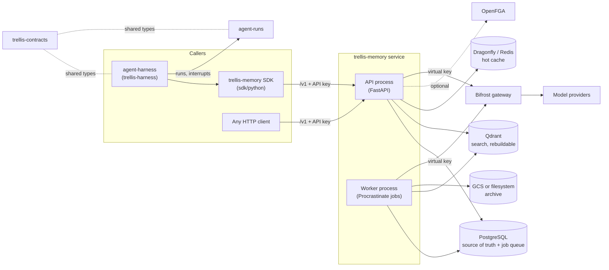
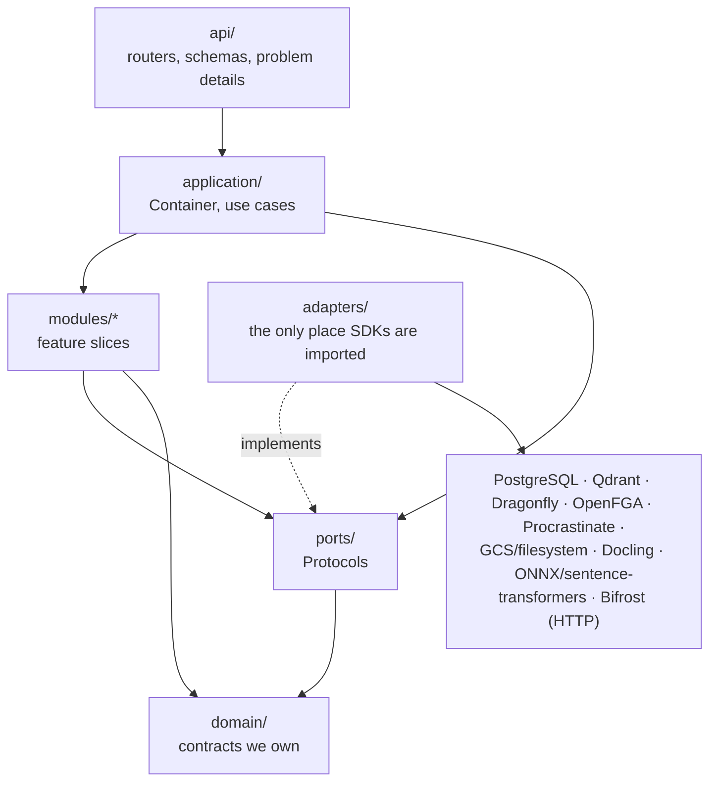
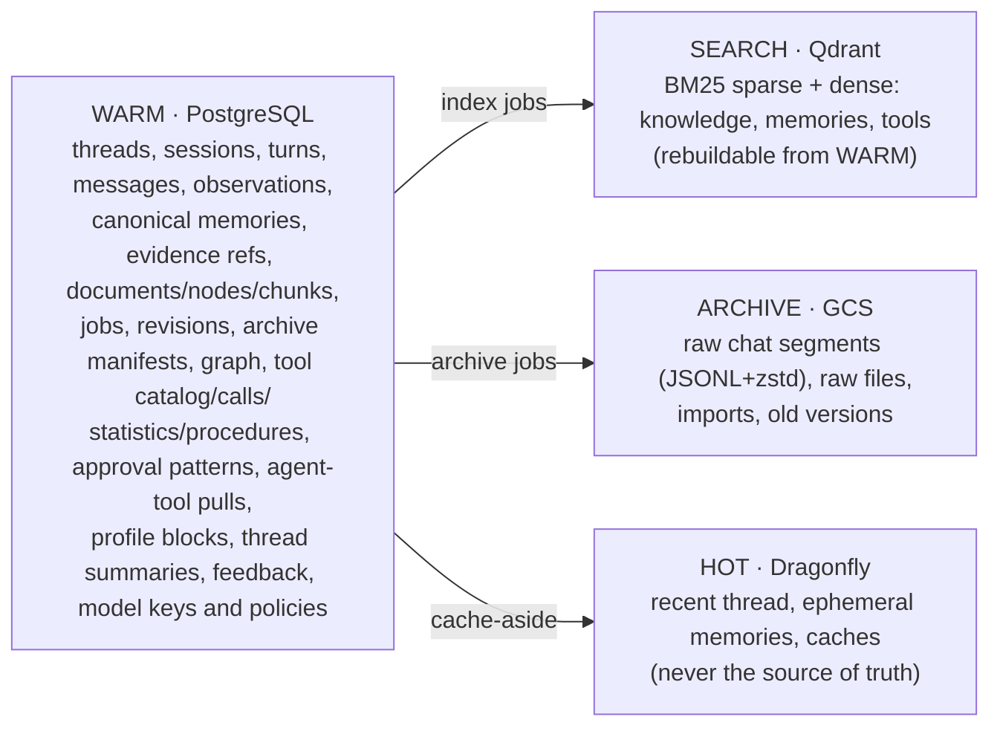
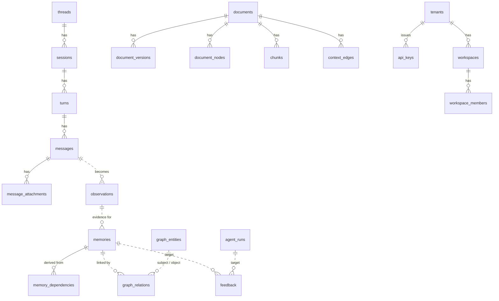
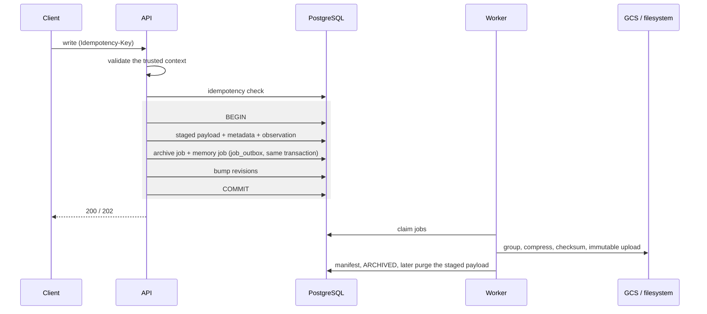
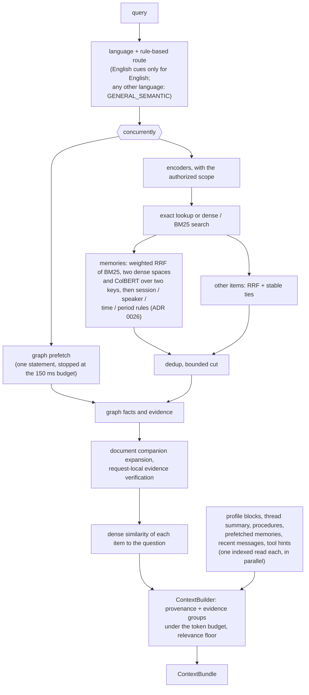
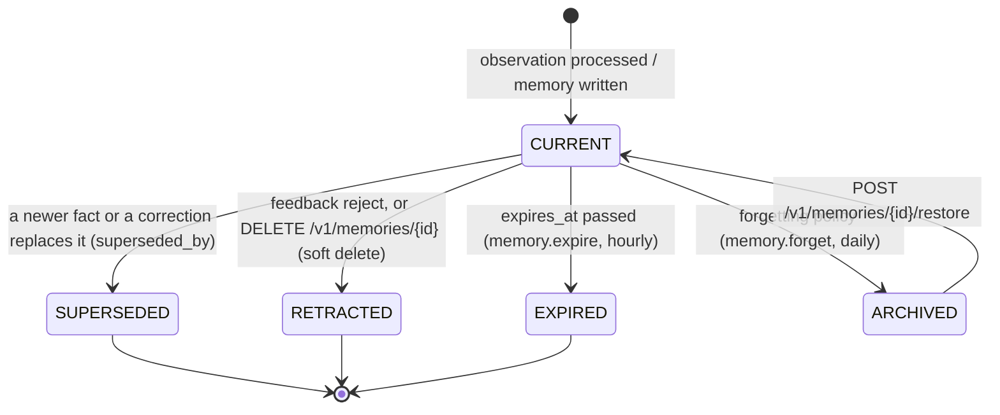
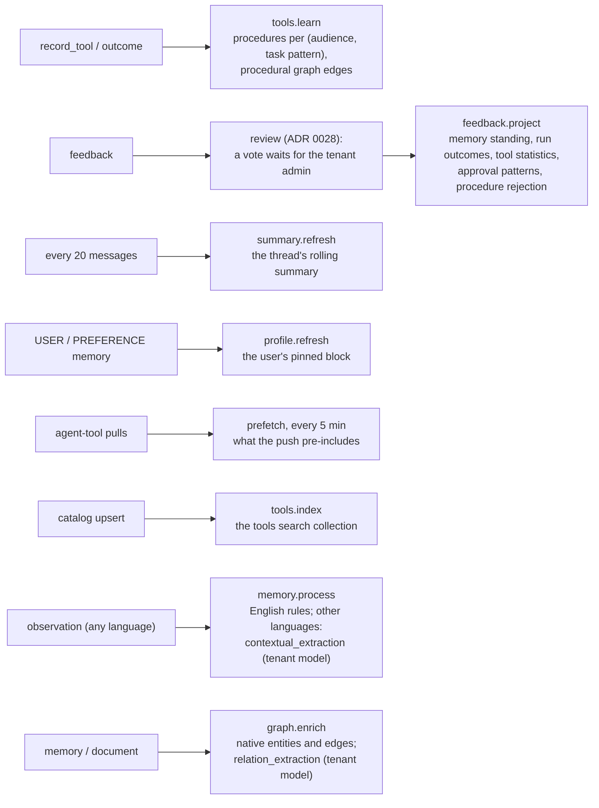

# Architecture

## Shape

Hexagonal architecture (ports and adapters), one microservice, horizontally scalable API
and worker processes sharing PostgreSQL.

### In the platform

### Inside the service

Rules enforced by `tests/unit/test_architecture.py` and Ruff `banned-api`:

- `domain/`, `application/`, `modules/`, `ports/` and `api/` never import provider SDKs.
- LangGraph types never appear anywhere in this repository. Framework adapters are not a
  memory-service concern at all (ADR 0020); they live in `agent-harness`.
- No module reads another module's tables directly; it goes through that module's service.
- Every persistent write is idempotent; every derived memory keeps `EvidenceRef` provenance.

## Layers

| Layer | Contains | Depends on |
|---|---|---|
| `domain` | `MemoryExecutionContext`, `CanonicalMemory`, `Scope`, `Visibility`, `TemporalState`, `EvidenceRef`, conversation and document models, `ContextBundle`, errors | nothing |
| `ports` | `CacheProvider`, `SearchStore`, `BlobStore`, `TaskQueue`, `AuthorizationProvider`, `EmbeddingProvider`, `SparseEncoder`, `LLMProvider`, `MemoryIntelligenceProvider`, `GraphStore`, `GraphEnrichmentProvider`, `DocumentParser` | domain |
| `application` | composition root (`Container`), use-case orchestration | domain, ports |
| `modules/*` | feature slices: archive, audit, auth, authz, context, conversation, feedback, graph, grounding, idempotency, ingestion, jobs, llm, memory, profile, rag, retrieval, tenancy, tools, agent_tools, working_memory (the hot thread cache) | domain, ports |
| `adapters` | one package per provider; the only place SDKs are imported; `wiring.py` attaches configured providers | everything |
| `api` | FastAPI routers, typed schemas with examples, RFC 9457 problem details, middleware, OpenAPI customization | application |

## Data placement

### Core data model

Solid lines are foreign keys; dashed lines are references the service keeps without one
(evidence refs, graph pointers, feedback targets).

## Durability protocol

Archive worker: group -> compress -> checksum -> immutable upload -> verify generation +
checksum -> persist manifest -> mark ARCHIVED -> purge large staged payload after grace period.
Reconciler repairs ACKed-but-unarchived, manifest-missing, checksum-mismatch, stuck jobs,
and canonical/search drift.

## Retrieval pipeline

Memories are re-scored by standing (confidence and reinforcement, which feedback moves) with
a bounded factor (±15%) before the cut.

## Memory lifecycle

A memory's `temporal_status`, as the code moves it. Every state but CURRENT is out of
retrieval; nothing is hard-deleted by these transitions.

`CONTRADICTED` is in the API's vocabulary but reserved: a conflict is resolved by
superseding, so no memory is set to it today.

## Learning (background)

Where each model use runs, its tier and its fallback: [LLM-USES.md](LLM-USES.md).

The request path reads only what these jobs precompute (indexed, bounded).

Document selection is applied to exact hits and after every post-stage, before the next
stage verifies evidence. Tenant and visibility filtering remain independent requirements.
Companion group identities include their target nodes; verification metadata is local to a
request. Expansion batches target/sibling reads, and graph evidence hydration has an enforced
chunk cap. These bounds do not establish an end-to-end latency SLO.

Chunks are indexed with deterministic context (document, section path, page, entities)
prepended — Contextual Retrieval — while the original text is kept separately for display.
The Document Context Graph (PARENT/NEXT/PREVIOUS/ON_PAGE/IN_TABLE/FOOTNOTE/CROSS_REFERENCE/
MENTIONS/DEFINED_BY) is built without an LLM and is distinct from the semantic Knowledge Graph.

## Generative model access

The service never talks to an LLM provider. The model is available exactly when
`BIFROST_URL` is set (`LLMSettings.enabled`); `adapters/models/llm.py` speaks the
OpenAI-compatible HTTP API of a [Bifrost](https://github.com/maximhq/bifrost) gateway that
runs outside the service and holds the provider keys. The service holds only Bifrost
*virtual keys*: the operator's (`BIFROST_VIRTUAL_KEY`, e.g. in `secrets.env`) and the
agent- and tenant-level keys registered through the API, stored encrypted. Calls are bounded
(timeout, bounded retries, circuit breaker; the values are `constants.LLM` /
`constants.LLM_TRANSPORT`, not environment variables), traced (`llm.chat` spans with
model/tokens/latency), metered (`memory_llm_*`) and logged without prompt text unless the
`LOG_SOURCE_TEXT` constant is on.
Provider SDK imports are banned under `src/` by Ruff and `tests/unit/test_architecture.py`.

Every deterministic path stays complete on its own. `modules/llm/assist.py::LLMAssist` is
the single entry point modules use. A request or job first binds the identity that owns the
work (`LLMAssist.bound` / `reading`: one indexed read of the key and policy hierarchies); a use
is then consulted only when the gateway is configured, the resolved tenant policy allows it
(no policy row: every use except the opt-in `memory_restatement`) and a key can pay
(contextual_extraction, relation_extraction, entity_resolution, conflict_adjudication,
summaries, reflection, memory_connections, query_expansion, chunk_context,
memory_restatement, grounding_judge, procedure_abstraction; see `docs/LLM-USES.md`).
Any failure returns
`None`, so the module continues with its native result. Every successful call is counted in
`llm_usage_daily` (one upsert) and `memory_llm_tokens_total{tenant,use,direction}`. Mem0/LangMem/Graphiti/Cognee provider adapters were removed; comparisons belong
in benchmark code. The production wiring does not enable every implemented memory feature;
see [the capability audit](RESEARCH-RAG-2026-09-25.md).

## Caching

Cache-aside. Every sensitive key contains tenant, principal scope fingerprint, revision
fingerprint, provider/model version and the content/query hash. Invalidation is by revision
bump, never by scan.

## Observability

OpenTelemetry spans per stage, Prometheus metrics (`/metrics`), structured JSON logs with
tenant/thread/session/turn/agent-run/job/trace fields, OpenLineage events for processing
lineage, `EvidenceRef` for claim provenance. Source text is never logged by default.
