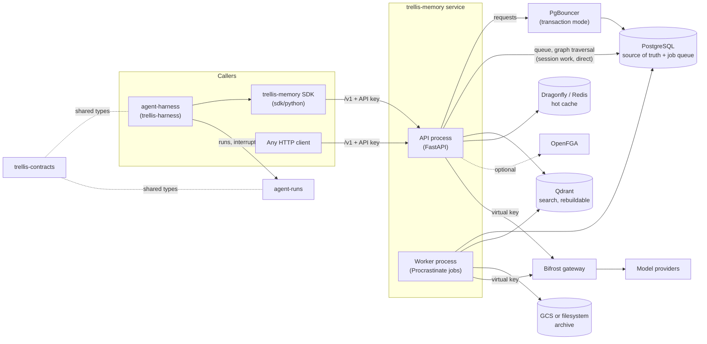
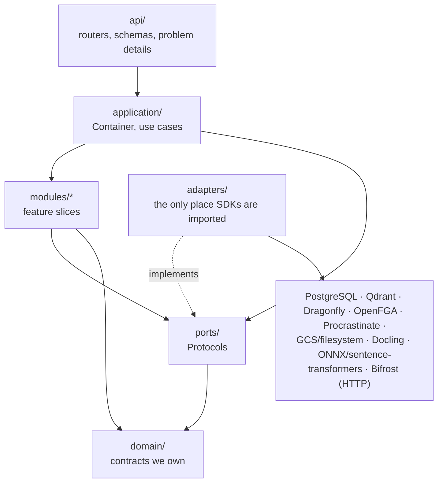
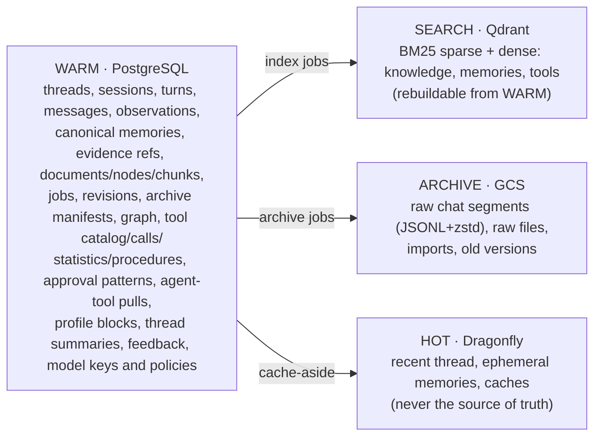
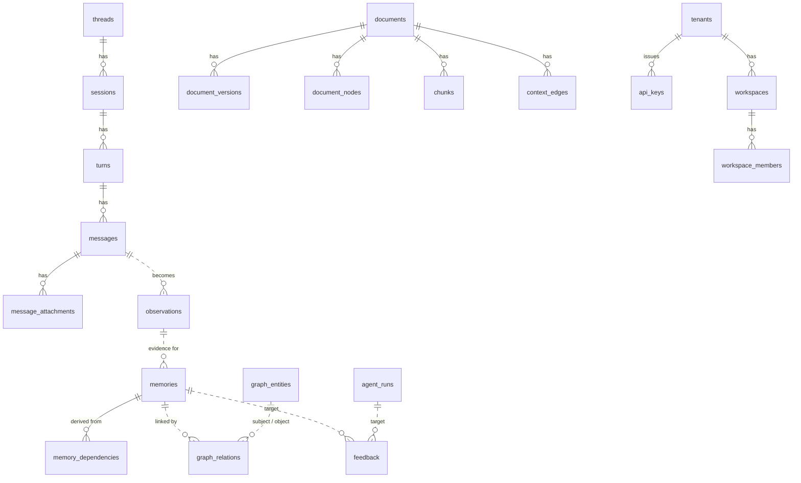
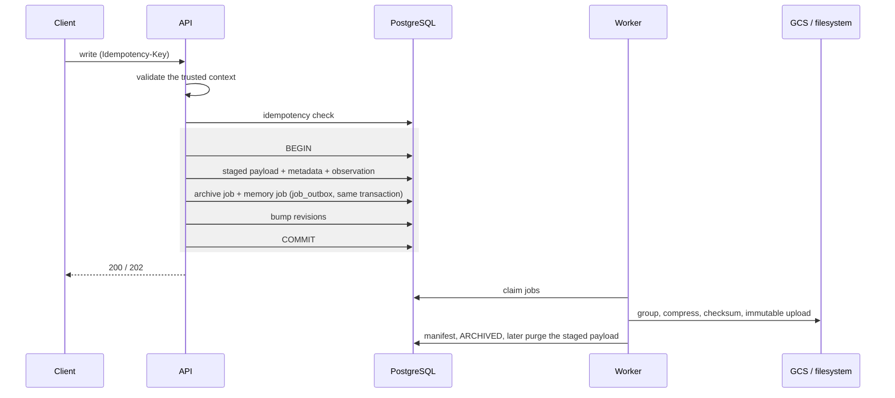
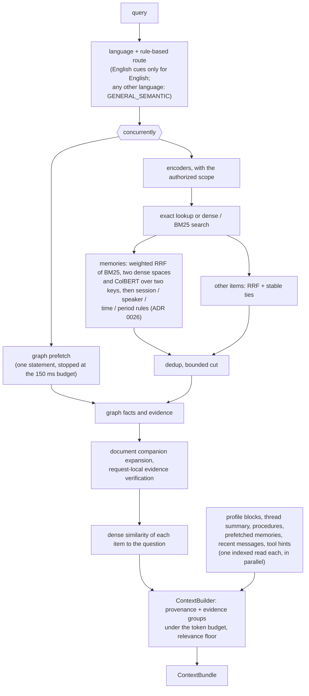
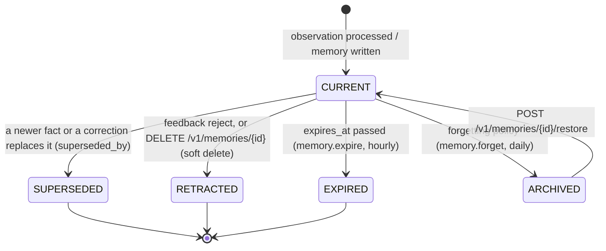
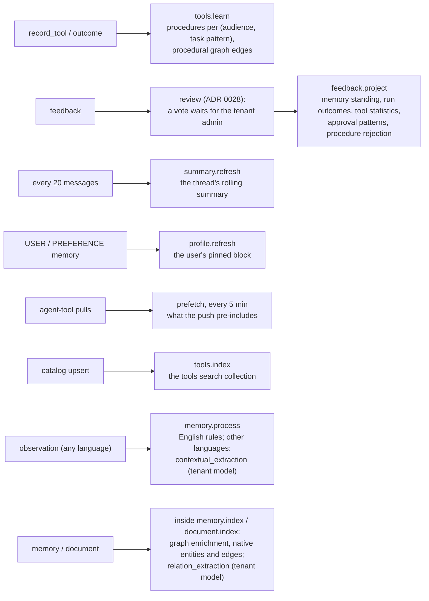
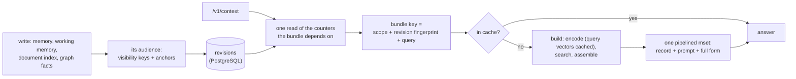
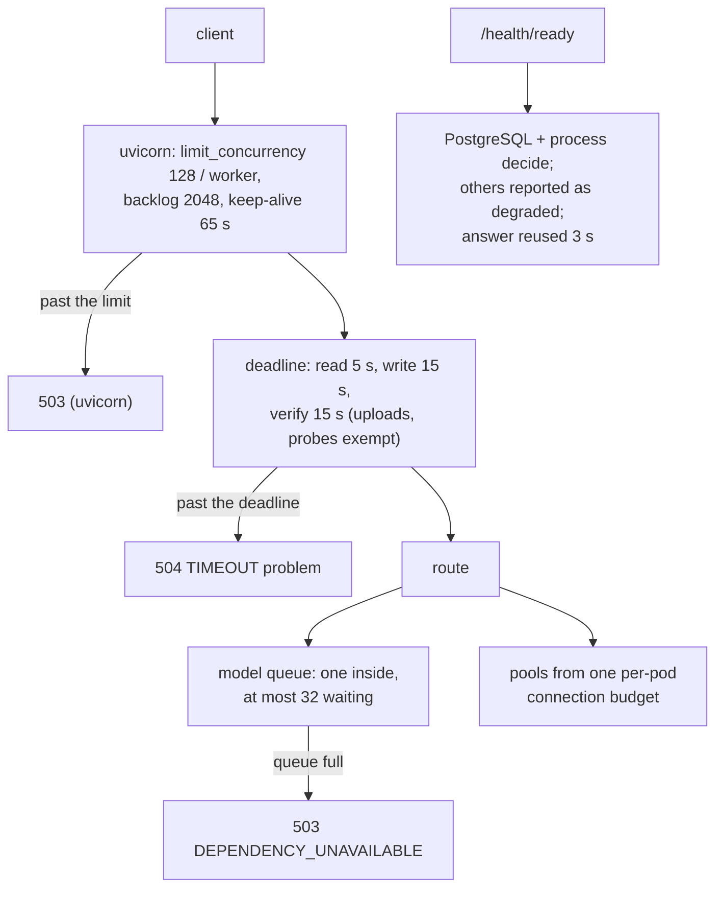

# Architecture

The high-level design of the memory service: where it sits among the five Trellis
repositories, what is inside it, where data lives, and how a write and a read move through
it. The flows, one sequence diagram each, are in [flows.md](flows.md); the explained version of
this page is [chapter 10](guide/10-architecture.md).

## Shape

Hexagonal architecture (ports and adapters), one microservice, horizontally scalable API
and worker processes sharing PostgreSQL.

### In the platform: the five Trellis repositories

Trellis is five repositories. Each owns one concern and ships its own package; they meet at
HTTP APIs and at the shared record types, never at each other's databases.

| Repository | Ships | Owns | How it meets the memory service |
|---|---|---|---|
| [agent-harness](https://github.com/amitmohapatra/agent-harness) | `trellis-harness` (`trellis.harness`) | running an agent of any framework: the two ways (wrapped, or pluggable blocks), governance, evals, the AG-UI and A2A surfaces | the main caller: through `trellis.memory`, it pushes `/v1/context` into each run, adds the pull tools, records the transcript and tool calls, and sends feedback ([USAGE §14](USAGE.md#14-through-the-harness)) |
| **agent-memory-service** (this one) | the service, and the SDK `trellis-memory` (`trellis.memory`, in [`sdk/python`](../sdk/python/README.md)) | what agents and people said, stated and uploaded; the context a turn needs; what tools worked | — |
| [agent-runs](https://github.com/amitmohapatra/agent-runs) | the runs service and `trellis-runs` (`trellis.runs`) | durable runs, the inbox, schedules, workers, and the webhooks that notify people | none directly: the harness calls both. Run notifications (paused, escalated, finished) are agent-runs' webhooks; the memory service sends none |
| [agent-contracts](https://github.com/amitmohapatra/agent-contracts) | `trellis-contracts` (`trellis.contracts`) | the shared record types (runs, interrupts, feedback, agent cards) | `POST /v1/feedback` takes the `trellis.contracts` `Feedback` shape; the service does not import the package |
| [bifrost-sdk](https://github.com/amitmohapatra/bifrost-sdk) | `bifrost-sdk` (`bifrost_sdk`) | the client for the Bifrost model gateway: retries, rate limits, the circuit breaker | every model call the service makes goes through it (`>=0.3`, vendored by `make vendor`), so the service and the harness share one transport |

What the memory service deliberately does **not** do: run an agent or a tool (the harness
does), hold a provider key (the gateway does), drive a framework (no LangGraph or other
adapter lives here, ADR 0020), or notify anyone (agent-runs does). Which versions work
together: [versioning.md](versioning.md).

### Inside the service

Rules enforced by `tests/unit/test_architecture.py` and Ruff `banned-api`:

- `domain/`, `application/`, `modules/`, `ports/` and `api/` never import provider SDKs.
- LangGraph types never appear anywhere in this repository. Framework adapters are not a
  memory-service concern at all (ADR 0020); they live in `agent-harness`.
- No module reads another module's tables directly; it goes through that module's service.
- Every persistent write is idempotent; every derived memory keeps `EvidenceRef` provenance.

## Layers

| Layer | Contains | Depends on |
|---|---|---|
| `domain` | `MemoryExecutionContext`, `CanonicalMemory`, `Scope`, `Visibility`, `TemporalState`, `EvidenceRef`, conversation and document models, `ContextBundle`, errors | nothing |
| `ports` | `CacheProvider`, `SearchStore`, `BlobStore`, `TaskQueue`, `AuthorizationProvider`, `EmbeddingProvider`, `SparseEncoder`, `LLMProvider`, `MemoryIntelligenceProvider`, `GraphStore`, `GraphEnrichmentProvider`, `DocumentParser` | domain |
| `application` | composition root (`Container`), use-case orchestration | domain, ports |
| `modules/*` | feature slices: archive, audit, auth, authz, context, conversation, feedback, graph, grounding, idempotency, ingestion, jobs, llm, memory, profile, rag, retrieval, tenancy, tools, agent_tools, working_memory (the hot thread cache) | domain, ports |
| `adapters` | one package per provider; the only place SDKs are imported; `wiring.py` attaches configured providers | everything |
| `api` | FastAPI routers, typed schemas with examples, RFC 9457 problem details, middleware, OpenAPI customization | application |

## Data placement

### Core data model

Solid lines are foreign keys; dashed lines are references the service keeps without one
(evidence refs, graph pointers, feedback targets).

## Durability protocol

Archive worker: group -> compress -> checksum -> immutable upload -> verify generation +
checksum -> persist manifest -> mark ARCHIVED -> purge large staged payload after grace period.
Reconciler repairs ACKed-but-unarchived, manifest-missing, checksum-mismatch, stuck jobs,
and canonical/search drift.

## Retrieval pipeline

Memories are re-scored by standing (confidence and reinforcement, which feedback moves) with
a bounded factor (±15%) before the cut.

## Memory lifecycle

A memory's `temporal_status`, as the code moves it. Every state but CURRENT is out of
retrieval; nothing is hard-deleted by these transitions.

`CONTRADICTED` is in the API's vocabulary but reserved: a conflict is resolved by
superseding, so no memory is set to it today.

## Learning (background)

Where each model use runs, its tier and its fallback: [guide chapter 8, the twelve uses](guide/08-models.md#the-twelve-uses).

What each job learns, with the thresholds in the code:

- **Feedback.** Verdicts on memories, runs, tool calls and procedures adjust the confidence of
  the memories an answer cited, label run outcomes and feed tool statistics; a memory's
  standing moves its ranking within a bounded ±15%. A vote from a person or an agent counts
  only once the tenant admin approves it (ADR 0028).
- **Procedures.** Tool runs with outcomes are mined into one procedure per task pattern,
  admitted at 2 or more supporting runs and 60% success, updated by delta; hints and the push
  offer it as a plan with the next step's arguments filled from earlier outputs.
- **Approval suggestions.** Approve, reject and edit decisions per tool and argument shape
  become suggested rules after 5 decisions; the service never applies one itself.
- **Prefetch.** A memory the agent pulled for a kind of request at least 3 times and used at
  least half the time is included in the next push for that kind (at most 5).
- **Thread summaries and the profile.** Every 20 messages a thread's durable summary rolls
  forward, so the summary plus the 20-message window always cover the thread; the `user`
  profile block is kept from USER and PREFERENCE memories.
- **Reflection and connections.** Periodic, cited insights over a principal's memories and
  typed links between memories (supersedes, contradicts, relates), only with a gateway.

The request path reads only what these jobs precompute (indexed, bounded).

Document selection is applied to exact hits and after every post-stage, before the next
stage verifies evidence. Tenant and visibility filtering remain independent requirements.
Companion group identities include their target nodes; verification metadata is local to a
request. Expansion batches target/sibling reads, and graph evidence hydration has an enforced
chunk cap. These bounds do not establish an end-to-end latency SLO.

Chunks are indexed with deterministic context (document, section path, page, entities)
prepended — Contextual Retrieval — while the original text is kept separately for display.
The Document Context Graph (PARENT/NEXT/PREVIOUS/ON_PAGE/IN_TABLE/FOOTNOTE/CROSS_REFERENCE/
MENTIONS/DEFINED_BY) is built without an LLM and is distinct from the semantic Knowledge Graph.

## Generative model access

The service never talks to an LLM provider. The model is available exactly when
`BIFROST_URL` is set (`LLMSettings.enabled`); `adapters/models/llm.py` speaks the
OpenAI-compatible HTTP API of a [Bifrost](https://github.com/maximhq/bifrost) gateway that
runs outside the service and holds the provider keys. The service holds only Bifrost
*virtual keys*: the operator's (`BIFROST_VIRTUAL_KEY`, e.g. in `secrets.env`) and the
agent- and tenant-level keys registered through the API, stored encrypted. Calls are bounded
(timeout, bounded retries, circuit breaker; the values are `constants.LLM` /
`constants.LLM_TRANSPORT`, not environment variables), traced (`llm.chat` spans with
model/tokens/latency), metered (`memory_llm_*`) and logged without prompt text unless the
`LOG_SOURCE_TEXT` constant is on.
Provider SDK imports are banned under `src/` by Ruff and `tests/unit/test_architecture.py`.

Every deterministic path stays complete on its own. `modules/llm/assist.py::LLMAssist` is
the single entry point modules use. A request or job first binds the identity that owns the
work (`LLMAssist.bound` / `reading`: one indexed read of the key and policy hierarchies); a use
is then consulted only when the gateway is configured, the resolved tenant policy allows it
(no policy row: every use except the opt-in `memory_restatement`) and a key can pay
(contextual_extraction, relation_extraction, entity_resolution, conflict_adjudication,
summaries, reflection, memory_connections, query_expansion, chunk_context,
memory_restatement, grounding_judge, procedure_abstraction; see [the twelve uses](guide/08-models.md#the-twelve-uses)).
Any failure returns
`None`, so the module continues with its native result. Every successful call is counted in
`llm_usage_daily` (one upsert) and `memory_llm_tokens_total{tenant,use,direction}`. Mem0/LangMem/Graphiti/Cognee provider adapters were removed; comparisons belong
in benchmark code. The production wiring does not enable every implemented memory feature;
`tests/eval/test_capability_coverage.py` holds which capability provides what.

## Caching

Cache-aside. Every sensitive key contains tenant, principal scope fingerprint, revision
fingerprint, provider/model version and the content/query hash. Invalidation is by revision
bump, never by scan. The revision counters live only in PostgreSQL. A bump commits with the
write it describes, and a bundle lookup reads every counter it depends on in one statement.

A write bumps the revisions of the **audience** that can read what it changed (ADR 0031):

| write | revisions bumped |
|---|---|
| a memory (written, superseded, forgotten, indexed) | its owner's USER / THREAD / AGENT, plus every reader its visibility keys name (`memory_revision_keys`) |
| working memory (EPHEMERAL, or DEFER) | the THREAD, or TENANT when anchored only by an agent run |
| a document indexed or removed | its visibility keys' readers and its THREAD (`document_revision_keys`), with or without graph enrichment |
| graph facts from a memory or document | that memory's or document's audience, plus the readers of every entity whose summary changed; GRAPH only when the audience is unknown |
| a grant | MEMBERSHIP (the authorization scope cache) |

Query vectors are cached per dense space (`emb:<encoder fingerprint>:q:<sha256(query)>`,
one day) beside the document vectors (`emb:<fingerprint>:<content hash>`, a week).

## Runtime: overload, readiness, workers

ADR 0031; the operator's view is [guide/11-operations.md](guide/11-operations.md) and
[deploy/database.md](deploy/database.md).

- **Pools.** One per-pod connection budget is split per process 4:2:1: requests (through
  PgBouncer when there is one), the graph traversal (direct), and the task queue (direct).
  Every connection is bounded by connect, checkout and statement timeouts.
- **Readiness** is PostgreSQL and the process. Search, authorization, blob, the queue and the
  cache are reported without failing it. Liveness checks nothing outside the process.
- **The job worker** stops fetching on SIGTERM and gives running jobs 30 s, then releases
  them for a retry. It serves queue depth, oldest-job lag, outbox backlog and failed jobs on
  its own metrics port.
- **CPU-bound parsing** (the builtin parser, document fact extraction) runs in a thread, and
  thread write authorization is asked before the unit of work and its lock.
- **The tenant registry** learns live keys one at a time and applies suspensions and
  revocations announced on the cache's pub/sub channel. Its one-minute refresh is the
  fallback when the cache is down.

## Observability

OpenTelemetry spans per stage, Prometheus metrics (`/metrics`, summed over the API's worker
processes; the job worker on its own port), structured JSON logs with
tenant/thread/session/turn/agent-run/job/trace fields, and `EvidenceRef` for claim provenance.
OpenLineage events are **not built** (chapter 11 says the same). Source text is never logged by default.
