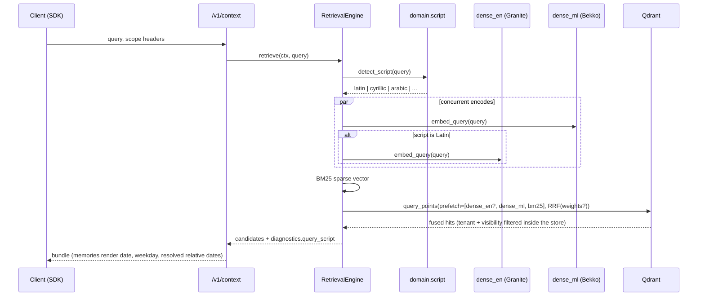
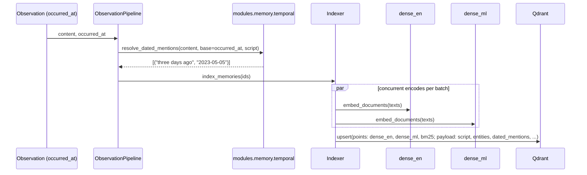
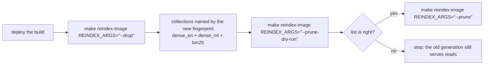

# The multilingual runtime

How a query in any of twelve scripts is retrieved, how a record is indexed, and how an
existing tenant is moved onto it. Decisions: ADR 0024. Numbers: `history/PHASE7-RESULTS-2026-09-28.md`.

## The models

| Space | Model | Searched for | Indexed for |
|---|---|---|---|
| `dense_en` | `ibm-granite/granite-embedding-small-english-r2`, 384-d, ONNX | Latin-script queries | every record |
| `dense_ml` | `hotchpotch/bekko-embedding-v1-a8m`, 384-d, ONNX (MIT; ModernBERT + mmBERT lineage) | every query | every record |
| `bm25` | Unicode BM25 (`v2-unicode`), server-side IDF | every query | every record |
| NLI | `MoritzLaurer/mDeBERTa-v3-base-xnli-multilingual-nli-2mil7`, FP32 ONNX | `/v1/verify`, `/v1/context` with `answer` | - |

No Chinese-origin model or derivative is loaded anywhere; `tests/unit/test_model_provenance.py`
asserts it on every surface that names a model.

## `POST /v1/context` and `POST /v1/recall`: the query path

Diagnostics carry `query_script`; the engine never sends the English vector for a
non-Latin query, and the English encoder is not even called for it.

## Ingestion: the index path

Payload fields `script` and `entities` are indexed and matched inside the store; they are
never returned to a reader. `dated_mentions` is projected and rendered.

`resolve_dated_mentions` covers named and counted offsets in all twelve languages
(`yesterday`, `tomorrow`, `three days ago`, `last week`, `hace 2 días`, `вчера`, `昨天`). The
English weekday and weekend phrases that are unambiguous (`last Tuesday`, `next Monday`,
`last weekend`, `this morning`, `a few days ago`) are resolved by rule, and a named period is
a range (`last week` = `2023-05-01..2023-05-07`). dateparser's absolute-time parser is never
used - it reads the word "we" as a Wednesday - and a bare weekday, `next weekend` and the
seasons stay unresolved: a date resolved to the wrong day is worse for a reader than one left
alone (ADR 0024, decision 7, amended).

## Language on write, and the model where the rules cannot read

`domain/language.py` decides a text's language without a model (the script, letters only one
language of a shared script uses, function-word votes) and every observation, memory and chunk
stores it as `lang` (migration 0018). It decides three things:

| where | English | any other language |
|---|---|---|
| memory extraction | the rules, then narrative units for what they missed | typed facts in the message's language when a key can pay (`contextual_extraction`, fast tier); a slot is kept only when its value is copied from the cited sentence |
| graph enrichment | rule entities; the model types relations between them | the model names both entities (verbatim in the text) and the relation (`relation_extraction`) |
| query routing | the cue patterns | GENERAL_SEMANTIC, and query expansion when the read may use the model |

The verbatim turn is kept in every language either way. Every prompt ends with the rule that
text is returned in its source's language, never translated. Details:
[LLM-USES.md](LLM-USES.md).

## Moving an existing tenant: the reindex path

The rebuild reads PostgreSQL (the source of truth), writes every READY document's chunks
and summaries and every CURRENT memory with both vectors, the script tag and the resolved dates. Until `--prune` runs, the previous generation is untouched,
so a rollback is a revert of the build and nothing else.

## Benchmarks that exercise it

| Gate | Command | Artifact |
|---|---|---|
| SciFact through the store path | `make bench-runtime-retrieval RUNTIME_ARGS="--suite scifact --output …"` | `benchmark/results/phase7/runtime_scifact.json` |
| XQuAD, 12 languages | `make bench-runtime-retrieval RUNTIME_ARGS="--suite xquad --output …"` | `benchmark/results/phase7/runtime_xquad.json` |
| LoCoMo source arms (English, ensemble) | `make bench-locomo-source BENCH_DENSE=english\|ensemble SOURCE_ARGS="…"` | `benchmark/results/phase7/locomo_source_*.json` |
| Weighted RRF fit | `python -m benchmark.fit_rrf_weights <dump> --output …` | `benchmark/results/phase7/rrf_weight_fit.json` |
| Judged arms | `make bench-locomo-judged LOCOMO_ARGS="--reuse-corpus --reask …"` | `benchmark/results/phase7/locomo_judged_*.json` |
| Budget | `make bench-budget BUDGET_ARGS="read --checkpoint <label>"` | `benchmark/results/phase7/budget.json` |

Every benchmark points at its own `p7_*` database and the isolated Qdrant on `16333`
(`BENCH_QDRANT_URL`, `BENCH_DB_P7_*`). Two refusals stand behind those defaults, because a
harness resets whole stores rather than its own rows: `benchmark/common.py:reset_store`
refuses to TRUNCATE any database not named for a benchmark (`memory` and `harness_live` are
deployed stores, and `memory` is what an unset `MEMORY__DATABASE__URL` would select), and the
source harness additionally refuses any Qdrant but the isolated one. `LOCOMO_DB` selects a
judged arm's corpus: `BENCH_DB_P7_CONV` for A0, `BENCH_DB_P7_LLM` for A1.
