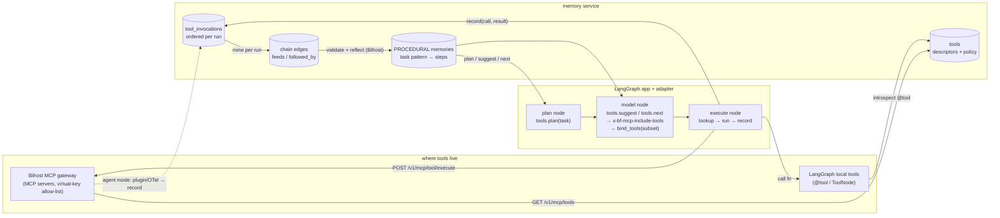

# Tool memory — remembering tool calls, outcomes and procedures (change 30)

Companion to `TARGET_STACK.md` and `INTEGRATIONS_PLAN.md`.

## What the service does today

Nothing tool-specific. An agent can already `observe()` a sentence about a tool outcome with a
hint (`memory_type: PROCEDURAL` or `AGENT`), and the native extractor recognises procedural
phrasing ("to do X, use Y"); working memory (EPHEMERAL, TTL) can hold a tool result for the
rest of a run; the LangGraph adapter can wrap a tool node like any node. But there is no
structured record of a tool invocation, no de-duplication of identical calls, no learning of
which tool works for which task, and no recommendation an agent can ask for. That is the gap.

## What we add

The 2026 procedural-memory work (Mem^p, MemToolAgent) shows that keeping *validated*
trajectories plus abstracted procedures — and reflecting on failures to correct them — raises
task success sharply (ALFWorld 42% → 78% with the same model, with 37% fewer steps), and that
the winning form pairs concrete examples with abstract guidance rather than either alone.
We implement exactly that, deterministic first, LLM (via Bifrost) only for abstraction.

### 30.0 Tool registry — how a tool gets known in the first place

The memory service never executes tools; they live in the agent framework (LangGraph, ADK,
CrewAI, an MCP server, plain code). The service only needs a *descriptor* so it can record,
cache and reason about calls. A descriptor is: `name`, `version`, `description`, JSON
`input_schema` / `output_schema` (optional), `tags`, and a `policy`
(`deterministic`, `side_effects`, `cacheable`, `cache_ttl`, `cache_scope`, `cost_hint`,
`redact: [arg paths]`). Descriptors are per tenant (optionally per workspace) and versioned;
a changed schema or policy creates a new version, old invocations keep pointing at theirs.

Three ways in, all landing in the same `tools` table:

1. **Automatic from the adapters** (the normal path). `memory.tool(fn)` /
   `memory.wrap_tools(ToolNode)` in LangGraph read the tool's name, docstring and argument
   model; ADK's tool callbacks read the `FunctionTool` declaration; the CrewAI wrapper reads
   `BaseTool`; the MCP server registers whatever tools the client lists. Registration is an
   idempotent upsert keyed by (tenant, name, schema hash) on first use — nobody has to
   pre-register anything to get invocation records and suggestions.
2. **Explicit via API/SDK**: `POST /v1/tools` / `client.tools.register(descriptor)` — used to
   set a policy (make a tool cacheable, mark side effects, redact an argument, add tags) or to
   describe tools the agent code cannot introspect (external MCP servers, HTTP tools).
3. **Declared per call**: `available_tools` in `suggest` / `next` / `plan` carries descriptors
   for the current task; unknown ones are upserted, known ones are matched by name+schema.

Defaults are conservative: an unregistered or undeclared tool is `deterministic=false`,
`cacheable=false`, `side_effects=unknown`, so nothing is ever cached or replayed until a
human or the adapter says it is safe. Policies can only be widened by an explicit register
call (admin scope), never by an agent's per-call declaration. `GET /v1/tools` lists a tenant's
tools with their outcome statistics; `client.tools.list()` in the SDK.

### 30.1 Tool invocation records (episodic layer)

`ToolInvocation` in PostgreSQL (`tool_invocations`, tenant-scoped, visibility like messages):
tool name and version, redacted arguments plus `args_hash`, output digest, a short extractive
output summary, an optional blob reference for the full output (archived like chat segments),
status (`ok | error | timeout | rejected`), error class, latency, token/cost, the run/thread/
turn it belonged to, and the task intent (the node's recall query or the user's turn). Indexed
as `kind=tool_call` so it is recallable ("what did the pricing API return for ACME last time").
Recorded idempotently (key = run + step + tool + args_hash). Retention/purge follow messages.

### 30.2 Tool-output working memory (short-term)

Per tool a policy: `cacheable: true|false`, `ttl`, `scope: run | thread | user | tenant`.
`POST /v1/tools/lookup {tool, args}` returns a still-valid identical result (same tenant/scope,
same `args_hash`, within TTL, tool marked deterministic) so an agent does not call a costly or
rate-limited tool twice for the same question inside a run or a thread. Never used for
non-deterministic or side-effecting tools; every cached reply says it is cached and how old.

### 30.3 Procedural memories (long-term)

From invocation records the service derives, deterministically, per tenant and agent group:
per (task pattern, tool) success rate, latency and cost, common error → the argument change or
alternative tool that fixed it, and ordered tool sequences that led to a successful outcome
(the "trajectory" form). A bounded reflection step through Bifrost turns validated
trajectories into abstract procedures (the "script" form): `{task_pattern, preconditions,
steps: [tool, arg template, expected output], failure_modes, when_not_to_use}` stored as
`memory_type = PROCEDURAL` with the usual visibility, supersession and validity windows.
Update rules follow Mem^p: only successful trajectories become procedures (validation);
a procedure that led to a failure is corrected in place, not duplicated (adjustment);
unused or repeatedly failing procedures decay and are archived.

### 30.4 Tool suggestion (what agents ask for)

`POST /v1/tools/suggest {task, available_tools: [{name, description, schema}], context}`
returns a ranked list: tool, confidence, an argument template, the procedures and past
invocations that support it (with evidence status), and warnings (known failure modes, cost,
staleness). Ranking is deterministic (procedure match + outcome statistics + recency),
optionally re-ranked through Bifrost when the `uses` flag `tool_selection` is on. Only tools
the agent declares as available are ever suggested; nothing is invented. Memories from other
agents count only if they were shared to the group — the same visibility rules as everything
else. SDK: `client.tools.suggest()`, `client.tools.record()`, `client.tools.lookup()`,
`client.tools.procedures()`.

### 30.5 Adapter integration

- LangGraph: `memory.tool(fn)` decorator and `memory.wrap_tools(ToolNode)` — before the call,
  cache lookup; after it, idempotent record; `state["memory"].tools` carries suggestions for
  the node's recall query; failures are recorded with the error class so the next attempt
  gets the corrected procedure.
- ADK: `before_tool_callback` / `after_tool_callback` do the same; suggestions are exposed as
  a `suggest_tools` tool.
- CrewAI: tool wrapper class; MCP: `memory.tools.suggest|record|lookup`.

### 30.6 Tool chains — which tool comes after which

Procedures are not flat lists: each is a small directed graph of steps with data flow.
A step records the tool, its argument template, and *where each argument came from* (a field
of a previous step's output, the task, or a memory), plus the expected output shape, a
precondition (e.g. "needs a customer id"), and branches on failure (retry with changed
argument, fall back to another tool, stop and ask). Chains are mined deterministically from
successful invocation records inside a run: consecutive calls where an output field of step
*n* appears in the arguments of step *n+1* become a `feeds` edge; the same (tool → tool) edge
seen across runs with a good outcome gains support, an edge that preceded failures loses it.
Bifrost reflection may name and generalise a chain, never invent edges without support.

Two calls serve agents mid-task:

- `POST /v1/tools/next {task, trajectory_so_far: [{tool, args_hash, status, output_summary}],
  available_tools}` → the ranked next steps given the prefix, each with the argument template
  already bound from earlier outputs where possible, the supporting chains/procedures, and
  the stop condition ("after `send_report` there is nothing left to call"). Ranking is
  deterministic (chain support × precondition satisfaction × outcome stats), optionally
  re-ranked through Bifrost.
- `POST /v1/tools/plan {task, available_tools}` → the whole best-known chain for a task
  pattern, as an ordered plan with data-flow bindings, so a planner node can start from a
  validated procedure instead of an empty prompt; the plan carries the evidence that backs it
  and the known failure branches.

The adapters use `next` automatically: in LangGraph the wrapped tool node gets
`state["memory"].tools.next` after each call, and a planner node can seed from
`tools.plan`; ADK's `before_tool_callback` can reorder or bind arguments; CrewAI tasks get the
plan as context. A chain suggested from another agent's runs is only offered if it was
shared to the group. The tool gate adds: next-step hit rate on held-out trajectories, plan
validity (every binding resolvable), and no chain ever suggesting a tool the agent did not
declare.

### 30.7 Grounding and evaluation

Tool outputs are evidence: a tool invocation summary in a context bundle is an evidence item
with `source=tool`, its digest and age, so the grounding cascade and `/v1/verify` treat claims
based on tool output like claims based on documents. Gate (`tests/eval/test_tool_gate.py`,
`benchmark/results/tool_gate.json`) on a replayed trajectory fixture: correct-tool suggestion
hit rate, cache precision (no stale or cross-scope hits = 0 violations), procedure correction
after an injected failure, and isolation (an agent never sees another agent's unshared
invocations). Thresholds are hard gates like the rest.

### 30.8 Tools through Bifrost's MCP gateway (alternative to framework tools)

Bifrost is also an MCP gateway: MCP servers (stdio/HTTP/SSE) are registered in Bifrost once,
their tools are injected into every `/v1/chat/completions` request, tool visibility is
governed per virtual key and per request (`x-bf-mcp-include-tools`), and execution is either
explicit (`POST /v1/mcp/tool/execute`, the default) or autonomous ("agent mode", opt-in with
`tools_to_auto_execute` and a max-iteration cap). Teams may therefore keep tools out of the
agent framework entirely. The memory service supports both paths:

- **Memory as an MCP server in Bifrost.** The `universal-memory-mcp` server (INTEGRATIONS_PLAN
  §28) is registered in Bifrost, so every model call routed through the gateway can see
  `memory.recall / context / remember / tools.suggest / tools.next` without any adapter; the
  virtual key decides which agents may use which memory tools.
- **Explicit execution path (recommended).** The app calls the model through Bifrost, gets the
  tool-call suggestions, and executes through the SDK: `client.tools.execute(call)` does
  lookup (cache) → `POST /v1/mcp/tool/execute` on Bifrost → record, so invocation records,
  chains and suggestions work exactly as with framework tools. Tool descriptors are pulled from
  Bifrost's tool list (`GET /v1/mcp/tools`) and upserted into the registry (§30.0) with the
  virtual key's allow-list as the `available_tools` set.
- **Agent mode path.** When Bifrost executes tools autonomously the app never sees the calls,
  so records come from Bifrost's side: a Bifrost plugin (its plugin hook system) or its
  OTel/log export posts each tool execution to `POST /v1/tools/record` with the virtual key
  → tenant/agent mapping. Cache lookups are not possible on this path (Bifrost decides), so
  `cacheable` policies apply only to explicit execution; the docs say so.
- **Governance stays in one place.** Which tools an agent may call is decided by the Bifrost
  virtual key; which tool memories an agent may see is decided by the memory service's
  visibility rules. Suggestions never name a tool the key does not allow, because the
  key's tool list is what is passed as `available_tools`.

**Picking one tool among many.** Bifrost narrows the catalogue before the model sees it: the
virtual key's `mcp_configs` allow-list (`tools_to_execute`) fixes the maximum set per agent,
and the per-request header `x-bf-mcp-include-tools` (wildcards, e.g. `pricing-*,crm-get_*`)
narrows it per call. The model then names one tool in `tool_calls` (server-prefixed name),
and executing that object routes to the right server. The memory service adds the third
narrowing: `tools.suggest` for the task returns the top-k tools, and the adapter writes them
into `x-bf-mcp-include-tools` (plus the procedure text into the system prompt), so the model
chooses among the few tools that worked for this kind of task instead of hundreds — fewer
tokens and a higher correct-tool rate, measured by the tool gate.

**Code mode.** When an MCP client is `is_code_mode_client`, the model does not see its tools
at all; it sees four meta-tools (`listToolFiles`, `readToolFile`, `getToolDocs`,
`executeToolCode`) and writes a Starlark script calling `server.tool(kwargs)` that runs in
Bifrost's sandbox; only the final `result` comes back. The explicit-execution loop is
unchanged (the tool calls are just the meta-tools). For memory: `executeToolCode` is recorded
as one invocation whose `sub_calls` are parsed from the script (`server.tool(` calls, in
order, with argument bindings) — the same parse Bifrost does for auto-approval — so chains and
data flow are recorded *more* precisely than with one-call-at-a-time execution; `tools.plan`
can return a validated procedure directly as a Starlark template for the model to adapt;
cache lookup applies to the whole script hash (tenant, script hash, TTL) for deterministic
scripts only. Suggestions in code mode are injected as a `getToolDocs`-style note ("for this
task, previous successful scripts used pricing.lookup_price → crm.update_quote") rather than
as a header filter.

The LangGraph example gains a second variant (`examples/langgraph_bifrost_mcp/`) with no
`ToolNode` at all: tools come from Bifrost, memory from the wrapped nodes, and the same checks
pass. The conformance suite (§29) runs the tool scenario over both paths.

### 30.9 End-to-end data flow and how sequences are inferred

Tools can live in three places at once for one agent: registered in Bifrost as MCP servers,
defined locally in LangGraph code (`@tool` + `ToolNode`), or both. Every path lands in the
same two calls — `tools.register` (descriptor, once) and `tools.record` (one row per call) —
so the memory service never cares where a tool runs.

**Step 1 — descriptors reach memory.** Bifrost tools: the adapter reads the virtual key's
tool list (`GET /v1/mcp/tools`) and upserts descriptors with `source=bifrost-mcp` and the
server name. Local tools: `memory.wrap_tools(ToolNode)` introspects each `@tool` (name,
docstring, args model) and upserts with `source=langgraph`. Same table, same policies; a
tool is identified by (tenant, name, schema hash), so the same tool used from both places is
one tool.

**Step 2 — every call becomes an ordered record.** The execute node (or `wrap_tools`, or a
Bifrost plugin in agent mode) records `{run_id, step, tool, args (redacted) + args_hash,
output summary + digest + blob ref, status, error class, latency, cost, task}`. Step numbers
come from the LangGraph superstep and tool-call index, so order is exact and retries are
idempotent. In code mode one `executeToolCode` record carries `sub_calls` parsed from the
script, in order, with argument bindings.

**Step 3 — the run gets an outcome.** A run is marked `success` when the final assistant
message was recorded with evidence status COMPLETE and no tool error was left unresolved,
or explicitly via `client.runs.outcome(run_id, success=True|False, note=...)` (a user
thumbs-up, a test passing, a human review). Unlabelled runs count as weak positives only
after they are older than a configurable window with no correction.

**Step 4 — chains are mined, deterministically.** Per run, consecutive records form a
trajectory. A `feeds` edge is created from step *i* to step *j>i* when a value in step *j*'s
arguments equals (exact or normalised) a value in step *i*'s output — with the field path on
both sides, which is the data-flow binding. A `followed_by` edge is created for adjacency.
Across runs with the same *task pattern* (the task text with entities replaced by typed
placeholders — "update quote {quote_id} with {region} price for {sku}" — matched by hybrid
search over patterns), edges accumulate `support`, `success_rate`, `median_latency`,
`median_cost`; edges that preceded failures accumulate `failure_modes` with the error class
and, when a later step fixed it, the correction. Edges are stored in the graph store with
`layer=procedural`, so `/v1/graph/query` can traverse them like any other relation.

**Step 5 — procedures are validated and abstracted.** From the mined prefix tree, the
highest-support successful path per task pattern becomes a procedure: ordered steps, each
with tool, argument template (bindings to earlier outputs, task slots, or memories),
preconditions (which arguments must be resolvable before the step), expected output shape,
and failure branches. A bounded Bifrost reflection may rewrite this into a readable script
and a `when_not_to_use`; the result is accepted only if every step exists in the registry
and every binding resolves against at least one real trajectory. Stored as a `PROCEDURAL`
memory (structured payload + text) with visibility (agent run → agent group only when
shared), supersession and validity windows.

**Step 6 — answering "what next".** `suggest(task)` ranks tools by procedure match for the
task pattern × outcome statistics × recency. `next(task, trajectory_so_far)` finds the
longest suffix of the trajectory that matches a procedure prefix (or the prefix tree when no
procedure exists yet), returns the candidate next steps with bindings already resolved from
the trajectory's outputs, drops candidates whose preconditions are unmet, penalises known
failure edges, and sets `stop=true` when the matched path has no successor. `plan(task)`
returns the whole procedure. All three only ever return tools in `available_tools` (the
Bifrost allow-list and/or the local `ToolNode` set), and only memories the agent may see.

**Cold start.** With no history the calls return empty suggestions and the model uses the
full allowed tool set exactly as it would without memory; the first successful run seeds the
prefix tree. Nothing is guessed.

## Sources

- Mem^p: exploring agent procedural memory (ACL 2026) — https://en.papernotes.org/ACL2026/llm_agent/memp_exploring_agent_procedural_memory/
- MemToolAgent: memory for tool-using agents from environment and user feedback (arXiv 2606.07909) — https://arxiv.org/html/2606.07909
- Memory for autonomous LLM agents: mechanisms, evaluation, frontiers (arXiv 2603.07670) — https://arxiv.org/html/2603.07670v1
- Bifrost MCP overview — https://docs.getbifrost.ai/mcp/overview
