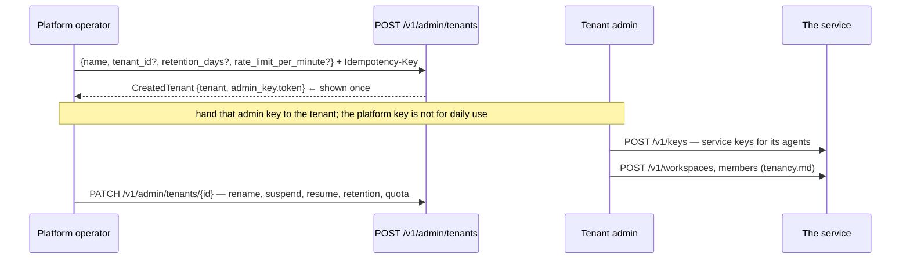

# Admin and operations: onboarding a tenant, and is it healthy?

Two audiences on one page. **Admin** is the platform operator creating tenants — the only caller
above the tenant wall. **Operations** is the probes and the version endpoint, which exist so a
deployment can tell "starting", "degraded" and "broken" apart without reading logs.

## Onboarding



| Route | Purpose | SDK (`memory.admin`) |
| --- | --- | --- |
| `POST /v1/admin/tenants` | onboard a tenant and receive its first admin key (shown once) | `admin.create_tenant(name, tenant_id=…, retention_days=…, rate_limit_per_minute=…)` |
| `GET /v1/admin/tenants` | list tenants (cursor: the last `tenant_id` seen) | `admin.tenants()`, `admin.tenants_page()` |
| `GET /v1/admin/tenants/{tenant_id}` | one tenant | `admin.get_tenant(id)` |
| `PATCH /v1/admin/tenants/{tenant_id}` | rename, suspend or resume; set retention and the request quota | `admin.update_tenant(id, **changes)` |

```python
created = await memory.admin.create_tenant(
    "Acme GmbH",
    tenant_id="acme",
    retention_days=365,
    rate_limit_per_minute=600,
    idempotency_key="onboard-acme-2026-09",  # a retry returns the tenant, token=None
)
print(created.tenant.tenant_id, created.admin_key.token)  # the token is shown once
```

A suspended tenant's own administrators are suspended with it — resuming is the platform's job, not
theirs. Retention and the request quota are per tenant, and a tenant with neither set inherits the
deployment's defaults.

## Operations

| Route | Answers | Status |
| --- | --- | --- |
| `GET /health/live` | is the process up? | always `200 {"status": "ok"}` |
| `GET /health/ready` | can it serve? | `200` when `ready` or `degraded`, **`503`** when `not_ready` |
| `GET /version` | what is running, and is it what was asked for? | `200` |
| `GET /metrics` | Prometheus metrics for the worker that answered this scrape | `200` |

There is no bare `/health` — `live` and `ready` answer two different questions, and a single
endpoint would have to lie about one of them. Both are excluded from tracing and from the request
log, so a probe every second does not become the loudest thing in your telemetry.

### `GET /health/ready` and its dependencies

```bash
curl -s http://localhost:8080/health/ready | jq
```

```json
{
  "status": "ready",
  "dependencies": {
    "postgres":   {"ok": true,  "mandatory": true,  "error": null},
    "task_queue": {"ok": true,  "mandatory": true,  "error": null},
    "qdrant":     {"ok": true,  "mandatory": true,  "error": null},
    "blob":       {"ok": true,  "mandatory": true,  "error": null},
    "openfga":    {"ok": true,  "mandatory": true,  "error": null},
    "cache":      {"ok": false, "mandatory": false, "error": "TimeoutError"},
    "llm":        {"ok": true,  "mandatory": false, "error": null}
  }
}
```

| Dependency | Mandatory | What it is | Down means |
| --- | --- | --- | --- |
| `postgres` | **yes** | the system of record: observations, memories, jobs, tenancy, audit | `not_ready`, `503` |
| `task_queue` | **yes** | the outbox worker's queue; without it a write is acknowledged and never processed | `not_ready`, `503` |
| `qdrant` | **yes** | the vector store behind retrieval | `not_ready`, `503` |
| `blob` | **yes** | uploaded document bytes | `not_ready`, `503` |
| `openfga` | **yes** | the authorization store that decides audiences | `not_ready`, `503` |
| `cache` | no | Dragonfly/Redis-protocol cache in front of hot reads | `degraded`, still `200` |
| `llm` | no | the Bifrost gateway, when model use is enabled at all | `degraded`, still `200` |

The three states are deliberate: `ready` (everything answered), `degraded` (an optional provider is
down — served with `200`, because refusing traffic because a *cache* is down is worse than serving
it), `not_ready` (a mandatory store is down — `503`, so a load balancer takes this instance out).
A dependency that is configured off is not a dependency and does not appear.

Which dependencies are registered depends on the deployment: a container that runs with stand-ins
(an in-memory cache, a local Qdrant path, an inline queue) registers fewer rows, so the set above
is the full production shape rather than a fixed list.

### `GET /version`

```json
{
  "service": "trellis-memory",
  "version": "0.2.0",
  "api_version": "v1",
  "environment": "prod",
  "degraded": ["document_parser: configured 'docling', running 'builtin'"],
  "providers": {
    "cache": "dragonfly", "search": "qdrant", "blob": "s3", "tasks": "procrastinate",
    "authorization": "openfga", "embedding": "ibm-granite/granite-embedding-small-english-r2",
    "llm": "bifrost", "memory_intelligence": "native",
    "graph_enrichment": "native", "document_parser": "builtin"
  }
}
```

`providers` reports what is **running**, not what was configured, and `degraded` names every place
the two disagree: a document parser that fell back to the builtin, an NLI head running a
non-representative stand-in (grounding verdicts are weak). This is the endpoint to check before believing a number from a benchmark: a run whose
`degraded` list is non-empty measured something other than the configured system.

## What this area does not do

* it does not let a tenant admin create or resume a tenant — that is the platform key;
* it does not show an admin key twice;
* it does not make readiness a health *history*: it is the answer right now, and `/metrics` plus
  `dependency_up` is where the history lives;
* it does not report a configured provider as running — see `degraded`.
