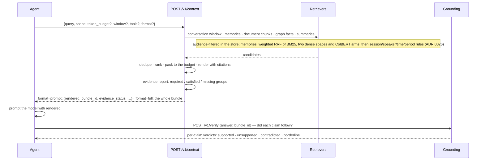

# Context: what goes into the prompt, and whether the answer followed from it

One call assembles everything relevant to this turn, ranked, deduplicated, inside a token budget,
with an evidence report saying what it could *not* find. That is the call an agent should be
making — `POST /v1/context`. The rest of this area exists for when you need a part of it: the
ranked items alone (`recall`), the conversation alone (`threads`/`messages`), a standing question
kept warm (a profile block with a `source_query`), or a check on the answer you produced (`verify`).

## One turn



The evidence report is the part people skip and then wish they had not. `status` is `COMPLETE`,
`INCOMPLETE` or `INSUFFICIENT`, with `required_groups`, `satisfied_groups` and `missing_groups`:
the service is telling you it could not find what an answer to *this* question needs. The
default (`format="prompt"`) response carries it as `evidence_status`; `format="full"` carries
the whole report as `evidence`. Nothing raises on `INSUFFICIENT` — there is no
`require_evidence` flag — so check it yourself and answer that you do not know rather than
answer from a bundle that cannot support it.

## Routes

| Route | Purpose | SDK |
| --- | --- | --- |
| `POST /v1/context` | the context for this turn: rendered (`format="prompt"`, the default) or the whole bundle (`format="full"`) | `ctx.context(query, token_budget=…, tools=[names], window=…, document_ids=…, format=…, debug=…)` |
| `POST /v1/recall` | ranked, scope-filtered items, no bundle assembly | `ctx.search(query, limit=…, kinds=[…], time_from=…, time_to=…, as_of=…, known_at=…, document_ids=…)`; kinds: `memory`, `chunk`, `summary`, `episode`, `message` |
| `POST /v1/verify` | verify an answer claim by claim against the context it was given; with a run, recorded as the judge's RUN feedback | `ctx.verify(answer, bundle_id=…, run_id=…)` |
| `GET /v1/threads/{id}` | one thread, with its durable `summary` once it has one | `ctx.history.thread()` |
| `PATCH /v1/threads/{id}` | title and metadata (creates the thread when it does not exist yet) | `ctx.history.update(title=…, metadata=…)` |
| `DELETE /v1/threads/{id}` | soft-delete a thread | `ctx.history.delete()` |
| `POST /v1/messages` | append a batch of messages; `role: "EVENT"` is something that happened | `ctx.history.add([...])` |
| `GET /v1/threads/{id}/messages` | the window, newest page last | `ctx.history(limit=…, include_internal=…)` |
| `GET /v1/messages/{id}` | one message | `ctx.history.message(id)` |

## The bundle

```python
prompt = await ctx.context("how did revenue develop?", token_budget=4000)
prompt.rendered, prompt.bundle_id, prompt.evidence_status, prompt.token_estimate
prompt.tool_candidates  # only when tools=[...] was given

bundle = await ctx.context(
    "how did revenue develop?", token_budget=4000, tools=tool_names, format="full"
)

bundle.rendered  # prompt-ready text, with citation markers
bundle.profile  # pinned blocks of the user, agent and workspace   (profile.md)
bundle.thread_summary  # the thread's durable summary: text, covers_to_sequence, version
bundle.conversation  # ConversationWindow: the messages after the summary that fit
bundle.procedures  # procedures learned for this task: id, title, steps, success_rate
bundle.tools  # tool hints (only when asked): candidates, plan, next, prefill, missing
bundle.memories  # durable facts and preferences      (ContextItem)
bundle.knowledge  # document passages, with document, page and evidence
bundle.graph_facts  # entity relations
bundle.summaries  # document and section summaries
bundle.evidence.status  # COMPLETE | INCOMPLETE | INSUFFICIENT
bundle.evidence.missing_groups
bundle.bundle_id, bundle.handles  # what /v1/verify and the [m1] handles refer to
bundle.token_estimate, bundle.token_budget, bundle.cache_hit
bundle.insufficient  # status == "INSUFFICIENT", as a boolean
```

The pinned sections — profile, thread summary, procedures, tool hints, in that order — open
`rendered` and may take at most half of `token_budget` (in that priority); ranked evidence fills
the rest - but only evidence that clears the encoder's relevance floor: every ranked memory,
chunk and summary carries its dense similarity to the question as `relevance` (0..1), and one
under the floor (0.20 for the shipped multilingual encoder) is not packed, so a question the
store cannot answer comes back nearly empty instead of full of whatever ranked next
(`diagnostics.below_relevance_floor` counts them). Exact identifier hits and expansion
companions are exempt. They are one indexed read each and run concurrently with retrieval; none of them calls
a model. Memories an agent's own pulls kept using for requests of the same pattern are
pre-included ([agent-tools.md](agent-tools.md)). `window=False` leaves the conversation window
out, for a framework that keeps its own history. The cache key includes the `tools` request.

`rendered` presents memory as evidence to weigh with ids to cite — not as instructions to follow.
That framing is deliberate: a retrieved passage is data, and an agent that treats it as a command
is one prompt-injection away from a problem.

## Reads call a model only when the tenant's policy says so

Whether a read consults a model is the tenant's model policy, `read_assist`
(`PUT /v1/model-key/policy`); a request cannot override it — there is no per-request
`use_llm`. Even then only the read uses the policy's `uses` name run (`query_expansion` for a
question no rule classified, `entity_resolution` on the graph route, `grounding_judge` for
borderline claims in `/v1/verify`), and only when a model key can pay
([tenancy.md](tenancy.md)); the response header `X-Trellis-LLM-Tokens` says what the request
spent. Query decomposition was removed in 0.3.0. The pinned sections never call a
model: summaries, profiles and procedure titles are written in the background. With no key,
the deterministic path answers.

## Verifying an answer

```python
report = await ctx.verify(answer_text, bundle_id=prompt.bundle_id)  # run_id= to record it on a run
print(report.supported, report.unsupported, report.contradicted, report.borderline)
print(report.per_claim_hallucination_rate, report.nli_provider, report.representative)
for verdict in report.claims:
    print(verdict.verdict, verdict.claim)  # supported | unsupported | contradicted | borderline
```

The cascade is deterministic first: citations are resolved, then an NLI head scores each claim
against its best premises, and a contradiction scan runs. Only the borderline band is a candidate
for a model, and only when the policy allows `grounding_judge` with `read_assist` on and a key
can pay. With a run (`run_id`, or the scope's agent run) the verdict is recorded as RUN feedback
from the service's own judge (`source="judge"`, applied without review —
[feedback.md](feedback.md)); `report.feedback_id` names it. This is the same endpoint the
harness's grounded judge uses before it is willing to spend anything on an LLM judge.

## Conversation

```python
thread = await ctx.history.update(title="Q3 planning")  # optional; messages also create one
await ctx.history.add(
    [
        ("USER", "Revenue was EUR 412 million in FY26."),
        ("ASSISTANT", "Noted — that's up 4% year on year."),
        {"role": "AGENT", "content": "plan: check the FY25 figure", "kind": "INTERNAL"},
    ]
)
for message in await ctx.history(limit=20):
    print(message.role, message.content[:60])
```

`history.*` needs a `thread_id` (without one, an agent run's messages go to the thread
named by its run id). `session_id` and `turn_id` are optional and are the application's
own ids when given: a `turn_id` belongs to the session that created it, and a session belongs
to a thread. Without them a message joins the thread's own session, a USER message opens the
thread's next turn and any other message joins its latest turn; the acknowledgement returns the
ids used. Without a turn the SDK sends a fresh idempotency key per call, so two identical
messages ("ok") are two messages. `remember`, `observe`, `recall` and `context` need none of
that — a tenant is enough.
Internal messages stay out of the window unless `include_internal=True`.

## A standing question, kept warm

```python
block = await ctx.profile.edit(
    "user.suppliers", source_query="Which suppliers does this team buy from, and on what terms?"
)
```

A profile block with a `source_query` is that question's answer. The `profile.query` job builds a
context for it in the scope that set it and writes the answer into the block (by the tenant's
model under the `summaries` use when a key is registered, the best evidence line by line
otherwise) — when the question is set and hourly after. Reading it is reading the profile: it is
pinned into every bundle and never generates text on the read path. `source_query=None` clears
the question and keeps the last answer.
