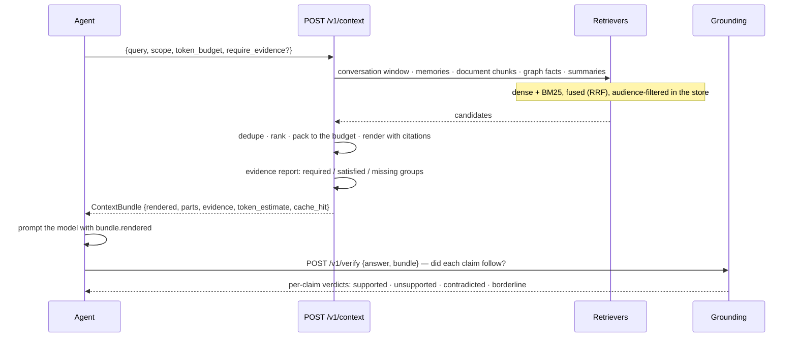

# Context: what goes into the prompt, and whether the answer followed from it

One call assembles everything relevant to this turn, ranked, deduplicated, inside a token budget,
with an evidence report saying what it could *not* find. That is the call an agent should be
making — `POST /v1/context`. The rest of this area exists for when you need a part of it: the
ranked items alone (`recall`), the conversation alone (`threads`/`messages`), a standing question
kept warm (`briefs`), or a check on the answer you produced (`verify`).

## One turn



The evidence report is the part people skip and then wish they had not. `status` is `COMPLETE`,
`INCOMPLETE` or `INSUFFICIENT`, with `required_groups`, `satisfied_groups` and `missing_groups`:
the service is telling you it could not find what an answer to *this* question needs. With
`require_evidence=True` an `INSUFFICIENT` report raises `InsufficientEvidence` instead of
handing you a bundle you might answer from anyway.

## Routes

| Route | Purpose | SDK |
| --- | --- | --- |
| `POST /v1/context` | build a `ContextBundle` for this turn | `ctx.context(query, token_budget=…, require_evidence=…)` |
| `POST /v1/recall` | ranked, scope-filtered items, no bundle assembly | `ctx.search(query, limit=…, kinds=["chunk", "memory", "summary"])` |
| `POST /v1/verify` | verify an answer claim by claim against evidence | `ctx.verify(answer, bundle=…)` |
| `POST /v1/threads` | create (or idempotently fetch) a thread | `ctx.chat.create(title=…)` |
| `GET /v1/threads/{id}` | one thread | `ctx.chat.thread()` |
| `DELETE /v1/threads/{id}` | soft-delete a thread | `ctx.chat.delete_thread()` |
| `POST /v1/messages` | append a message | `ctx.chat.user(...)`, `.assistant(...)`, `.internal(...)` |
| `GET /v1/threads/{id}/messages` | the window, newest page last | `ctx.history(limit=…, include_internal=…)` |
| `GET /v1/messages/{id}` | one message | `ctx.chat.message(id)` |
| `POST/PUT/GET/DELETE /v1/briefs…` | standing questions and knowledge pages | `ctx.briefs.*` |

## The bundle

```python
bundle = await ctx.context("how did revenue develop?", token_budget=4000)

bundle.rendered  # prompt-ready text, with citation markers
bundle.conversation  # ConversationWindow: thread_id, message_ids, rendered, summary
bundle.memories  # durable facts and preferences      (ContextItem)
bundle.knowledge  # document passages, with document, page and evidence
bundle.graph_facts  # entity relations
bundle.summaries  # rolling summaries
bundle.evidence.status  # COMPLETE | INCOMPLETE | INSUFFICIENT
bundle.evidence.missing_groups
bundle.token_estimate, bundle.token_budget, bundle.cache_hit
bundle.insufficient  # the status, as a boolean
bundle.evidence_items()  # the packed evidence as /v1/verify items, in citation order
```

`rendered` presents memory as evidence to weigh with ids to cite — not as instructions to follow.
That framing is deliberate: a retrieved passage is data, and an agent that treats it as a command
is one prompt-injection away from a problem.

## Reads never call a model unless you say so

Every read takes `use_llm` and it defaults to **False**, independently of whatever ingestion is
configured to do. `use_llm=True` permits the configured read helpers (query expansion, a
grounding judge in the borderline band, brief synthesis) and needs a model key the caller is
entitled to ([tenancy.md](tenancy.md)); the response header `X-Trellis-LLM-Tokens` says what the
request spent. With no key and no permission, the deterministic path answers — which is the
normal case.

## Verifying an answer

```python
report = await ctx.verify(answer_text, bundle=bundle)
print(report.supported, report.unsupported, report.contradicted, report.borderline)
print(report.per_claim_hallucination_rate, report.nli_provider, report.representative)
for verdict in report.claims:
    print(verdict.verdict, verdict.claim)  # supported | unsupported | contradicted | borderline
```

The cascade is deterministic first: citations are resolved, then an NLI head scores each claim
against its best premises, and a contradiction scan runs. Only the borderline band is a candidate
for a model, and only with `use_llm=True`. This is the same endpoint the harness's grounded judge
uses before it is willing to spend anything on an LLM judge.

## Conversation

```python
thread = await ctx.chat.create(title="Q3 planning")  # idempotent; messages also create one
await ctx.chat.user("Revenue was EUR 412 million in FY26.")
await ctx.chat.assistant("Noted — that's up 4% year on year.")
await ctx.chat.internal("plan: check the FY25 figure", role="AGENT")  # kind=INTERNAL
for message in await ctx.history(limit=20):
    print(message.role, message.content[:60])
```

`chat.*` needs `thread_id`. `session_id` and `turn_id` are optional and are the application's
own ids when given: a `turn_id` belongs to the session that created it, and a session belongs
to a thread. Without them a message joins the thread's own session, a USER message opens the
thread's next turn and any other message joins its latest turn; the acknowledgement returns the
ids used. Without a turn the SDK sends a fresh idempotency key per call, so two identical
messages ("ok") are two messages. `remember`, `observe`, `recall` and `context` need none of
that — a tenant is enough.
Internal messages stay out of the window unless `include_internal=True`.

## Briefs: a standing question, kept warm

```python
from trellis.memory import BriefSpec

brief = await ctx.advanced.briefs.create(
    BriefSpec(
        kind="mental_model",  # or "knowledge_page"
        title="Supply risk for SKU-1",
        question="What threatens SKU-1 availability this quarter?",
        refresh_seconds=3600,  # 60 … 86400
        use_llm=False,  # synthesis stays deterministic unless permitted
    )
)
fresh = await ctx.advanced.briefs.get(brief.brief_id)  # a read: never generates, may be stale
print(fresh.status, fresh.output.text if fresh.output else None)
```

A brief is a definition plus its stored output. **Reading one never generates text** — it returns
what is stored with `status` `pending`, `ready` or `stale`, and a refresh is queued by the write
path. That is what makes a brief cheap to read on every turn.
