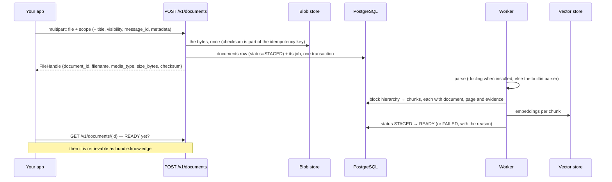

# Documents: a file becomes retrievable knowledge

Upload a file; it comes back as document passages an agent can cite, with the page they came from.
Ingestion is asynchronous and the upload is a `202`-shaped handshake: the document exists
immediately, its chunks do not.

## From upload to citable passage



## Routes

| Route | Purpose | SDK |
| --- | --- | --- |
| `POST /v1/documents` | ingest a file into RAG memory (multipart) | `ctx.advanced.documents.add(file, …)` |
| `GET /v1/documents/{document_id}` | status, versions, archive state | `ctx.advanced.documents.document(id)`, `ctx.advanced.documents.wait_ready(id)` |
| `POST /v1/files` | deprecated alias of `POST /v1/documents` (ADR 0022; removed in 0.3.0) | — (the SDK speaks `ctx.advanced.documents.add`) |

## Ingesting

```python
handle = await ctx.advanced.documents.add(
    "reports/fy26.pdf",  # bytes, a path, or (filename, bytes, media_type)
    title="FY26 annual report",
    visibility="WORKSPACE",  # default: the thread, else the user
    quarter="FY26",  # anything extra is custom metadata
)

info = await ctx.advanced.documents.wait_ready(handle.document_id, max_wait=60, interval=0.5)
print(info.status, info.archive_status)  # STAGED · READY · FAILED
```

Then it simply appears where an agent already looks:

```python
bundle = await ctx.context("what does the FY26 report say about EBITDA?")
for item in bundle.knowledge:
    print(item.citation, item.document_id, item.page, item.text[:80])
```

`visibility` decides who can retrieve it, and the prerequisite bites here more than anywhere else:
a THREAD-visible document is readable by thread participants, so the thread must exist (the
service creates it from the scope); a WORKSPACE-visible document needs a workspace row and
membership ([tenancy.md](tenancy.md)). Attaching a document to a message is one call —
`ctx.chat.user("see attached", attachments=[path])` — and the document inherits that message's
thread.

## Idempotency

The key the SDK derives covers the **bytes and the form**: the checksum plus filename, media type,
message id, title, visibility and metadata. Identical bytes uploaded under a different name are a
different document, not a replay — which is what you want when the same PDF arrives as
`report.pdf` and `report-final.pdf`, and also what stops a retried upload from producing two.

## Parsing, honestly

| Parser | When | What it costs you |
| --- | --- | --- |
| docling | installed in the image (its models are baked next to the weights) | PDF/DOCX/PPTX/XLSX/HTML/images with layout and tables |
| the builtin parser | docling absent | markdown, text and HTML only; a PDF degrades to extracted text |

`GET /version` reports which one is *running* — not which one was configured — and lists
`document_parser: configured 'docling', running 'builtin'` under `degraded` when they differ. A
service that reported the request rather than the reality would be worse than silent.

## What this area does not do

* no page-level update: a new version is a new upload (the document keeps its id and versions);
* no synchronous ingestion, and no "ready" promise on the upload response;
* no OCR claim beyond what the installed parser does — check `GET /version`.
