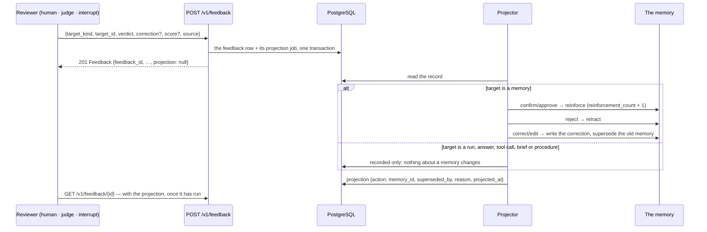

# Feedback: a judgement, and what it changes

Feedback is not a rating column. A verdict on a **memory** changes that memory — it is reinforced,
retracted, or superseded by a correction — and a verdict on a run, an answer, a tool call, a brief
or a procedure is the record learning reads later. Human verdicts, judge verdicts and interrupt
decisions land in one table with one shape, so nothing downstream has to know which it was reading
(ADR 0023).

## From verdict to consequence



The projection is a separate, later fact, which is why `GET` is worth doing: a `POST` answers
before the projector runs, so the record you get back has `projection: null`.

## Routes

| Route | Purpose | SDK |
| --- | --- | --- |
| `POST /v1/feedback` | record a judgement on a run, answer, memory, tool call, brief or procedure | `ctx.feedback.submit(...)` |
| `GET /v1/feedback/{feedback_id}` | one record, with its projection once it has run | `ctx.feedback.get(id)` |
| `GET /v1/feedback?target_kind=…&target_id=…` | the feedback on one target, newest first (cursor paged) | `ctx.feedback.list_for(...)`, `ctx.feedback.page_for(...)` |

## The vocabulary

| Field | Values |
| --- | --- |
| `target_kind` | `run` · `answer` · `memory` · `tool_call` · `brief` · `procedure` |
| `verdict` | `confirm` · `reject` · `correct` · `approve` · `edit` |
| `source` | `human` · `judge` · `interrupt` |

`approve` and `edit` are the interrupt vocabulary: a person approving a tool call, or approving it
with different arguments, is feedback as much as a thumbs-up is — and recording it that way is what
lets "what did people actually let this agent do?" be answered later.

## Submitting

```python
# a person corrects a memory
await ctx.feedback.submit(
    "memory",
    memory_id,
    "correct",
    correction="The reorder threshold is 12 days, not 10.",
    comment="confirmed with planning",
    reviewer="planner-7",
)

# an online judge scores a run
await ctx.feedback.submit(
    "run",
    run_id,
    "confirm",
    score=0.93,
    source="judge",
    reviewer="judge:gpt-4.1-nano",
)

record = await ctx.feedback.get(feedback_id)
print(record.projection.action if record.projection else "not projected yet")

page = await ctx.feedback.page_for("memory", memory_id, limit=50)
print([f.verdict for f in page.items], page.next_cursor)
```

The identity fields — tenant, workspace, user, agent, agent run — come from the bound context and
nothing else of the scope travels in the body. `reviewer` is a label, not an identity: a machine
verdict is `source="judge"` with `reviewer="judge:<model>"`, so no human is ever credited with a
model's opinion.

A retry with the same `feedback_id` (or an `Idempotency-Key`) returns the stored record rather than
writing a second one — which matters for a judge that samples the same run twice.

## What a verdict may need

An affirming verdict needs what reading that target needs. A verdict that **retracts or rewrites**
a memory needs more than read access to it — the service checks that the caller may change it, not
merely see it, so a viewer cannot delete a team's memory by disagreeing with it.

## What this area does not do

* it does not let a judge become its own ground truth: the harness's `DatasetBuilder` excludes
  `source="judge"` when it builds an offline dataset from what happened;
* it does not project a verdict on anything other than a memory — the other target kinds are
  recorded, and reading them is the point;
* it does not delete: a retraction closes a memory's validity and keeps the record.
