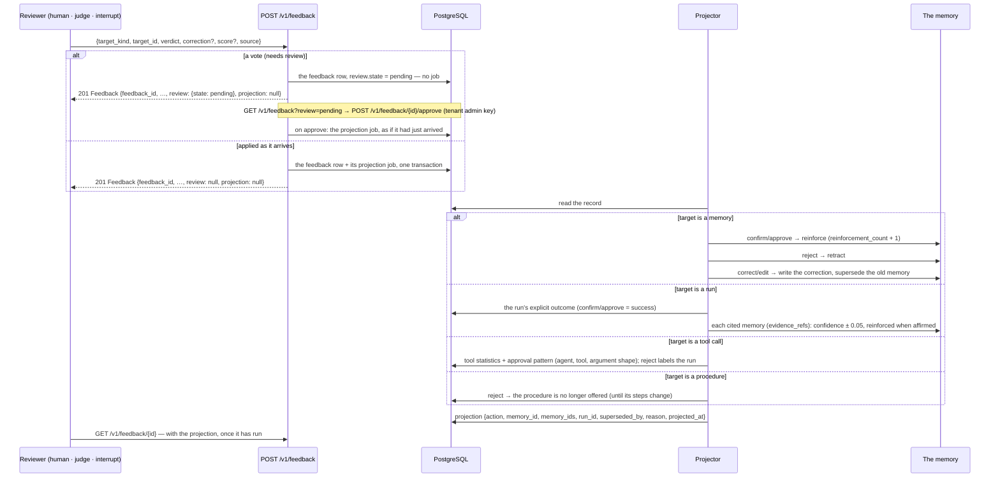

# Feedback: a judgement, and what it changes

Feedback is not a rating column. A verdict on a **memory** changes that memory — it is reinforced,
retracted, or superseded by a correction; a verdict on a **run** is its explicit outcome, and moves the
confidence of the memories its answer cited (`evidence_refs`); a verdict on a **tool call** counts toward the tool's statistics and its approval
pattern; rejecting a **procedure** stops it being offered. Human verdicts, judge verdicts, interrupt
decisions and a run's own status land in one table with one shape, so nothing downstream has to
know which it was reading (ADR 0023).

**A vote waits for review before it changes anything (ADR 0028).** A verdict that would change
what was learned on a person's or an agent's word alone is stored with `review.state=pending`
and changes nothing — no confidence, reinforcement, run outcome, procedure or index — until the
tenant's administrator approves it. See [Review](#review-what-applies-now-and-what-waits).

## From verdict to consequence



The projection is a separate, later fact, which is why `GET` is worth doing: a `POST` answers
before the projector runs, so the record you get back has `projection: null`.

An answer's `evidence_refs` name what it cited (`{"source_type": "memory", "source_id":
"mem_…"}`; `source_type` is one of the service's evidence sources: `memory`, `message`, `file`,
`document_chunk`, `agent_result`, `tool_result`, `import`, `observation`, `statement`,
`graph_fact`, `summary`, `episode`, `feedback`); each must be a memory the reviewer may read, or the `POST` is refused. Memory
standing — confidence and reinforcement — is part of the retrieval ranking: a bounded factor
(at most ±15%) on the fused score, so it reorders near-ties and never outweighs relevance.

## Routes

| Route | Purpose | SDK |
| --- | --- | --- |
| `POST /v1/feedback` | record a judgement on a run, memory, tool call or procedure | `ctx.feedback(...)` |
| `GET /v1/feedback/{feedback_id}` | one record, with its projection once it has run | `ctx.feedback.get(id)` |
| `GET /v1/feedback?target_kind=…&target_id=…` | the feedback on one target, newest first (cursor paged) | `ctx.feedback.page_for(...)` |
| `GET /v1/feedback?review=pending` | the review queue (tenant admin key): verdicts that change nothing until approved, newest first, each with `author_record` | `ctx.feedback.pending(limit=…, cursor=…)` |
| `GET /v1/feedback/pending` | **deprecated** alias of the queue, answered with `Deprecation: true` and `Link: rel="successor-version"` | — |
| `POST /v1/feedback/{feedback_id}/approve` | apply a pending verdict as if it had just arrived; optional `{"note": …}`; 409 when it is not pending | `ctx.feedback.approve(id, note=…)` |
| `POST /v1/feedback/{feedback_id}/dismiss` | keep a pending verdict for statistics, never apply it; optional `{"note": …}`; 409 when it is not pending | `ctx.feedback.dismiss(id, note=…)` |

## The vocabulary

| Field | Values |
| --- | --- |
| `target_kind` | `run` · `memory` · `tool_call` · `procedure` |
| `verdict` | `confirm` · `reject` · `correct` · `approve` · `edit` |
| `source` | `human` · `judge` · `interrupt` · `system` (a run's own final status, as the harness reports it) |

`approve` and `edit` are the interrupt vocabulary: a person approving a tool call, or approving it
with different arguments, is feedback as much as a thumbs-up is — and recording it that way is what
lets "what did people actually let this agent do?" be answered later.

## Submitting

```python
# a person corrects a memory
await ctx.feedback(
    "memory",
    memory_id,
    "correct",
    correction="The reorder threshold is 12 days, not 10.",
    comment="confirmed with planning",
    reviewer="planner-7",
)

# an external judge scores a run: a client-claimed source="judge" is a vote, so it waits
# for review (only the service's own /v1/verify verdict is applied as it arrives)
vote = await ctx.feedback(
    "run",
    run_id,
    "confirm",
    score=0.93,
    source="judge",
    reviewer="judge:gpt-4.1-nano",
)
print(vote.review.state if vote.review else "applied")  # "pending"

record = await ctx.feedback.get(feedback_id)
print(record.projection.action if record.projection else "not projected yet")

page = await ctx.feedback.page_for("memory", memory_id, limit=50)
print([f.verdict for f in page.items], page.next_cursor)
```

The identity fields — tenant, workspace, user, agent, agent run — come from the bound context and
nothing else of the scope travels in the body. `reviewer` is a label, not an identity: a machine
verdict is `source="judge"` with `reviewer="judge:<model>"`, so no human is ever credited with a
model's opinion.

A retry with the same `feedback_id` (or an `Idempotency-Key`) returns the stored record rather than
writing a second one — which matters for a judge that samples the same run twice.

## Review: what applies now and what waits

Applied as it arrives (`review: null`), because none of these is a vote:

* the service's own grounding judge — the verdict `POST /v1/verify` records on a run;
* a run reporting its own status: `source="system"`, `target_kind="run"`, the target is the
  calling scope's `agent_run_id`, and it cites no memories (`evidence_refs` empty) — the
  lowest-ranked word on a run, which never overrides a person or the judge;
* an owner's `reject`, `correct` or `edit` of their own memory (already limited to the owner,
  the user an agent acts for, or a tenant admin — the rule that governs forgetting);
* any verdict on a `tool_call` (what it teaches is an approval *suggestion*, which changes
  nothing until it is accepted — [tools.md](tools.md));
* anything sent with the tenant's admin key (or the platform key), or by a tenant admin user
  in person (never an agent acting for one).

Everything else waits (`review.state = "pending"`): a `confirm`/`approve` of a memory by a
non-admin, a verdict on a run from a person or a client (including a client-claimed
`source="judge"`, and a `system` verdict that cites memories or names another run), and any
verdict on a procedure.

The tenant's administrator works the queue with the admin key:

```python
admin = MemoryClient(url, api_key=tenant_admin_key).bind()  # the key names the tenant
page = await admin.feedback.pending(limit=50)
for vote in page.items:
    print(vote.target_kind, vote.target_id, vote.verdict, vote.source, vote.author_record)
    # author_record: how this author's verdicts fared in review - {pending, approved, dismissed}
    await admin.feedback.approve(vote.feedback_id, note="matches the signed contract")
    # or: await admin.feedback.dismiss(vote.feedback_id, note="duplicate vote")
```

A verdict is decided once: approving or dismissing one that is not pending is a `409`. An
approved verdict is projected exactly as if it had just arrived; a dismissed one gets a
projection with `action: none` and `reason: "dismissed in review"`, and stays readable for
statistics. Without anyone working the queue, votes accumulate and the platform learns nothing
from them. A run verdict's own evidence and the judge's verdict on the same run
(`GET /v1/feedback?target_kind=run&target_id=…`) are what a reviewer weighs a thumbs-down against.

## What a verdict may need

An affirming verdict needs what reading that target needs. A verdict that **retracts or rewrites**
a memory needs more than read access to it — the service checks that the caller may change it, not
merely see it, so a viewer cannot delete a team's memory by disagreeing with it.

## What this area does not do

* it does not let a judge become its own ground truth: every record keeps its `source`
  (`human`, `judge`, `interrupt`), so whoever builds an offline dataset from what happened can
  leave out `source="judge"`;
* it does not apply a vote on its own: until the tenant's administrator approves it, a
  pending verdict is a record and nothing more;
* it does not delete: a retraction closes a memory's validity and keeps the record.
