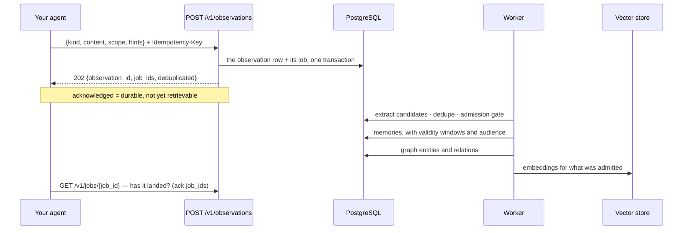

# Memory: observations in, memories out

You do not write memories. You write **observations** — things that happened, or things you know
— and the service decides what becomes a durable memory, how it relates to what it already holds,
and when it stops being true. That asymmetry is the whole design: a caller that could write
memories directly would also own deduplication, contradiction and decay, and every caller would
own them differently.

## What one observation becomes



The admission gate is why a chatty agent does not fill the store: a candidate is scored on
worthiness, novelty, confidence and expected utility, and is admitted, deferred or rejected.
Deduplication is lexical *and* dense, so the same fact said twice is one memory with two pieces
of evidence.

## Routes

| Route | Purpose | SDK |
| --- | --- | --- |
| `POST /v1/observations` | submit an observation (durably acknowledged, processed asynchronously) | `ctx.observe(...)`, `ctx.remember(...)` |
| `GET /v1/memories` | the inventory: current memories anchored to the caller's scopes, newest first (cursor paged) | `ctx.memories()`, `ctx.memories_page()`, `ctx.iter_memories()` |
| `GET /v1/memories/{memory_id}` | one memory, with its evidence and temporal state | `ctx.get_memory(id)` |
| `DELETE /v1/memories/{memory_id}` | forget: soft delete plus index removal | `ctx.forget(id)` |
| `POST /v1/graph/query` | resolve entities and traverse the knowledge graph (bounded, visibility-filtered) | `ctx.graph.query(...)` |
| `GET /v1/jobs/{job_id}` | has the processing for that write finished? | `ctx.job(job_id)` |

`kind` is a closed vocabulary — `MESSAGE`, `FILE`, `AGENT_RESULT`, `TOOL_RESULT`, `DECISION`,
`FEEDBACK`, `EVENT`, `IMPORT` — and anything else is refused rather than stored as a surprise.

## `observe` versus `remember`

```python
# "this happened": let the service classify, extract and decide
await ctx.observe(
    "Stock check for SKU-1 returned 95 units at EU-1.",
    kind="EVENT",
    sku="SKU-1",  # anything extra is custom metadata
)

# "I know this": state the type, the lifetime and the audience yourself
await ctx.remember(
    "The planner prefers weekly digests over per-event alerts.",
    memory_type="PREFERENCE",  # SEMANTIC · EPISODIC · PROCEDURAL · PREFERENCE · DECISION · OUTCOME · FAILURE · SHARED
    lifetime="LONG_TERM",  # EPHEMERAL · SHORT_TERM · LONG_TERM · ARCHIVAL
    visibility="USER",  # PRIVATE · RUN · AGENT_GROUP · THREAD · USER · WORK · WORKSPACE · TENANT
)
```

`remember` is `observe` with hints; both are idempotent on the key the SDK derives from the scope
and the content, so a retried turn writes one row.

## The inventory, and forgetting

```python
page = await ctx.memories_page(limit=50)
for memory in page.items:
    print(memory.memory_id, memory.memory_type, memory.content[:60])
if page.next_cursor:
    page = await ctx.memories_page(limit=50, cursor=page.next_cursor)

async for memory in ctx.iter_memories(limit=200):  # the cursor, walked for you
    ...

await ctx.forget(memory.memory_id)  # soft delete + index removal; idempotent
```

`memories` is the audit view — "what do we hold about this user, thread or run" — and it is not
ranked. The ranked, query-driven view is `recall` ([context.md](context.md)).

## The knowledge graph

```python
answer = await ctx.graph.query("who supplies SKU-1?", hops=2)
for fact in answer.facts:
    print(fact.subject, fact.predicate, fact.object, fact.valid_from, fact.valid_to)
```

Entities and relations are extracted from the same observations, deterministically, with validity
windows — so "who approved this, and when" is answerable, and a fact that stopped being true is
closed rather than deleted. Traversal is bounded (hops and fan-out) and filtered by the caller's
audience before it walks.

## Waiting, when you must

```python
ack = await ctx.observe("Castor Supply raised lead time to 12 days.", kind="EVENT")
for job_id in ack.job_ids:  # one write can queue more than one job
    job = await ctx.job(job_id)
    while job.status in ("PENDING", "RUNNING", "RETRYING"):
        await asyncio.sleep(0.2)
        job = await ctx.job(job_id)
    print(job_id, job.status, job.attempts, job.last_error)
```

Do this in a test or a script, not in a turn. The reason retrieval does not wait for ingestion is
that a person's question should not queue behind consolidation; the reason the job id exists is
that sometimes you genuinely need to know.

## What this area does not do

* it does not let you write a memory directly — see the first paragraph;
* it does not promise read-after-write;
* it does not take the *identity* from the body. The body's `scope` carries lineage only —
  thread, session, turn, work, task, agent, agent run, parent run — while tenant, workspace and
  user come from the credential and the trusted headers, and a body value that disagrees with a
  trusted header is refused (`… in body does not match trusted header`). The trace id is always
  the request's, never the body's. A `visibility` the resulting scope cannot express is refused
  too ([tenancy.md](tenancy.md)).
