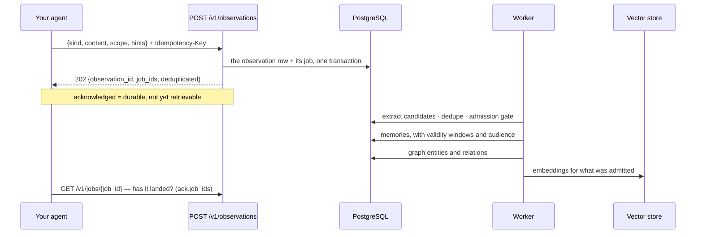

# Memory: statements and observations in, memories out

Two ways in, deliberately different. An **observation** is evidence — something that happened —
and the service decides, asynchronously, what it teaches: what becomes a durable memory, how it
relates to what is already held, and when it stops being true. A **statement** (`remember`) is
the caller asserting a fact: it is stored verbatim as one memory before the call returns, with no
extraction and no admission gate, and a correction to it is a new version (`update`), never an
overwrite.

## What one observation becomes



The admission gate is why a chatty agent does not fill the store: a candidate is scored on
worthiness, novelty, confidence and expected utility, and is admitted, deferred or rejected.
Deduplication is lexical *and* dense, so the same fact said twice is one memory with two pieces
of evidence.

## Routes

| Route | Purpose | SDK |
| --- | --- | --- |
| `POST /v1/observations` | submit an observation (durably acknowledged, processed asynchronously) | `ctx.observe(...)` |
| `POST /v1/memories` | remember a statement verbatim, as one memory, now (deduplicated per owner and scope) | `ctx.remember(...)` |
| `POST /v1/memories/{memory_id}/supersede` | replace a memory with a new version; the old one is closed, not deleted | `ctx.update(id, content, reason=...)` |
| `GET /v1/memories` | the inventory: current memories anchored to the caller's scopes, newest first (cursor paged) | `ctx.advanced.memories.list()`, `ctx.advanced.memories.page()`, `ctx.advanced.memories.iter()` |
| `GET /v1/memories/{memory_id}` | one memory, with its evidence and temporal state | `ctx.advanced.memories.get(id)` |
| `DELETE /v1/memories/{memory_id}` | forget: soft delete plus index removal | `ctx.forget(id)` |
| `POST /v1/graph/query` | resolve entities and traverse the knowledge graph (bounded, visibility-filtered; `layers`, `as_of`, `valid_at`) | `ctx.advanced.graph.query(...)` |
| `GET /v1/graph/entities` | search visible entities by name prefix (`q`) and `type`, most mentioned first | `ctx.advanced.graph.entities(...)` |
| `GET /v1/graph/entities/{entity_id}` | an entity's profile: current value per predicate, relations, history, evidence | `ctx.advanced.graph.entity(id)` |
| `GET /v1/jobs/{job_id}` | has the processing for that write finished? | `ctx.advanced.job(job_id)` |

`kind` is a closed vocabulary — `MESSAGE`, `FILE`, `AGENT_RESULT`, `TOOL_RESULT`, `DECISION`,
`FEEDBACK`, `EVENT`, `IMPORT` — and anything else is refused rather than stored as a surprise.

## `observe` versus `remember`

```python
# "this happened": let the service classify, extract and decide, later
await ctx.observe(
    "Stock check for SKU-1 returned 95 units at EU-1.",
    kind="EVENT",
    sku="SKU-1",  # anything extra is custom metadata
)

# "this is true": stored as said, now; the id comes back
fact = await ctx.remember(
    "The planner prefers weekly digests over per-event alerts.",
    memory_type="PREFERENCE",  # SEMANTIC · PREFERENCE · EPISODIC · PROCEDURAL · TASK · USER · TOOL · OUTCOME
    lifetime="LONG_TERM",  # SHORT_TERM · LONG_TERM
    visibility="USER",  # PRIVATE · RUN · AGENT_GROUP · THREAD · USER · WORK · WORKSPACE · TENANT
    entities=["weekly digest"],  # linked in the graph
)
print(fact.memory_id, fact.deduplicated)

# a correction is a new version: the old one gets valid_to and superseded_by
new = await ctx.update(fact.memory_id, "The planner prefers daily digests.", reason="changed")
```

Both are idempotent on the key the SDK derives from the scope and the content, so a retried turn
writes one row. `remember` also deduplicates on the content itself: the same statement in the
same scope by the same owner is the memory already stored (`deduplicated=True`). Its index and
graph work are queued with it, so it is readable at once (`get_memory`) and searchable once the
job lands. `update` needs the memory's owner (or the user an agent acts for, or a tenant admin),
and a memory already superseded answers 409.

## The inventory, and forgetting

```python
page = await ctx.advanced.memories.page(limit=50)
for memory in page.items:
    print(memory.memory_id, memory.memory_type, memory.content[:60])
if page.next_cursor:
    page = await ctx.advanced.memories.page(limit=50, cursor=page.next_cursor)

async for memory in ctx.advanced.memories.iter(limit=200):  # the cursor, walked for you
    ...

await ctx.forget(memory.memory_id)  # soft delete + index removal; idempotent
```

`memories` is the audit view — "what do we hold about this user, thread or run" — and it is not
ranked. The ranked, query-driven view is `recall` ([context.md](context.md)).

## The knowledge graph

```python
answer = await ctx.advanced.graph.query("who supplies SKU-1?", hops=2)
for fact in answer.facts:
    print(fact.subject, fact.predicate, fact.object, fact.valid_from, fact.valid_to)
```

Entities and relations are extracted from the same observations, deterministically, with validity
windows — so "who approved this, and when" is answerable, and a fact that stopped being true is
closed rather than deleted. Traversal is bounded (hops and fan-out) and filtered by the caller's
audience before it walks; each hop's limit is spent only on new, visible edges.

Two clocks: `as_of` asks what was *true* at an instant (valid time — a superseded fact that
held then comes back), `valid_at` what had been *asserted* by then and not yet invalidated
(knowledge time). `layers` restricts the walk to `entity`, `temporal`, `causal`,
`structural` and/or `procedural` relations (the last written from recorded tool calls: a call
`used_entity` what its typed argument named, and that entity is `identified_by` the id a tool
returned for it — see [tools.md](tools.md)).

```python
[acme] = await ctx.advanced.graph.entities("acme", entity_type="ORG", limit=1)
print(acme.summary)  # "Acme Corp (ORG): acquired Westfalen; operates in Germany"
profile = await ctx.advanced.graph.entity(acme.entity_id)
for value in profile.current:  # the newest current value of each predicate
    print(value.predicate, value.value)
for fact in profile.history:  # superseded, retracted and invalidated facts
    print(fact.predicate, fact.object, fact.status, fact.valid_to)
```

An entity's `summary` is written by the enrichment job from its strongest current typed facts
— only facts every reader of the entity may read, so a summary never discloses more than the
relations do. With a model key and the `summaries` use the model phrases it (a bounded number
of entities per job); otherwise it is the facts on one line. It is rewritten only when those
facts change.

## Waiting, when you must

```python
ack = await ctx.observe("Castor Supply raised lead time to 12 days.", kind="EVENT")
for job_id in ack.job_ids:  # one write can queue more than one job
    job = await ctx.advanced.job(job_id)
    while job.status in ("PENDING", "RUNNING", "RETRYING"):
        await asyncio.sleep(0.2)
        job = await ctx.advanced.job(job_id)
    print(job_id, job.status, job.attempts, job.last_error)
```

Do this in a test or a script, not in a turn. The reason retrieval does not wait for ingestion is
that a person's question should not queue behind consolidation; the reason the job id exists is
that sometimes you genuinely need to know.

## What this area does not do

* it does not extract anything from a statement, or store an observation synchronously — an
  observation's memories are not readable until its job has run;
* it does not take the *identity* from the body. The body's `scope` carries lineage only —
  thread, session, turn, work, task, agent, agent run, parent run — while tenant, workspace and
  user come from the credential and the trusted headers, and a body value that disagrees with a
  trusted header is refused (`… in body does not match trusted header`). The trace id is always
  the request's, never the body's. A `visibility` the resulting scope cannot express is refused
  too ([tenancy.md](tenancy.md)).
