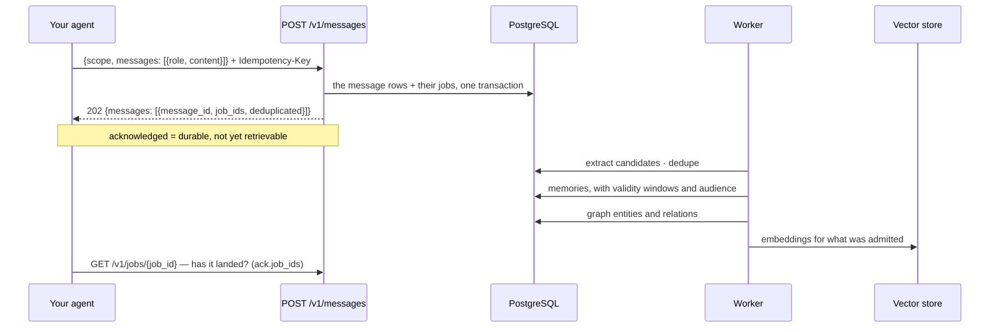

# Memory: statements and events in, memories out

Two ways in, deliberately different. An **event** (a message with `role: "EVENT"`, or any turn of the transcript) is evidence — something that happened —
and the service decides, asynchronously, what it teaches: what becomes a durable memory, how it
relates to what is already held, and when it stops being true. A **statement** (`remember`) is
the caller asserting a fact: it is stored verbatim as one memory before the call returns, with no
extraction and no admission gate, and a correction to it is a new version (`update`), never an
overwrite.

## What one message becomes



Deduplication is lexical *and* dense, so the same fact said twice is one memory with two pieces
of evidence.

### The admission gate

An admission gate (`modules/memory/admission.py`) scores each extracted candidate on worthiness
(type prior and extraction confidence, penalised for transient or generic phrasing), novelty
(what deduplication decided), confidence and expected utility (lifetime × importance ×
recency), and admits, defers or rejects it. It is a **tenant's switch**, off by default:
`admission_gate` on the tenant (`POST`/`PATCH /v1/admin/tenants`, [admin.md](admin.md)). With it
on, a rejected candidate is not stored (the job records it as `IGNORE` with the gate's reasons),
a deferred one waits in working memory and is admitted when it is said again, and every stored
memory carries the decision and its inputs in `system_metadata.admission`. With it off — and for
a tenant with no row, such as the development tenant — every deduplicated candidate is stored,
as before. It is off by default because the retrieval gates were measured with every candidate
kept: on LoCoMo, keeping the verbatim turn is what lifted the retrieval ceiling from 0.098 to
0.685, and a gate that drops a turn drops what retrieval can reach. Statements made with
`remember` are never gated (ADR 0032).

## Routes

| Route | Purpose | SDK |
| --- | --- | --- |
| `POST /v1/messages` | append messages; `role: "EVENT"` is something that happened (durably acknowledged, processed asynchronously) | `ctx.history.add([...])` |
| `POST /v1/memories` | remember a statement verbatim, as one memory, now (deduplicated per owner and scope) | `ctx.remember(...)` |
| `POST /v1/memories/{memory_id}/supersede` | replace a memory with a new version; the old one is closed, not deleted | `ctx.update(id, content, reason=...)` |
| `GET /v1/memories` | the inventory: current memories anchored to the caller's scopes, newest first (cursor paged) | `ctx.advanced.memories.page()`, `ctx.advanced.memories.iter()` |
| `GET /v1/memories/{memory_id}` | one memory, with its evidence and temporal state | `ctx.advanced.memories.get(id)` |
| `DELETE /v1/memories/{memory_id}` | forget: soft delete plus index removal, and what was derived from it is retracted | `ctx.forget(id)` |
| `POST /v1/memories/{memory_id}/restore` | bring back a memory **automatic forgetting archived**: `CURRENT` and searchable again | `ctx.advanced.memories.restore(id)` |
| `GET /v1/graph/entities` | search visible entities by name prefix (`q`) and `type`, most mentioned first (cursor paged through the ranking, at most 100 in all) | `ctx.advanced.graph.entities(...)` |
| `GET /v1/graph/entities/{entity_id}` | an entity's profile: current value per predicate, relations, history, evidence; `depth` hops of traversal (bounded, visibility-filtered; `layers`, `as_of`, `valid_at`) | `ctx.advanced.graph.entity(id)` |
| `GET /v1/jobs/{job_id}` | has the processing for that write finished? | `ctx.advanced.job(job_id)` |

`role` is a closed vocabulary (`USER`, `ASSISTANT`, `SYSTEM`, `TOOL`, `EVENT`, …) and anything
else is refused rather than stored as a surprise.

## An event versus `remember`

```python
# "this happened": let the service classify, extract and decide, later
await ctx.history.add([("EVENT", "Stock check for SKU-1 returned 95 units at EU-1.")])

# "this is true": stored as said, now; the id comes back
fact = await ctx.remember(
    "The planner prefers weekly digests over per-event alerts.",
    memory_type="PREFERENCE",  # SEMANTIC · PREFERENCE · EPISODIC · PROCEDURAL · TASK · USER · TOOL · OUTCOME
    lifetime="LONG_TERM",  # SHORT_TERM · LONG_TERM
    visibility="USER",  # PRIVATE · RUN · AGENT_GROUP · THREAD · USER · WORKSPACE · TENANT
    entities=["weekly digest"],  # linked in the graph
)
print(fact.memory_id, fact.deduplicated)

# a correction is a new version: the old one gets valid_to and superseded_by
new = await ctx.update(fact.memory_id, "The planner prefers daily digests.", reason="changed")
```

Both are idempotent on the key the SDK derives from the scope and the content, so a retried turn
writes one row. `remember` also deduplicates on the content itself: the same statement in the
same scope by the same owner is the memory already stored (`deduplicated=True`). Its index and
graph work are queued with it, so it is readable at once (`get_memory`) and searchable once the
job lands. `update` needs the memory's owner (or the user an agent acts for, or a tenant admin),
and a memory already superseded answers 409.

## The inventory, and forgetting

```python
page = await ctx.advanced.memories.page(limit=50)
for memory in page.items:
    print(memory.memory_id, memory.memory_type, memory.content[:60])
if page.next_cursor:
    page = await ctx.advanced.memories.page(limit=50, cursor=page.next_cursor)

async for memory in ctx.advanced.memories.iter(page_size=200):  # the cursor, walked for you
    ...

await ctx.forget(memory.memory_id)  # soft delete + index removal; idempotent
```

`memories` is the audit view — "what do we hold about this user, thread or run" — and it is not
ranked. The ranked, query-driven view is `recall` ([context.md](context.md)).

### Archived is not forgotten

Two different things take a memory out of retrieval. **Forgetting** (`DELETE`, `ctx.forget`, the
`memory_forget` agent tool, a tenant's `retention_days` sweep) is a soft delete: final from the
API's point of view. **Archiving** is the background forgetting policy (importance × recency ×
access decay): a memory idle for at least 30 days whose score falls below 0.05 is marked
`ARCHIVED` — the row and its evidence stay, it leaves the search index and the default
listings. `restore` undoes only the second:

```python
memory = await ctx.advanced.memories.restore(memory_id)  # CURRENT and re-indexed
```

The same people who may forget a memory may restore it (its owner, the user an agent acts for,
or a tenant admin). Restoring a memory that is not archived returns it unchanged; one that was
forgotten stays forgotten (`404`).

### Forgetting takes what was derived from it

A derived memory — an insight the background reflection wrote from several memories — records
its sources (`memory_dependencies`, and `supporting_memory_ids` on the memory). Forgetting a
memory (`DELETE`, `ctx.forget`, `memory_forget`, and the retention sweep) **retracts every
memory derived from it, recursively**: the insight, an overview written from that insight, and
so on. A derived memory goes even when it had other sources that are still live, because it
still says what the forgotten one said; those other sources stay, and the next reflection pass
over them writes a new insight from what is left. Memories derived only from other memories are
untouched. The retracted ones leave the search index and every reader's cache in the same
commit (their revisions move with it), and stay readable only in a temporal view. Superseding,
expiring or archiving a source does the same (ADR 0032).

## The knowledge graph

```python
[sku] = await ctx.advanced.graph.entities(query="SKU-1", limit=1)
profile = await ctx.advanced.graph.entity(sku.entity_id, depth=2)
for fact in profile.relations:
    print(fact.subject, fact.predicate, fact.object, fact.valid_from, fact.valid_to)
```

Entities and relations are extracted from the same messages, deterministically, with validity
windows — so "who approved this, and when" is answerable, and a fact that stopped being true is
closed rather than deleted. Traversal is bounded (hops and fan-out) and filtered by the caller's
audience before it walks; each hop's limit is spent only on new, visible edges.

Two clocks: `as_of` asks what was *true* at an instant (valid time — a superseded fact that
held then comes back), `valid_at` what had been *asserted* by then and not yet invalidated
(knowledge time). `layers` restricts the walk to `entity`, `temporal`, `causal`,
`structural` and/or `procedural` relations (the last written from recorded tool calls: a call
`used_entity` what its typed argument named, and that entity is `identified_by` the id a tool
returned for it — see [tools.md](tools.md)).

```python
[acme] = await ctx.advanced.graph.entities("acme", entity_type="ORG", limit=1)
print(acme.summary)  # "Acme Corp (ORG): acquired Westfalen; operates in Germany"
profile = await ctx.advanced.graph.entity(acme.entity_id)
for value in profile.current:  # the newest current value of each predicate
    print(value.predicate, value.value)
for fact in profile.history:  # superseded, retracted and invalidated facts
    print(fact.predicate, fact.object, fact.status, fact.valid_to)
```

An entity's `summary` is written by the enrichment job from its strongest current typed facts
— only facts every reader of the entity may read, so a summary never discloses more than the
relations do. With a model key and the `summaries` use the model phrases it (a bounded number
of entities per job); otherwise it is the facts on one line. It is rewritten only when those
facts change.

## Waiting, when you must

```python
[ack] = await ctx.history.add([("EVENT", "Castor Supply raised lead time to 12 days.")])
for job_id in ack.job_ids:  # one write can queue more than one job
    job = await ctx.advanced.job(job_id)
    while job.status in ("PENDING", "RUNNING", "RETRYING"):
        await asyncio.sleep(0.2)
        job = await ctx.advanced.job(job_id)
    print(job_id, job.status, job.attempts, job.last_error)
```

Do this in a test or a script, not in a turn. The reason retrieval does not wait for ingestion is
that a person's question should not queue behind consolidation; the reason the job id exists is
that sometimes you genuinely need to know.

## What this area does not do

* it does not extract anything from a statement, or process a message synchronously — a
  message's memories are not readable until its job has run;
* it does not take the *identity* from the body. The body's `scope` carries lineage only —
  thread, session, turn, work, task, agent, agent run, parent run — while tenant, workspace and
  user come from the credential and the trusted headers, and a body value that disagrees with a
  trusted header is refused (`… in body does not match trusted header`). The trace id is always
  the request's, never the body's. A `visibility` the resulting scope cannot express is refused
  too ([tenancy.md](tenancy.md)).
