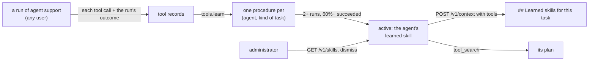

# Learned skills

An agent's successful runs teach it how a kind of task is done, and the next run of that agent
is offered what it learned, in its context, on its own. Nobody writes, publishes or approves a
learned skill; an administrator can see them all and dismiss one. Decisions:
[ADR 0034](../adr/0034-learned-skills-in-context.md).

| Route | What | SDK |
| --- | --- | --- |
| `GET /v1/skills?agent=…` | what the tenant's agents learned, best supported first (at most 100), one agent's with `agent` (administrator) | `admin.advanced.skills.list(agent=…)` |
| `POST /v1/skills/{skill_id}/dismiss` | stop offering one until its steps change; dismissing again returns it unchanged (administrator) | `admin.advanced.skills.dismiss(id)` |

## How an agent learns one



1. **Recorded.** The harness records every tool call of a run (`POST /v1/tools/invocations`)
   and how the run ended ([tools.md](tools.md)). The calls are the agent's own (`PRIVATE`),
   whichever user it ran for.
2. **Learned per agent.** The learning job groups an agent's calls by the kind of task (the
   task with its values as `{slots}`) **across all of the agent's users**, and keeps the steps
   that worked, in order, with what fixed a failing step. Two runs that agree and succeed at
   least 60% of the time make it **active**: the agent's learned skill. It is **retired** when
   that stops holding (and offered again if it works again).
3. **Offered.** Every context the agent asks for with its tools carries the (up to three)
   learned skills that match the task, in full:

   ```text
   ## Learned skills for this task
   - refund-an-order: find_order -> refund (worked 95% of 40 runs)
     - if refund on AlreadyRefunded: stop and tell the user
   - adds to your skill refund-policy: find_order -> refund (worked 100% of 12 runs)
   ```

   The `tool_search` memory tool returns the best one as its `plan`. Nothing to load, nothing
   to install: the harness puts the context in front of the model, and every framework gets it.

**Who is offered it.** A learned skill names the task the way its runs were asked. So it
reaches the agent's other users only once **two different users** produced it; until then only
the user whose runs taught it is offered it, and one person's wording ("send Ann's leave form
to HR") never reaches another. Another agent, or another tenant, is never offered it. Calls an
agent shared with a group or workspace (`visibility`) are learned for that audience instead.

**The agent's own skills.** When every run of a skill opened one of the agent's own (written)
skills - the harness's `load_skill`, recorded like any call - the learned skill is what those
runs added to it: `adds to your skill refund-policy: …`, never a copy of it. The written skill
stays the person's; the learned one is listed with `with_skill`.

## Listing and dismissing

```python
admin = admin_client.bind(tenant_id="acme")  # the tenant's administrator key
for s in await admin.advanced.skills.list(agent="support"):
    print(s.name, s.status, s.steps, s.success_rate, s.runs, s.users, s.with_skill, s.fixes)
await admin.advanced.skills.dismiss(s.id)  # no longer offered, until its steps change
```

| Field | What |
| --- | --- |
| `id` | what `dismiss` takes (`prc_…`) |
| `agent_id` | the agent that learned it; `null` for one learned from records shared wider |
| `name` | the task in a few words, in the language it was asked in |
| `status` | `active` (offered), `retired` (stopped working), `dismissed` |
| `pattern` | the kind of task (`refund order {id}`) |
| `steps`, `fixes` | the tools it calls in order; what fixed a failing step |
| `with_skill` | the agent's own skill its runs opened, when they did |
| `success_rate`, `runs`, `users` | its track record, and how many users' runs it came from |

`401` without a key, `403` for a key that is not the tenant's administrator, `404` for no such
skill (`dismiss`), `422` for a malformed `agent`. `dismiss` takes an `Idempotency-Key`.

## What it does not do

* it writes nothing anywhere: a learned skill lives in its agent's context, and a team that
  wants one as a written skill copies its text into its own skills;
* it never edits the agent's own skills;
* it adds no setting: who is offered what follows from the agent, its users and the runs.
