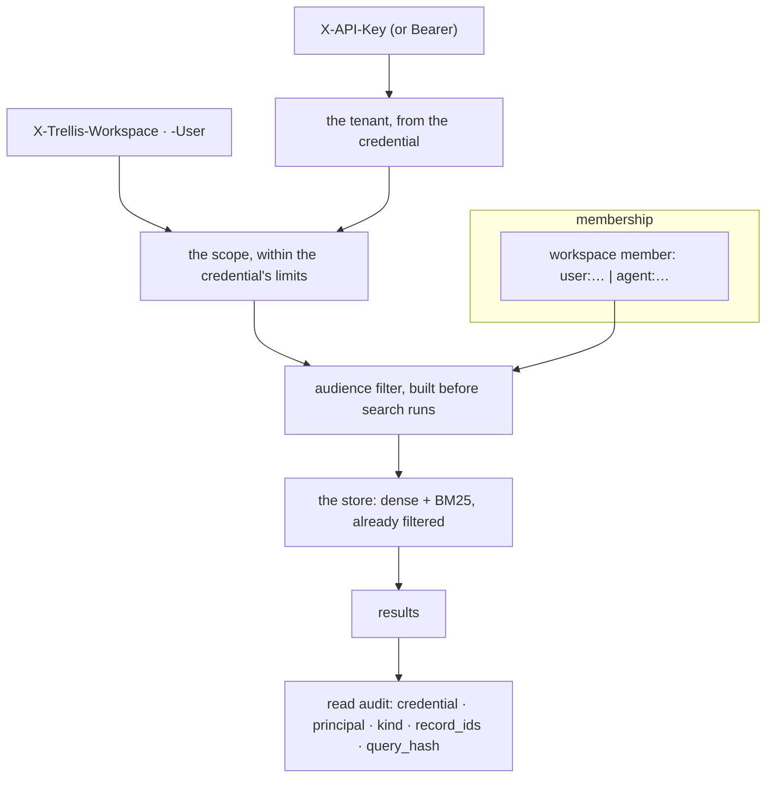

# Tenancy: who may see what

A tenant is the wall nothing crosses. Inside it, a **workspace** is a team that shares what it
stores, a **key** is a credential bound
to the tenant that issued it, and a **model key** is the Bifrost virtual key a read may spend
against. The read audit says who actually read which records (ADR 0021, ADR 0023).

## How a read is authorized



The filter is built **before** the search, not applied to its results: a store-side filter cannot
be forgotten by a caller, and a result that was never a candidate cannot leak through a ranking bug.

## Routes

| Route | Purpose | SDK (`t = memory.administer("acme")`) |
| --- | --- | --- |
| `POST /v1/keys` | issue an admin or service key; the secret is shown once | `t.keys.issue(role, name, workspace_id=…, expires_in_days=…, may_act_as=…)` |
| `GET /v1/keys` | the tenant's keys, oldest first (cursor paged) | `t.keys.list()`, `t.keys.page()` |
| `PATCH /v1/keys/{key_id}` | change whom a key may act for (`may_act_as`); it applies on the key's next request | `t.keys.update(key_id, may_act_as=[…])` |
| `DELETE /v1/keys/{key_id}` | revoke; it fails on its next request from any instance | `t.keys.revoke(key_id)` |
| `GET /v1/keys/self` | who the calling key is — any key may ask about itself (401 unknown, revoked or expired; 403 refused) | `memory.tenant.keys.whoami()` |
| `POST /v1/workspaces` | create a workspace | `t.workspaces.create(name, workspace_id=…)` |
| `GET /v1/workspaces` · `/{id}` | list, or read one | `t.workspaces.list()`, `.get(id)` |
| `DELETE /v1/workspaces/{id}` | delete it; every member loses the audience and every key bound to it is revoked at once | `t.workspaces.delete(id)` |
| `PUT /v1/workspaces/{id}/members/{principal_ref}` | admit `user:<id>` or `agent:<id>` with one role | `t.workspaces.set_member(id, "user:u1", role=…)` |
| `DELETE /v1/workspaces/{id}/members/{principal_ref}` | remove a member; its next request no longer reads the workspace | `t.workspaces.remove_member(id, principal)` |
| `GET /v1/workspaces/{id}/members` | who is in it, by principal (cursor paged) | `t.workspaces.members(id)`, `.members_page(id, cursor=…)` |
| `GET` / `PUT` / `DELETE /v1/model-key` | the tenant's Bifrost virtual key (metadata only on read; `DELETE` answers `204`) | `t.model_key_status()`, `t.set_model_key(vk)`, `t.revoke_model_key()` (reads the status back) |
| `GET` / `PUT` / `DELETE /v1/agents/model-key` | the **acting agent's** own key (`DELETE` answers `204`) | `ctx.advanced.model_keys.status()`, `ctx.advanced.model_keys.set(vk)`, `ctx.advanced.model_keys.revoke()` (reads the status back) |
| `GET` / `PUT /v1/model-key/policy` | the tenant's model policy: which uses may run, whether reads are assisted, the model per use | `t.model_policy()`, `t.set_model_policy(uses, read_assist=…, models=…)` |
| `GET /v1/model-key/usage` | tokens and calls per day and use (default: the last 30 days) | `t.model_usage(since=…, until=…)` |
| `GET /v1/reads` | who read which records, newest first (cursor paged) | `t.reads()`, `t.reads_page()` |

## Onboarding a team, in full

```python
t = memory.administer("acme")

await t.workspaces.create("supply-chain", workspace_id="supply-chain-ws")
await t.workspaces.set_member("supply-chain-ws", "user:planner-7")
await t.workspaces.set_member("supply-chain-ws", "agent:reorder-agent")

await t.workspaces.set_member("supply-chain-ws", "user:planner-8")

issued = await t.keys.issue("service", "reorder-agent", workspace_id="supply-chain-ws")
print(issued.token)  # shown once: store it now
```

Only now will a `visibility="WORKSPACE"` write be readable by that team. A workspace-visible write
with no workspace row answers `Workspace not found`, and that is the single most common first-run
surprise.

**A workspace id cannot be reclaimed.** An id that already labels threads or documents cannot later
become a workspace (`in use as an anchor`), and a deleted workspace's id is never reused
(`exists or was used before`) — so a new team never inherits an old team's anchors or audit trail.

## Keys

| Role | May | Held by |
| --- | --- | --- |
| `platform` | onboard tenants and issue their first admin key; never a row in a tenant | the operator's bootstrap credential ([admin.md](admin.md)) |
| `admin` | administer one tenant: keys, workspaces, model keys, the read audit | a tenant's own administrators |
| `service` | act for that tenant's users and agents: read and write memory within the scope it is given | **a harness** |

`POST /v1/keys` issues the `admin` and `service` roles; `platform` is not issuable through it.

**Workspace membership has its own three roles**, and they are not the key roles: `admin`,
`member` and `viewer`. Every one of them *reads* the workspace; `admin` and `member` also write
into it. So a `viewer` sees the team's memory and cannot add to it — which is also why a viewer
cannot retract a memory it disagrees with ([feedback.md](feedback.md)).

A key is bound to the tenant it was issued for: presenting a valid key with another tenant's header
is a `403`, not a read. Revocation takes effect on the next request from **any** instance, not when
a cache expires. `expires_in_days` is available at issue time, and a `workspace_id` on the key binds
it to that workspace (and is revoked with it).

A key also says **whom it may act for** (`may_act_as`: `user:<id>`, `agent:<id>`, or `*` for every
principal of the tenant — the default at issue; empty means only the key itself). An admin
narrows or widens it later with `PATCH /v1/keys/{key_id}`; like a revocation it applies on the
key's next request from any instance.

A restricted key is checked against **every principal a request names**: its user
(`X-Trellis-User` or the body's `user_id`) must be listed as `user:<id>`, and its agent (the
body's or query's `agent_id`) as `agent:<id>`; either missing is `403` (`this key may not act for
that user` / `… as that agent`, `details.field` naming which). So a key listing `user:planner-7`
and `agent:reorder-agent` may run `reorder-agent` for `planner-7`, but not another agent for
her, nor `reorder-agent` for another user. A request naming neither user nor agent acts as the
key itself — the anonymous service principal, which holds no grant on any user's or agent's
memories. `*` lifts the restriction. (Before 0.4 only the user was checked: an `agent:` entry was
stored and reported, and a key restricted to one agent could act as any other by naming it.)

```python
await t.keys.update(issued.key_id, may_act_as=["agent:reorder-agent", "user:planner-7"])
me = await MemoryClient(url, api_key=issued.token).tenant.keys.whoami()  # GET /v1/keys/self
print(me.key_id, me.tenant_id, me.principal, me.role, me.may_act_as)
```

`GET /v1/keys/self` is open to every key, about itself: it is how a harness checks its
credential at startup and how the platform's other services authenticate a key they were
handed. `tenant_id` is null for a credential that names the tenant per request (the platform
key, an issuer's token). A development key reports the development tenant —
`MEMORY__AUTHENTICATION__TRUSTED_DEV_TENANT`, `default` unless set — and acts in it on every
route when a request names no tenant, so a laptop's harness needs no tenant configured anywhere;
`X-Trellis-Tenant` still names another. The development tenant gets its row the first time
it is administered, and the development stack also accepts the keys it issued: `POST /v1/keys`
with the development key gives the service key a deployment would use, ready at once. `role` is `platform`, `admin`, `service`, `trusted_dev` or `jwt`.

## Model keys: two registered levels and the operator's, resolved in order

A read that is permitted to use an LLM spends *someone's* virtual key, and the service resolves the
most specific level that has a row:

```
the acting agent's key  →  the tenant's key  →  (no row anywhere) the operator's
```

The agent's key is `PUT /v1/agents/model-key` (the request names the `agent_id`; one key per
`agent_id`, whichever user it acts for); the tenant's is `PUT /v1/model-key` (the admin key); the
operator's is the deployment's `BIFROST_VIRTUAL_KEY`, on the gateway at `BIFROST_URL`. There is no
workspace level.

Two rules make that safe rather than merely convenient:

* **a revocation at the resolved level refuses** — a revoked agent never silently borrows the
  tenant's or the operator's key, because a tombstone raises instead of falling through;
* **the operator fallback applies only while no row exists at any level**, and a key registered
  mid-request fails that request closed rather than mixing keys.

Each key is stored encrypted, and a read returns **metadata only** — `registered`, `revoked`,
`revision`, `updated_at` — never the key or its ciphertext. Revoking one invalidates the assisted
read output built with it.

```python
status = await ctx.advanced.model_keys.set("vk-…")  # the acting agent's own key
print(status.registered, status.revision)
print(await t.model_key_status())  # the tenant level, metadata only
```

## Model policies: what a key may be spent on

A policy narrows what the model is used for. It is the tenant's alone (there is no agent- or
workspace-level policy) and has exactly three fields: `uses`, `read_assist` and
`models: {use: model}`. With no row the default is **every use except the opt-in ones** —
today only `memory_restatement` (ADR 0027), which costs a model call per conversation message
and so is never started by registering a key — with reads assisted and the service's default
model per use. (`GET /v1/model-key/policy` answers `stored: false` and that default.) A stored
policy's `uses` is exactly what runs: name `memory_restatement` there to opt in. A use runs
only when all of these hold:

```
the gateway is configured (BIFROST_URL)  ∧  the tenant policy's uses  ∧  a key that can pay
```

There is no deployment-level allow-list of uses and no environment variable that names a
model: the service's defaults are the `LLMTuning` constants (`model` and `fast_model`, both
`auto`: discovered through the gateway's model catalogue), and the policy's `models` map
overrides them per use.

`read_assist` decides whether a read (`/v1/context`, `/v1/recall`, `/v1/verify`, the graph
routes) consults the model; a request cannot override the policy. Background work — extraction, reflection,
connections, summaries — runs bound to the owner of the data, so the owner's key pays and the
owner's policy decides; a periodic job scans only tenants that hold a live key (every tenant when
the operator's key pays). Changing a policy invalidates the assisted read output built under it.

```python
await t.set_model_policy(
    ["contextual_extraction", "summaries", "memory_restatement"],  # restatement: opt-in
    read_assist=False,
    models={"memory_restatement": "openai/gpt-4.1-mini"},  # provider/model, through Bifrost
)
for day in (await t.model_usage()).days:  # one row per day and use
    print(day.day, day.use, day.tokens, day.calls)
```

Every successful gateway call adds its tokens to the tenant's day (`GET /v1/model-key/usage`) and
to `memory_llm_tokens_total{tenant,use,direction}`; a request reports its own spend in
`X-Trellis-LLM-Tokens`, and a background job logs its spend as `job.llm_tokens`.

## The read audit

```python
for record in await t.reads(limit=50):
    print(record.at, record.credential, record.principal, record.kind, record.record_ids)
```

Each entry names the credential and the principal that read, whether it was a `recall` or a
`context` assembly, the `record_ids` that came back, and a `query_hash` plus a `scope_fingerprint`
rather than the query text — the audit answers *who read which records* without becoming a second
copy of what was asked. Newest first, pageable by cursor (or `before=<the last entry's at>`);
`since=<instant>` keeps only newer entries (a filter that stays the same across pages; it was
`after` before ADR 0030). The keyset is the instant, so entries sharing one instant across a page
boundary need a larger page.

## What this area does not do

* it does not let a caller widen its own scope: the credential fixes the tenant, and a body that
  disagrees with a trusted header is refused;
* it does not provision external authorization for you — a WORKSPACE audience means membership in
  this service's authorization store, and nothing else grants it;
* it does not show a key or a model key twice;
* it does not have per-user ACLs on individual memories: the audience levels are the vocabulary,
  and they are deliberately few.
