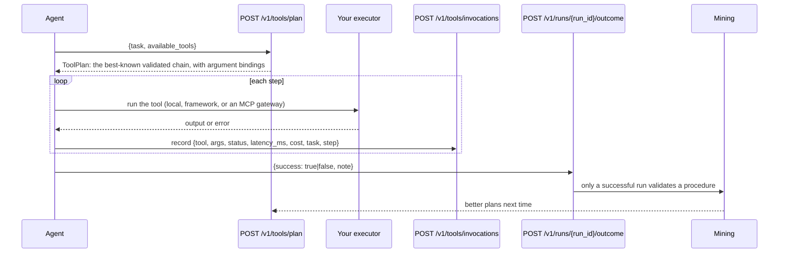

# Tool memory: which tool worked, for what, in which order

The service never runs a tool. It records what your agent called, what happened, and whether the
run it belonged to succeeded — and from that it mines **procedures**: validated chains for a task
pattern, so the second agent facing the same task does not rediscover the sequence by trial.

## The loop



The outcome label is the part that makes this work. Without it the service waits hours to infer a
weak positive and never learns from a failure at all; with it, a failed run's chain is *not*
promoted.

## Routes

| Route | Purpose | SDK |
| --- | --- | --- |
| `POST /v1/tools/invocations` | record one call (idempotent on run + step + tool + arguments) | `ctx.record_tool(...)` |
| `POST /v1/tools/plan` | the best-known validated chain for a task, as an ordered plan with bindings | `ctx.advanced.tools.plan(task, available_tools=…)` |
| `GET /v1/tools/procedures` | procedures mined for a task pattern | `ctx.advanced.tools.procedures(task)` |
| `POST /v1/runs/{run_id}/outcome` | label a run successful or not | `ctx.outcome(run_id=run_id, success=…, note=…)` |
| `POST /v1/tools/record` | deprecated alias of `POST /v1/tools/invocations` | — |

## Recording a call

```python
result = await ctx.record_tool(
    "stock_level",
    {"sku": "SKU-1"},
    output={"on_hand": 95},
    output_summary="95 units at EU-1",
    status="ok",  # ok | error | timeout | rejected
    latency_ms=41.0,
    cost=0.0,
    task="check stock before reordering",
    step=1,
    visibility="PRIVATE",
)
```

`task` is what makes an invocation minable — it is the pattern procedures are keyed on — and
`step` is what makes a chain a chain. `visibility` defaults to `PRIVATE`: tool arguments and
outputs are the most likely place for customer data, so they are not shared by default.

## Asking what to call

```python
plan = await ctx.advanced.tools.plan(
    "reprice a quote",
    available_tools=[{"name": "reprice", "description": "…", "parameters": {...}}],
)
print(plan.valid, plan.reason, plan.problems)  # whether there is a validated chain at all
print(plan.steps)  # the tool sequence, in order, with argument bindings
print(plan.support)  # how many successful runs back it
print(plan.success_rate)  # and how often they succeeded

for procedure in await ctx.advanced.tools.procedures("reprice a quote"):
    print(procedure)
```

`available_tools` is what *this* agent can actually call, so the plan never names a tool the caller
does not have. A plan with nothing behind it comes back `valid=False` with a `reason`, not as a guess.

## What this area does not do

* it does not execute anything, ever;
* it does not promise a plan: a task nobody has completed successfully has no validated chain;
* it does not learn from a run you never labelled — `ctx.outcome(...)` is not optional if you
  want procedures;
* it does not make tool outputs searchable knowledge by default: `visibility="PRIVATE"` keeps them
  to the agent that recorded them.
