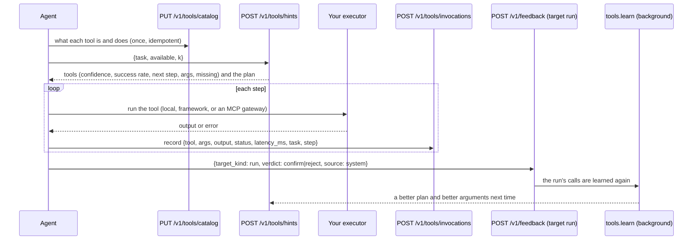
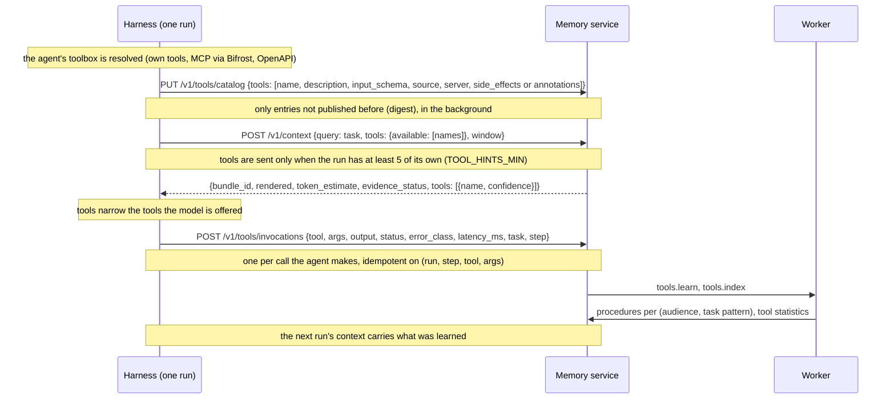

# Tool memory: which tool, which plan, which arguments

The service never runs a tool. It keeps a **catalog** of what each tool is and does, records what
your agent called and whether the run succeeded, and learns from that: **procedures** (the chain
that worked for a task pattern, with where each argument came from), running **statistics** per
tool, **graph edges** from what the calls touched, and **approval patterns** from what reviewers
let the agent do. **Tool hints** read all of it back in one answer.

## The loop



The run's verdict is what makes this work (the harness sends a `system` verdict from the
run's final status; a judge or a person overrides it, human > judge > system): only a successful run validates a procedure, and a
run nobody labelled counts as a (weak) success only a day later, if none of its calls failed.

## Routes

| Route | Purpose | SDK |
| --- | --- | --- |
| `PUT /v1/tools/catalog` | upsert catalog entries by name (idempotent) | `ctx.advanced.tools.put_catalog([...])` |
| `GET /v1/tools?names=…` | the catalog visible in this scope, by name, with statistics (cursor paged; a page holds the whole 500-entry catalog by default). `ETag` + `Cache-Control: private, no-cache`: send it back in `If-None-Match` and an unchanged catalog is a `304` without a body — how a harness refreshes approval tiers cheaply | `ctx.advanced.tools.catalog(names=…)` (follows the cursor); `catalog_if_changed(names, etag=)` → `(entries | None, etag)`, `None` when unchanged |
| `POST /v1/tools/invocations` | record one call (idempotent on run + step + tool + arguments) | `ctx.record_tool(...)` |
| `POST /v1/feedback` (target `run`) | label a run successful or not | `ctx.feedback("run", run_id, "confirm", source="system")` |
| `POST /v1/tools/hints` | the tools that fit, best first: confidence, success rate, next step, the arguments found and the ones missing; the plan | `ctx.tool_hints(task, available=…, k=…)` |
| `GET /v1/tools/approval-suggestions?tool=…` | approval rules this agent's reviewed calls support, most supported first (cursor paged) | `ctx.advanced.tools.approval_suggestions(tool=…)` |
| `POST /v1/tools/approval-suggestions/{suggestion_id}/accept` | accept one: its rule is written into the tool's `approve_when` | `ctx.advanced.tools.accept_suggestion(id)` |
| `GET /v1/tools/skill-drafts` | the tenant's active procedures as draft Agent Skills (administrator) | `ctx.advanced.tools.skill_drafts()` |
| `POST /v1/tools/skill-drafts/{draft_id}/publish` | publish one where agents load skills from (administrator) | `ctx.advanced.tools.publish_skill(id, name=…, description=…)` |
| `POST /v1/tools/skill-drafts/{draft_id}/dismiss` | not a skill: not offered again until its steps change (administrator) | `ctx.advanced.tools.dismiss_skill(id)` |

`POST /v1/context` answers the same hints inline when asked (`tools: {available, k}`; the SDK's
`ctx.context(query, tools=[...names])`), and
tool-call feedback (`POST /v1/feedback`, `target_kind: tool_call`) feeds the statistics and the
approval patterns.

## The catalog

```python
await ctx.advanced.tools.put_catalog(
    [
        {
            "name": "erp-create_po",
            "description": "Create a purchase order",
            "input_schema": {
                "type": "object",
                "properties": {"supplier_id": {"type": "string"}, "amount": {"type": "number"}},
                "required": ["supplier_id", "amount"],
            },
            "argument_entity_types": {"supplier_id": "ORG"},
            "side_effects": "write",  # read | write | irreversible; omit when unknown
            "source": "mcp",
            "server": "erp",
            "redact": ["auth.token"],  # argument paths never stored
        }
    ]
)
entries = await ctx.advanced.tools.catalog(names=["erp-create_po"])  # .side_effects, .stats
```

An entry is one row per name in the caller's workspace (or tenant-wide without one); a
workspace's own entry shadows the tenant's. A changed input schema is a new `version`; an
unchanged entry is left as it is. Entries are embedded (name, description, argument names) into
the `tools` search collection by a background job. `required` defaults to the input schema's.

## Recording a call

```python
result = await ctx.record_tool(
    "erp-get_stock",
    {"sku": "A4-80"},
    output={"on_hand": 95},
    status="ok",  # ok | error | timeout | rejected | cancelled
    latency_ms=41.0,
    task="order 500 sheets of A4 paper from Acme",
    step=0,
    visibility="PRIVATE",
)
```

`task` is the question, in words: it is normalised into a typed-placeholder **pattern**
(`order {num} sheets of {id} paper from {entity}`) that procedures are keyed on, so two phrasings
of the same request pool their runs. `step` makes a chain a chain. `visibility` defaults to
`PRIVATE` (this agent, across its runs); a procedure is readable by exactly the audience of the
calls it was learned from, so share with `AGENT_GROUP`, `WORKSPACE` or `TENANT` to learn across
agents or users. Every new call is counted on the tool (calls, successes, latency).

## Tool hints

```json
{
  "tools": [
    {"name": "erp-create_po", "confidence": 0.74, "success_rate": 1.0, "next": true,
     "args": {"amount": 700, "cost_centre": "CC-7"},
     "missing": [{"arg": "supplier_id", "question": "erp-create_po needs 'supplier id': what should it be?"}]},
    {"name": "erp-get_budget", "confidence": 0.74, "success_rate": 1.0, "args": {"cost_centre": "CC-7"}},
    {"name": "calendar-book", "confidence": 0.21, "missing": [{"arg": "when", "question": "calendar-book needs 'when': what should it be?"}]}
  ],
  "plan": {"id": "prc_…", "title": "Order supplies", "steps": ["erp-search_supplier", "erp-get_budget", "erp-create_po"], "success_rate": 1.0, "runs": 3}
}
```

```python
hints = await ctx.tool_hints("order 500 sheets of A4 from Acme", available=tools, k=8)
hints.tools  # best first, only tools in `available`
hints.next  # the plan's next step, else the best tool: .name .confidence .args .missing
hints.plan  # the learned procedure: .steps (tool names), .success_rate, .runs | None
```

- **tools** — hybrid search (dense + BM25) over the catalog, narrowed to `available` (a
  callable tool the search missed still competes on its record), scored by relevance × how
  well the tool has worked, with a bonus for the plan's tools, its next step, and recent use.
  `confidence` is that score as 0..1 (`1 - e^-score`, same order); `success_rate` is the share
  of the tool's recorded calls that succeeded (absent: never called).
- **plan / next** — the stored procedure whose pattern matches the task and whose tools are all
  callable; `next: true` marks the step this run has not done yet.
- **args** — every candidate's arguments, first found wins: the procedure's binding (an
  earlier step's output in this run, or the literal every successful run used) → the
  knowledge graph (an entity of the argument's type named in the task; for an `…id` argument,
  the id a tool returned for it) → a `name: value` line of a pinned profile block, or a memory
  whose predicate is the argument's name → a value the task itself names → a value a memory in
  hand names right after the argument's words ("their supplier id is SUP-40" for
  `supplier_id`). A value named right after an argument's own words fills that argument and no
  other ("for cost centre CC-7" is `cost_centre`, never `supplier_id`), as does an identifier
  that spells it (`SKU-22` is `sku`, never the quote `Q-1183`); a name is never an `…id`
  argument's (it is left for the argument that takes a name). Each value is used once, a
  currency on either side of an amount is the amount's (`700 EUR`), and a value for a number
  argument is a number (`"700 EUR"` → `700`).
- **missing** — required arguments nothing filled, with the question to ask (and the
  `entity_type` the argument names, when the catalog says).

## Procedures and the learning job

`tools.learn` runs after every outcome label and every five minutes. It reads the calls not
learned yet (a partial index), re-mines every task pattern they touch from that pattern's newest
calls (the prefix-tree miner: coverage first, then length; retries collapse; failures are kept
as the step's failure modes) and updates that pattern's one stored procedure — a delta, never a
rewrite of the others. A procedure is **active** (offered) once at least 2 runs support it and
at least 60% succeeded; it is **retired** when that stops holding and **rejected** by a
`reject` verdict on it (`target_kind: procedure`) until its steps change.

With the tenant's model (use `procedure_abstraction`, the recording principal's key), an active
procedure whose steps changed is distilled into a title and a strategy from the runs that
succeeded and those that failed ("what to avoid"). Without one, the title is the pattern and the
strategy the miner's own rendering.

The same job writes graph edges in the `procedural` layer: a call with a typed argument
(`argument_entity_types`) `used_entity` the entity it names; when that call succeeded and returned
an id field, the entity is `identified_by` the id. That is how "Acme" becomes `supplier_id`
`SUP-42` in a later hint's `args`.

## Approval suggestions

A verdict on a tool call (`POST /v1/feedback` with `target_kind: tool_call`, `metadata.tool` and,
ideally, `metadata.args`; an `edit`'s correction stands in for the arguments) is counted per
(agent, tool, argument shape). The shape is value-free: each argument with its kind, numbers by
order of magnitude (`amount:num:1e4,supplier:str`). With at least 5 decisions, 95% approved
suggests `auto_approve` and 50% or fewer `always_ask`. Nothing applies them on its own.

```python
for s in await ctx.advanced.tools.approval_suggestions(tool="erp-create_po"):
    print(s.id, s.arg_shape, s.suggestion, s.support, s.approve_rate, s.accepted)
entry = await ctx.advanced.tools.accept_suggestion(s.id)  # the catalog entry, updated
print(entry.approve_when)
```

Accepting composes the suggestion into the tool's catalog `approve_when` expression (the
harness evaluates it before a call; `trellis.memory.approval.evaluate` is the reference). The
rules of the route:

* only the agent whose decisions the suggestion was learned from may accept it (bind the same
  `agent_id`); any other caller gets `404`;
* `409` when the decisions no longer support the suggestion, or when it would auto-approve an
  `irreversible` tool (those calls are always asked about; `always_ask` may be accepted for any
  tool);
* accepting one already part of `approve_when` returns the entry unchanged.

## Learned skills

An **active** procedure is something the agents have done successfully, again and again. A
skill draft offers it to the tenant's administrator as an [Agent Skill](https://agentskills.io):
a `SKILL.md` built from the procedure alone (its title, the tasks it is for, the strategy and
the steps in order, with what to do on the errors that happened), nothing invented. A person
decides; nothing is published on its own.

```python
admin = admin_client.bind(tenant_id="acme")  # the tenant's administrator key
for d in await admin.advanced.tools.skill_drafts():  # new, or changed since published
    print(d.id, d.state, d.name, d.support, d.success_rate)
    print(d.body)
decision = await admin.advanced.tools.publish_skill(d.id, name="refund-order")
print(decision.name, decision.version, decision.destination)  # refund-order 1.0.0 bifrost
await admin.advanced.tools.dismiss_skill(other.id)  # not a skill
```

**Where it goes.** Where the agents already load skills from, so nothing else changes for
them: the folder `SKILLS_DIR` names when it is set (`<name>/SKILL.md`, the Agent Skills layout
the harness's `skills_dir`, the Claude Agent SDK and Deep Agents read), else the Bifrost
gateway's skills repository (`BIFROST_URL`; `BIFROST_ADMIN_TOKEN` when its management API
needs a credential). Neither configured: `503`. An agent picks the skill up by name, for
example `h.wrap(agent, skills=["refund-order"])`.

**Versions and rollback.** The first publication is `1.0.0`, each later one the next minor
(`1.1.0`). On the gateway every version is kept and a rollback is its own
`shift_version`; a folder is replaced whole (atomically), and its rollback is the folder's own
history (git, a volume snapshot). A run pins the version it loaded, so a new version never
changes a run under way.

**Decisions are kept with the steps.** Publishing or dismissing records the decision on the
procedure, with the steps it was about (`GET /v1/tools/skill-drafts` no longer lists it); a
retry sent with the same `Idempotency-Key` gets that decision back instead of a `409`. When
the learning job finds different steps, the draft comes back: `new`, or `changed` naming what
was published so it is published again under the same name. A re-mine never overwrites a
decision.

**Ownership.** A published skill's metadata names the tenant and the procedure
(`trellis_tenant`, `trellis_procedure`). Publishing over a skill of the same name that this
tenant did not publish — a person's, another tenant's — is refused (`409`); choose another
`name`.

## Tools in context: what is sent, what comes back

The same tool information reaches the service three ways and comes back two ways. This is the
whole round trip as the harness (`agent-harness`) drives it; a caller without the harness
sends the same requests itself.



### What the harness sends

| When | Request | Tool fields | Where in the harness |
|---|---|---|---|
| a run's toolbox is resolved | `PUT /v1/tools/catalog` | `name`, `description`, `input_schema`, `source` (`local`, `mcp`, `openapi`, `a2a`), `server`; `side_effects` where the harness knows them (local and OpenAPI tools), the server's `annotations` for MCP tools (the service derives the tier) | `tools/toolbox.py`, `governance/catalog.py` (`entry`, `MemoryCatalog.publish`) |
| before the model runs | `POST /v1/context` | `tools.available`: the run's own tool names (not the memory tools), only when there are at least 5; `tools.k` defaults to 8 | `agent.py::push` |
| each tool call | `POST /v1/tools/invocations` | `tool`, `args`, `output`, `status` (ok, error, timeout, rejected, cancelled), `error_class`, `latency_ms`, `task`, `step` | `clients/memory.py::record_tool` |
| on demand, mid-run | `POST /v1/tools/hints` | `task`, `available` (the run's tool names) | the `tool_search` memory tool |

Arguments are redacted per the catalog entry's `redact` list before they are stored.

### What comes back

`POST /v1/context` with `format=prompt` (the harness's default) returns:

| Field | What it holds | Who uses it |
|---|---|---|
| `rendered` | the prompt text. With tools it starts with `## Procedures that worked for this task` (each as `title: tool -> tool (worked N% of M runs)`) and `## Tools`: the best three tools and the next step, each as `- <tool> (confidence 0.74, next step): <arg> = <value>, …; missing <arg>: <question>`; then the profile, summary, conversation, memories and the rest | the model reads it |
| `tools` | the tools that fit the task, best first (at most `k`), each `{name, confidence}`, only when `tools` was sent | the harness offers only these to the model |
| `bundle_id`, `token_estimate`, `evidence_status` | as for any context | `/v1/verify`, budgeting, abstaining |

`format=full` returns the same content as data instead: `procedures` (`id`, `title`, `steps` as
tool names, `success_rate`, `runs`) and `tools`, each with `confidence`, `success_rate`, `next`,
`args` and `missing`, exactly as `POST /v1/tools/hints` returns them.

Nothing tool-related is in the context when `tools` is not sent: no procedures, no hints, no
tools. A run with fewer than five tools therefore gets plain memory context, and its calls
are still recorded and still teach procedures for later runs.

## What this area does not do

* it does not execute anything, ever;
* it does not publish a skill on its own: a person publishes each draft;
* it does not invent a plan: a task nobody has completed successfully has none;
* it does not learn from a run you never labelled until a day has passed;
* it does not make tool outputs searchable knowledge: `PRIVATE` keeps them to the agent.
