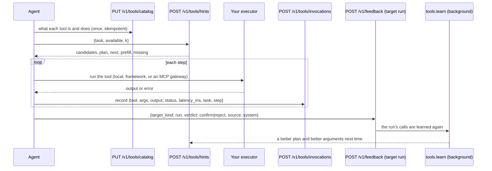

# Tool memory: which tool, which plan, which arguments

The service never runs a tool. It keeps a **catalog** of what each tool is and does, records what
your agent called and whether the run succeeded, and learns from that: **procedures** (the chain
that worked for a task pattern, with where each argument came from), running **statistics** per
tool, **graph edges** from what the calls touched, and **approval patterns** from what reviewers
let the agent do. **Tool hints** read all of it back in one answer.

## The loop



The run's verdict is what makes this work (the harness sends a `system` verdict from the
run's final status; a judge or a person overrides it, human > judge > system): only a successful run validates a procedure, and a
run nobody labelled counts as a (weak) success only a day later, if none of its calls failed.

## Routes

| Route | Purpose | SDK |
| --- | --- | --- |
| `PUT /v1/tools/catalog` | upsert catalog entries by name (idempotent) | `ctx.advanced.tools.put_catalog([...])` |
| `GET /v1/tools?names=…` | the catalog visible in this scope, with statistics | `ctx.advanced.tools.catalog(names=…)` |
| `POST /v1/tools/invocations` | record one call (idempotent on run + step + tool + arguments) | `ctx.record_tool(...)` |
| `POST /v1/feedback` (target `run`) | label a run successful or not | `ctx.feedback("run", run_id, "confirm", source="system")` |
| `POST /v1/tools/hints` | candidates, plan, next step, prefilled and missing arguments | `ctx.tool_hints(task, available=…, k=…)` |
| `GET /v1/tools/approval-suggestions?tool=…` | approval rules this agent's reviewed calls support | `ctx.advanced.tools.approval_suggestions()` |

`POST /v1/context` answers the same hints inline when asked (`tools: {available, k}`), and
tool-call feedback (`POST /v1/feedback`, `target_kind: tool_call`) feeds the statistics and the
approval patterns.

## The catalog

```python
await ctx.advanced.tools.put_catalog(
    [
        {
            "name": "erp-create_po",
            "description": "Create a purchase order",
            "input_schema": {
                "type": "object",
                "properties": {"supplier_id": {"type": "string"}, "amount": {"type": "number"}},
                "required": ["supplier_id", "amount"],
            },
            "argument_entity_types": {"supplier_id": "ORG"},
            "side_effects": "write",  # read | write | irreversible; omit when unknown
            "source": "mcp",
            "server": "erp",
            "redact": ["auth.token"],  # argument paths never stored
        }
    ]
)
entries = await ctx.advanced.tools.catalog(names=["erp-create_po"])  # .side_effects, .stats
```

An entry is one row per name in the caller's workspace (or tenant-wide without one); a
workspace's own entry shadows the tenant's. A changed input schema is a new `version`; an
unchanged entry is left as it is. Entries are embedded (name, description, argument names) into
the `tools` search collection by a background job. `required` defaults to the input schema's.

## Recording a call

```python
result = await ctx.record_tool(
    "erp-get_stock",
    {"sku": "A4-80"},
    output={"on_hand": 95},
    status="ok",  # ok | error | timeout | rejected | cancelled
    latency_ms=41.0,
    task="order 500 sheets of A4 paper from Acme",
    step=0,
    visibility="PRIVATE",
)
```

`task` is the question, in words: it is normalised into a typed-placeholder **pattern**
(`order {num} sheets of {id} paper from {entity}`) that procedures are keyed on, so two phrasings
of the same request pool their runs. `step` makes a chain a chain. `visibility` defaults to
`PRIVATE` (this agent, across its runs); a procedure is readable by exactly the audience of the
calls it was learned from, so share with `AGENT_GROUP`, `WORKSPACE` or `TENANT` to learn across
agents or users. Every new call is counted on the tool (calls, successes, latency).

## Tool hints

```python
hints = await ctx.tool_hints("order 500 sheets of A4 from Acme", available=tools, k=8)
hints.candidates  # [{name, score, success_rate, why}], only tools in `available`
hints.plan  # {procedure_id, title, steps (with bindings), success_rate, support} | None
hints.next  # the plan's first step this run has not done, else the best candidate
hints.prefill  # {arg: {tool, value, source, evidence_id}} for the next tool
hints.missing  # [{tool, arg, entity_type, question}]: required, nothing could fill it
```

- **candidates** — hybrid search (dense + BM25) over the catalog, narrowed to `available` (a
  callable tool the search missed still competes on its record), scored by relevance × how
  well the tool has worked, with a bonus for the plan's tools, its next step, and recent use.
- **plan / next** — the stored procedure whose pattern matches the task and whose tools are all
  callable; `next` follows this run's recorded calls through it.
- **prefill** — each argument of the next tool, first found wins: the procedure's binding (an
  earlier step's output in this run, or the literal every successful run used) → the
  knowledge graph (an entity of the argument's type named in the task; for an `…id` argument,
  the id a tool returned for it) → a `name: value` line of a pinned profile block, or a memory
  whose predicate is the argument's name → a value the task itself names (ids, emails, amounts,
  dates, numbers), each used once.
- **missing** — required arguments nothing filled, with the question to ask.

## Procedures and the learning job

`tools.learn` runs after every outcome label and every five minutes. It reads the calls not
learned yet (a partial index), re-mines every task pattern they touch from that pattern's newest
calls (the prefix-tree miner: coverage first, then length; retries collapse; failures are kept
as the step's failure modes) and updates that pattern's one stored procedure — a delta, never a
rewrite of the others. A procedure is **active** (offered) once at least 2 runs support it and
at least 60% succeeded; it is **retired** when that stops holding and **rejected** by a
`reject` verdict on it (`target_kind: procedure`) until its steps change.

With the tenant's model (use `procedure_abstraction`, the recording principal's key), an active
procedure whose steps changed is distilled into a title and a strategy from the runs that
succeeded and those that failed ("what to avoid"). Without one, the title is the pattern and the
strategy the miner's own rendering.

The same job writes graph edges in the `procedural` layer: a call with a typed argument
(`argument_entity_types`) `used_entity` the entity it names; when that call succeeded and returned
an id field, the entity is `identified_by` the id. That is how "Acme" becomes `supplier_id`
`SUP-42` in a later prefill.

## Approval suggestions

A verdict on a tool call (`POST /v1/feedback` with `target_kind: tool_call`, `metadata.tool` and,
ideally, `metadata.args`; an `edit`'s correction stands in for the arguments) is counted per
(agent, tool, argument shape). The shape is value-free: each argument with its kind, numbers by
order of magnitude (`amount:num:1e4,supplier:str`). With at least 5 decisions, 95% approved
suggests `auto_approve` and 50% or fewer `always_ask`. Nothing applies them.

## What this area does not do

* it does not execute anything, ever;
* it does not invent a plan: a task nobody has completed successfully has none;
* it does not learn from a run you never labelled until a day has passed;
* it does not make tool outputs searchable knowledge: `PRIVATE` keeps them to the agent.
