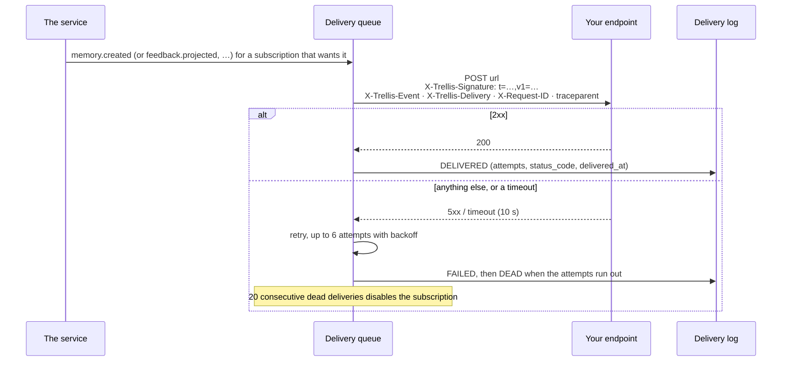

# Webhooks: hearing that something was remembered

A subscription is a URL plus the events it wants. Deliveries are signed, retried with backoff, kept
for thirty days so you can look at what happened, and disabled if an endpoint stays dead (ADR 0023).

## One event, one delivery



## Routes

| Route | Purpose | SDK |
| --- | --- | --- |
| `POST /v1/webhooks` | subscribe a URL to events; the signing secret is shown **once** | `webhooks.create(url, events, …)` |
| `GET /v1/webhooks` | the tenant's subscriptions (cursor paged) | `webhooks.list()`, `webhooks.page()` |
| `GET /v1/webhooks/{id}` | one subscription | `webhooks.get(id)` |
| `PATCH /v1/webhooks/{id}` | change its url, events, description or enabled flag | `webhooks.update(id, …)` |
| `DELETE /v1/webhooks/{id}` | delete it (its delivery history stays readable by id) | `webhooks.delete(id)` |
| `GET /v1/webhooks/{id}/deliveries` | what was delivered and what failed, newest first | `webhooks.deliveries(id)`, `webhooks.deliveries_page(id)` |
| `POST /v1/webhooks/{id}/test` | queue a `webhook.test` delivery | `webhooks.test(id)` |

`webhooks` is `memory.administer(tenant_id).webhooks` — subscriptions are a tenant-level resource,
not something a per-request scope owns.

## Subscribing

```python
webhooks = memory.administer("acme").webhooks

created = await webhooks.create(
    "https://ops.example.com/hooks/memory",
    ["memory.created", "feedback.projected"],
    workspace_id="supply-chain-ws",      # optional: only that workspace's events
    description="ops timeline",
)
secret = created.secret       # shown once; None on an idempotent replay. Store it now.

await webhooks.test(created.subscription_id)
for delivery in await webhooks.deliveries(created.subscription_id, limit=20):
    print(delivery.status, delivery.attempts, delivery.status_code, delivery.last_error)
```

The event vocabulary is closed: `memory.created`, `memory.superseded`, `memory.retracted`,
`feedback.received`, `feedback.projected`, `webhook.test`.

## Verifying what you receive

```python
from fastapi import Request
from trellis.memory.webhooks import verify_signature


async def receive(request: Request) -> dict:
    body = await request.body()                       # the raw bytes, not the parsed JSON
    if not verify_signature(SECRET, request.headers.get("X-Trellis-Signature"), body):
        return {"ok": False}                          # 400: not ours, or too old
    event = await request.json()
    print(event["type"], event["event_id"], event["data"])
    return {"ok": True}
```

The signature is `t=<unix seconds>,v1=<hex hmac-sha256 of "t.body">`, compared in constant time,
and a timestamp more than 300 seconds old is refused — so a captured delivery cannot be replayed
at you later. Verify against the **raw body**: re-serialising the JSON changes the bytes and the
signature will not match.

Payload shape: `{event_id, type, tenant_id, workspace_id, occurred_at, data}`. `event_id` is the
deduplication key — deliveries are at-least-once, so a receiver that must be exactly-once keeps a
seen-set of those ids.

## The limits, because they are not settings

| Rule | Value |
| --- | --- |
| delivery timeout | 10 s |
| attempts | up to 6, with backoff |
| disabled after | 20 consecutive dead deliveries |
| subscriptions per tenant | 50 |
| response body read | first 64 KB, then the connection closes |
| delivery history | 30 days |

These are the same for every deployment on purpose: a per-tenant retry policy is a way to make one
tenant's broken endpoint everyone's problem.

## What this area does not do

* it does not deliver to a private or local address (`.localhost`, `.local`, `.internal` and
  private ranges are refused) — an SSRF surface is not a feature;
* it does not show you the secret twice;
* it does not guarantee ordering: use `occurred_at` and the payload, not arrival order;
* it does not deliver a run's *events* — run events are the harness's stream
  (`WebhookEventSink`), and this is the Memory Service's own vocabulary.
