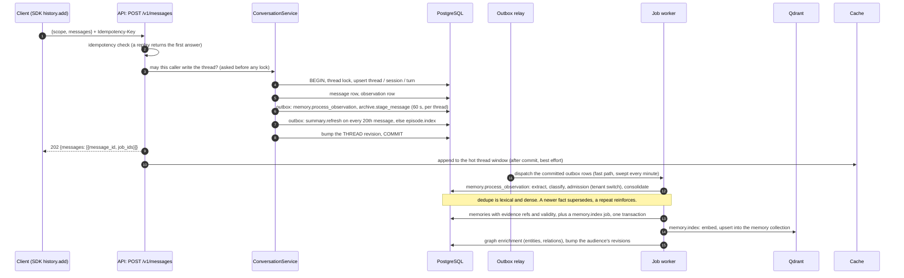
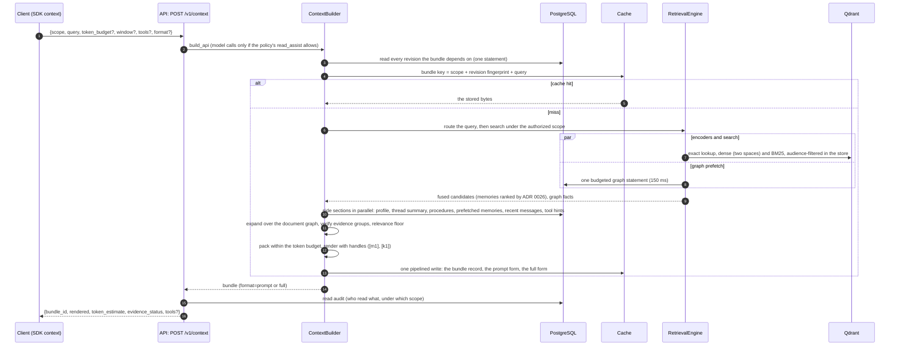
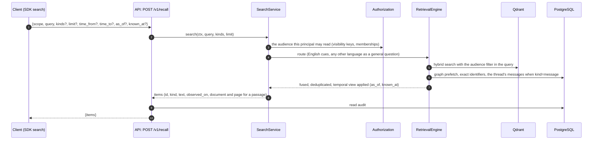
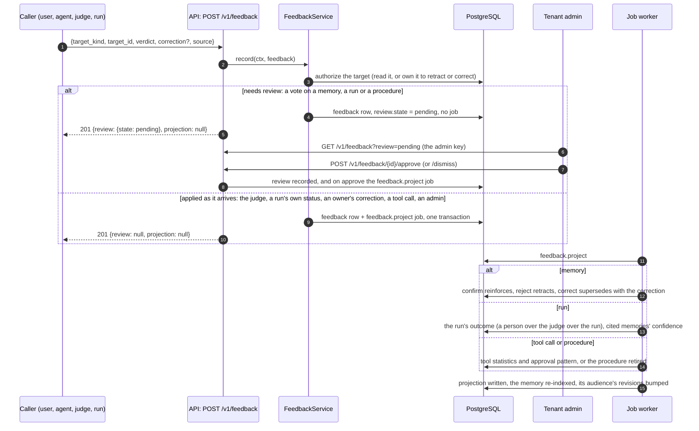
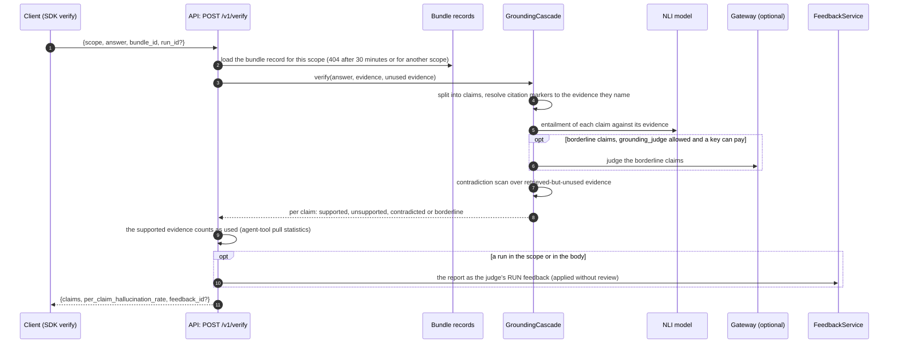
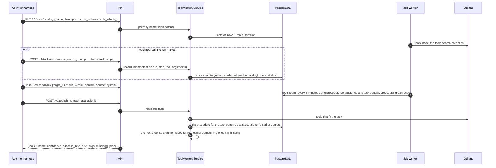
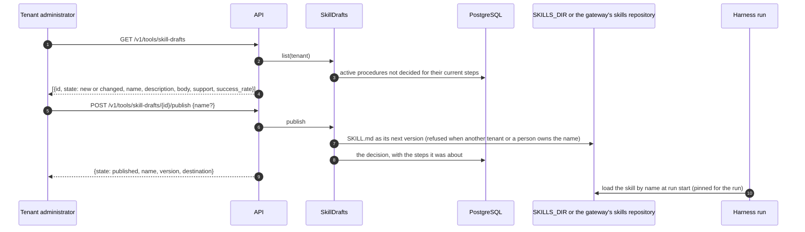
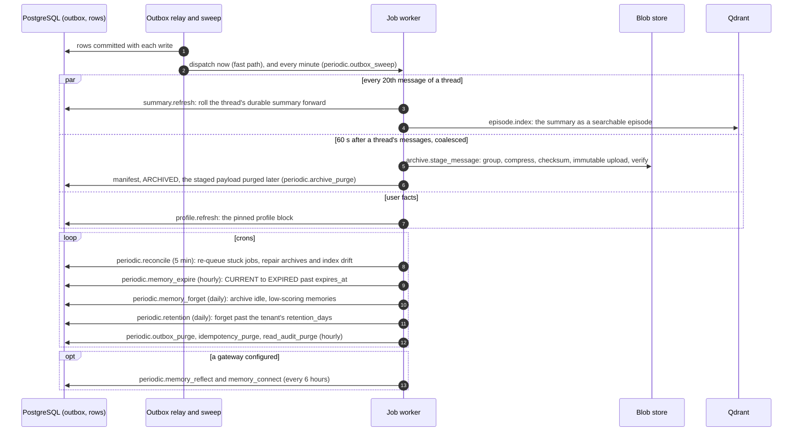

# Key flows

How the service handles each kind of call, inside the service: which module does what, what is
committed before the response, and what runs later in the job worker. One sequence diagram per
flow. The per-area pages in [`api/`](api/README.md) show the same flows from the caller's side,
with every route and SDK call; [ARCHITECTURE.md](ARCHITECTURE.md) is the structure the flows
run through. The runnable form of each flow is in [`examples/`](../examples/README.md).

| Flow | Entry point | Runs in | Example |
|---|---|---|---|
| [1. Ingest: history add](#1-ingest-history-add) | `POST /v1/messages` | request, then jobs | [02](../examples/02_conversation_history.py), [03](../examples/03_remember_search_forget.py) |
| [2. Context build](#2-context-build) | `POST /v1/context` | request | [01](../examples/01_quickstart_context.py), [04](../examples/04_documents.py) |
| [3. Search and recall](#3-search-and-recall) | `POST /v1/recall` | request | [03](../examples/03_remember_search_forget.py), [05](../examples/05_agents_runs_and_sharing.py) |
| [4. Feedback and the review queue](#4-feedback-and-the-review-queue) | `POST /v1/feedback`, `/approve`, `/dismiss` | request, then a job | [08](../examples/08_feedback_and_review.py) |
| [5. Verify and grounding](#5-verify-and-grounding) | `POST /v1/verify` | request | [06](../examples/06_verify_grounding.py) |
| [6. Tool catalog and hints](#6-tool-catalog-and-hints) | `PUT /v1/tools/catalog`, `POST /v1/tools/invocations`, `POST /v1/tools/hints` | request, then jobs | [07](../examples/07_tool_memory_and_hints.py) |
| [7. Compaction and background jobs](#7-compaction-and-background-jobs) | the outbox, the worker, the crons | job worker | [10](../examples/10_background_jobs_and_summary.py) |

Every flow starts the same way: the credential is authenticated, the trusted headers and the
body's `scope` become one `MemoryExecutionContext` (a body that contradicts a header is
refused), and a write carries an `Idempotency-Key` (the SDK derives one). Every read is
filtered by audience **in the store**, before anything is ranked.

---

## 1. Ingest: history add

A message is durable when the response says so, and becomes memory afterwards. The request does
the cheap, transactional part (`modules/conversation/service.py`); everything expensive is a
job, committed in the same transaction as the message (the transactional outbox, ADR 0004).

`role: "EVENT"` is stored as an internal message and learned from as an event. A message in a
language other than English is kept verbatim and indexed in the multilingual dense space; the
model reads it into typed facts only when the tenant's key and policy allow
([chapter 8](guide/08-models.md#the-twelve-uses)). `ctx.remember(...)` (`POST /v1/memories`) is
the direct path: one memory, stored verbatim, never gated.

## 2. Context build

`POST /v1/context` is the call an agent makes every turn (`modules/context/builder.py`). A
cached bundle is served only while every revision it depends on is unchanged, so a write by
anyone in the bundle's audience retires it ([caching](ARCHITECTURE.md#caching)).

The `bundle_id` names the record `verify` later checks an answer against (kept 30 minutes).
`evidence_status` is `COMPLETE`, `INCOMPLETE` or `INSUFFICIENT`; nothing raises on
`INSUFFICIENT`, so check it and say you do not know. The pipeline in detail:
[chapter 4](guide/04-retrieval.md) and [api/context.md](api/context.md).

## 3. Search and recall

`POST /v1/recall` (SDK `search`) is retrieval without the bundle: ranked, scope-filtered items
of the kinds you ask for (`memory`, `chunk`, `summary`, `episode`, `message`). It shares the
retrieval engine with the context build and skips the packing, the side sections and the cache.

A superseded or forgotten memory is never served as current; `as_of` and `known_at` read it as
it was. Example [05](../examples/05_agents_runs_and_sharing.py) shows the audience at work: a
`RUN` note is found by its run and the runs it spawned, and by nobody else.

## 4. Feedback and the review queue

A verdict is stored, then projected by a job (`modules/feedback/service.py`). A vote that
would change what was learned on one person's or one agent's word waits for the tenant's
administrator (ADR 0028).

The projection is a later fact, which is why `GET /v1/feedback/{id}` is worth calling after a
`POST`: example [08](../examples/08_feedback_and_review.py) reads it back. Details:
[api/feedback.md](api/feedback.md).

## 5. Verify and grounding

`POST /v1/verify` checks an answer claim by claim against the bundle it was built from
(`modules/grounding/cascade.py`). Deterministic first, the model last and only for the
borderline band.

Without a gateway a borderline claim stays `borderline`. Offline the NLI is the lexical
stand-in, so example [06](../examples/06_verify_grounding.py) shows the mechanism, not the
quality of a real entailment model.

## 6. Tool catalog and hints

The service never runs a tool. It keeps the catalog, records what a run called, learns from
runs labelled successful, and answers which tool, which plan and which arguments
(`modules/tools/*`, ADR 0018).

`POST /v1/context` answers the same hints inline when it is sent `tools`. A run nobody labelled
counts as a weak success a day later if none of its calls failed. Details:
[api/tools.md](api/tools.md).

An active procedure becomes a skill only when a person publishes it
([learned skills](api/tools.md#learned-skills)):

## 7. Compaction and background jobs

What keeps memory small and current runs off the request path, in the job worker
(`modules/jobs/registry.py`). A job is committed with the write that needs it and dispatched
after the commit. The outbox sweep is the floor on how late a write can become a memory when
the fast path misses it.

The summary plus the 20-message window always covers the whole thread, so a long conversation
fits a context at any length; example [10](../examples/10_background_jobs_and_summary.py)
crosses the mark. Every job, its queue, its retries and its schedule:
[chapter 11](guide/11-operations.md#workers-and-periodic-jobs).
