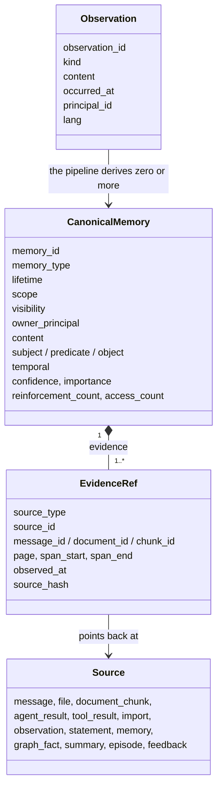
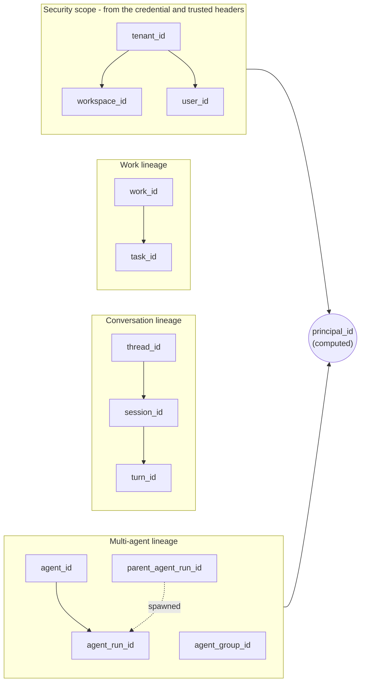

# 2 · Concepts

> Every page of this documentation uses about twenty nouns: observation, memory, evidence,
> scope, visibility, principal, run, bundle. This chapter defines each one against the code
> that implements it, so the rest of the guide and the API reference read without guessing.

**Previous:** [1 · Why a memory service](01-why-a-memory-service.md) · **Next:** [3 · Time](03-time.md) · **Up:** [Documentation](../README.md)

---

## The three nouns everything else hangs off

**An observation** is "this happened or was learned" (`domain/observation.py`). It is the
service's record of something an application reported, not a fact. Its `kind` is one of
`MESSAGE`, `FILE`, `AGENT_RESULT`, `TOOL_RESULT`, `DECISION`, `FEEDBACK`, `EVENT` or `IMPORT`
(`domain/enums.py:ObservationKind`). You do not post observations directly — the public API
has no observations route (`docs/openapi.json`). The service writes one for you:

- every message appended with `POST /v1/messages` becomes an observation of kind `MESSAGE`,
  or `EVENT` for `role: "EVENT"` (`modules/conversation/service.py:append_message`);
- an ingested document writes one too (`modules/ingestion/service.py`).

Each observation copies the full lineage of the request that produced it (`ctx.provenance()`,
fourteen fields from tenant to trace id) and its language (`lang`, decided without a model by
`domain/language.py`).

**A memory** is a `CanonicalMemory` (`domain/memory.py`): "a durable unit of intelligence
derived from raw evidence. Never replaces the evidence." It has compact canonical `content`,
optionally a `subject`/`predicate`/`object` triple, a temporal state (chapter 3), and the
counters that the ranking and forgetting read: `confidence`, `importance`,
`reinforcement_count` and `access_count`.

**Evidence** is an `EvidenceRef` (`domain/evidence.py`): a pointer from a derived object back
to the message, document chunk, page and character span, tool run or import it came from.
`CanonicalMemory.evidence` has `min_length=1`, so a memory with no provenance cannot be
constructed. The evidence module calls this the third lineage layer, next to processing
lineage and OpenTelemetry execution traces; of the three, only `EvidenceRef` and the traces
exist in the code today (chapter 11).

### Two ways a memory comes to exist

| You send | Route | What happens | Returns |
|---|---|---|---|
| an **event** — a conversation turn, or something that happened | `POST /v1/messages` | the message and its observation are stored with a `memory.process_observation` job in one transaction; a worker later extracts, classifies, consolidates and indexes | `202`: durable, not yet retrievable |
| a **statement** — a fact you know | `POST /v1/memories` | stored verbatim as one memory before the call returns, deduplicated on content per owner and scope; index and graph work are queued with it | the memory id (`deduplicated` when it already existed) |

The asynchronous path is the default because the service, not the caller, decides what is
worth keeping (chapter 1). Chapter 10 follows both paths step by step.

### The verbatim turn

Extraction is rule-based and conservative (ADR 0009): a sentence no rule recognises produces
no fact. So that such a turn can still be found, a user-authored message is also kept
**verbatim** as its own memory: type `OBSERVATION`, predicate `said`, category
`verbatim_turn`, importance 0.25 and confidence 0.99 (`modules/memory/native.py`, the
`keep_verbatim_turns` constant in `config/constants.py`). Three rules keep it from interfering
with real facts:

- `OBSERVATION` is one of `DERIVED_MEMORY_TYPES`, which consolidation never supersedes or
  merges, so a raw turn cannot replace a fact or be replaced by one;
- an agent's own text is never kept verbatim (`Observation.agent_authored`);
- a turn made only of questions and acknowledgements is not kept.

Forgetting a fact therefore does not forget the sentence it came from; the turn stays
searchable until it is forgotten too ([USAGE §4](../USAGE.md#4-correcting-supersede-forget-restore)).

### What a statement does

Each sentence of a user's message is also labelled with what it **does**, a `StatementKind`
(`domain/enums.py`, ADR 0037), stored on every memory it produced as
`system_metadata["statement_kind"]` (read it with `domain.memory.statement_kind_of`):

| Kind | The sentence | Example |
|---|---|---|
| `FACT` | states something | "Our primary supplier for heavy-duty pallets is Uline." |
| `RULE` | gives a standing instruction | "Whenever I ask for a stock audit, always format the response as a markdown table." |
| `CONDITIONAL_RULE` | gives one with an exception or a condition about the world | "Never include zero-stock items unless I type 'include out of stock'." |
| `STATUS` | reports the state of a thing | "Forklift #4 has been repaired and is back on the floor." |
| `CORRECTION` | revises something said before | "No, our system was updated. We now use the /shrinkage command." |
| `LIFECYCLE` | says a thing or a relationship began or ended | "The temporary refrigeration unit has been dismantled." |

A question, a greeting or a one-off request gets no kind; a verbatim turn carries the most
telling kind of its sentences (a correction outranks a rule, a rule a lifecycle change, then a
status, then a fact). A rule keeps its trigger and its exception as said
(`rule_trigger`, `rule_exception`) and is stored as a lasting rule wherever its standing word
sits ("For weekly overviews, never ...") and in any of the labeller's languages.

The labeller (`modules/memory/statements.py`) reads cue words from data packs
(`modules/memory/lexicon/generic.json` and the default domain pack `retail.json`) and leaves
what they cannot settle to the grounding model's NLI head and, when the tenant's policy
allows `contextual_extraction`, to the model - whose proposal counts only if the NLI head
confirms it. The kind changes nothing about what is retrieved; it is what later stages read
to keep rules in every answer and to let a correction, a status or a lifecycle change replace
what it revises.

### When two statements are about the same thing

Consolidation reinforces, replaces or links a memory only when the new statement is about the
same **subject** (ADR 0035, `domain/subjects.py`). A subject is compared by what decides its
identity, not by how it is spelled:

- **Identifiers block.** Every number, code, unit, date and month is an identifier, and so is
  a short code ("LA", "IN", "Block A", "C#", "A+", "Sales SE") - never mistaken for the word
  or company form it looks like.
  "Forklift #3" and "Forklift #4", "Warehouse 3" and "Warehouse 13", "Store LA" and "Store
  AL", "Dock 3 door 4" and "Dock 4 door 3", "5 kg" and "5 lb", "1,5 kg" and "15 kg", "Level
  -1" and "Level 1", "Q3" and "Q4" are different subjects however alike the rest is, and
  nothing - no vector, no model - joins them. Neither do two different titles ("Mrs Patel",
  "Mr Patel"), directions ("Shipment to Berlin", "Shipment from Berlin") or legal forms ("Acme
  Inc", "Acme Ltd"), nor a code alone and a name ("LA", "Berlin Hub").
- **Spelling and shorthand do not.** Letter case (of words; a short code keeps it),
  punctuation, "#", "No.", "Nr.", "núm.", "رقم", "नंबर" before a number, spacing, digits of
  any script and a leading article (not one that is part of a name, as in "El Salvador") are
  ignored: "Forklift 4" is "forklift #4" is "FORKLIFT-4", "Acme Logistics GmbH" is "Acme
  Logistics". Abbreviations
  and aliases from two vocabulary packs (data in `domain/vocabulary/`, a generic one and a
  retail one, both always on) are read as what they stand for: "OOS" is "out of stock", "PO
  4471" is "purchase order 4471", "DC 3" is "Distribution Centre 3", "hazmat" is "hazardous
  materials".
- **A tenant's own shorthand is learned from its own text**, with nothing to configure: once a
  stored memory says "cross-dock facility (CDF)" or "WOS stands for weeks of supply", the two
  forms name one subject in that memory's neighbourhood - even when a pack reads the short
  form otherwise. A short form defined as two things is not learned.
- **Uncertain is not the same.** What matches only with a plural folded, a title or a
  connective dropped or the words reordered ("John Roberts" / "John Robert", "Dr. Priya
  Sharma" / "Priya Sharma", "Bank of China" / "China Bank"), a code on one side only ("Sales
  SE" / "Sales"), a short form ("Acme" for "Acme Logistics"), a likely typo
  ("Jonathon"), an initialism ("GFS") or a translation ("Gabelstapler 4") is only
  *possible*: the service never merges it on its own. With the `conflict_adjudication` model
  use enabled (chapter 8), the closest such memory is what the model is asked about.

A memory about a person or anchor (`user:…`, `thread:…`) is about that identity: two of them
share a subject in the same single-valued slot (one city, one employer), or when their topics
share words ("tabs over spaces", "spaces instead of tabs"). Which values replace which is
[chapter 3](03-time.md)'s.

---

## A memory is classified on several axes at once

"Memory classification is deliberately multi-dimensional … No single enum describes a memory"
(`domain/enums.py`). The axes:

| Axis | Values | Question it answers |
|---|---|---|
| `memory_type` | eight primary kinds a caller states or the pipeline extracts — `SEMANTIC`, `PREFERENCE`, `EPISODIC`, `PROCEDURAL`, `TASK`, `USER`, `TOOL`, `OUTCOME`; three the service derives itself — `OBSERVATION`, `BELIEF`, `ENTITY_SUMMARY`; others accepted for imports; `CUSTOM` with a `custom_type` | what kind of knowledge is this? |
| `lifetime` | `EPHEMERAL`, `SHORT_TERM`, `LONG_TERM`, `ARCHIVAL` | how long is it expected to matter? |
| `scope` | a level — `AGENT`, `AGENT_GROUP`, `THREAD`, `USER`, `WORKSPACE`, `TENANT` — plus the ids that anchor it | where is it anchored? |
| `visibility` | `PRIVATE`, `RUN`, `AGENT_GROUP`, `THREAD`, `USER`, `WORKSPACE`, `TENANT` | who may read it? |
| `representation` | `MEMORY`, `CHUNK`, `SECTION`, `TABLE`, `MESSAGE`, `ENTITY`, `RELATION`, … | which form of knowledge is this object? |
| `temporal.status` | `CURRENT`, `SUPERSEDED`, `EXPIRED`, `RETRACTED`, `ARCHIVED` (and the reserved `CONTRADICTED`) | is it still true? (chapter 3) |

### Lifetime follows type

When the writer gives no lifetime, the type decides (`_LIFETIME_BY_TYPE` in
`modules/memory/native.py`):

| Lifetime | Types | What it means in practice |
|---|---|---|
| `LONG_TERM` | `PREFERENCE`, `USER`, `SEMANTIC`, `PROCEDURAL`, `EPISODIC`, `SHARED` | kept until superseded, forgotten, or archived by the forgetting policy |
| `SHORT_TERM` | `TASK`, `TOOL`, `AGENT`, `WORK`, `CONVERSATION` | expires seven days after it was last said (`SHORT_TERM_TTL` in `modules/memory/pipeline.py`) |
| `EPHEMERAL` | `WORKING` | never reaches PostgreSQL: a cache entry per thread or agent run (`modules/memory/ephemeral.py`) |

One sentence-level exception: an imperative ("do not invent a sales number") is a
`PREFERENCE` by shape but is given `SHORT_TERM`, so a one-off instruction does not become
permanent; restating it restarts its clock (`classify` in `modules/memory/native.py`). A
`RULE` or `CONDITIONAL_RULE` ("never suggest recipes with cilantro") says it is standing and is
`LONG_TERM` on sight.

---

## Scope and visibility are separate on purpose

**Scope** says where a memory is anchored; **visibility** says who may read it. The `Scope`
model (`domain/memory.py`) refuses a level without its anchor: an `AGENT` scope needs an
`agent_id`, a `THREAD` scope a `thread_id`, and so on. Visibility is turned into audience keys
that the store filters on before any search runs — that is chapter 7.

When the writer does not say, the visibility follows the type and the request
(`default_visibility` in `modules/memory/native.py`):

| Memory type | Default visibility |
|---|---|
| `USER`, `PREFERENCE` | `USER` when the request names a user, else `PRIVATE` |
| `AGENT`, `TOOL`, `WORKING` | `RUN` when the request carries an agent run, else `PRIVATE` |
| `SHARED` | `AGENT_GROUP` with a group id, else `THREAD` with a thread, else `TENANT` |
| anything else | `THREAD` with a thread, else `USER` with a user, else `TENANT` |

An agent writing a `TASK` or `EPISODIC` memory keeps it `PRIVATE` unless it says otherwise:
an agent's working notes are not shared by accident (ADR 0013).

---

## Principals: who is acting

A **principal** is the identity a request acts as, and the owner recorded on everything it
writes (`owner_principal`). It is computed, never sent (`MemoryExecutionContext.principal_id`
in `domain/context.py`):

| The request names | Principal |
|---|---|
| an agent and a user | `agent:<user_id>/<agent_id>` |
| an agent and no user (an unattended job) | `agent:<agent_id>` |
| a user only | `user:<user_id>` |
| neither | `service:anonymous` |

The agent form is bound to the user because `agent_id` arrives in the request body and is not
authenticated. The docstring records why: with a bare `agent:<agent_id>`, a caller who named
another user's agent read that agent's `PRIVATE` memory (HTTP 200), reproduced against a live
service before the change. Two users each running an agent called "research" are two
principals. Chapter 7 covers what each principal may read.

---

## The execution context

Every request is turned into one immutable `MemoryExecutionContext` (`domain/context.py`;
built in `api/deps.py:build_context`). It carries four groups of fields:

- **Security fields** — `tenant_id`, `workspace_id`, `user_id` — come from the credential and
  the trusted headers; a body value that disagrees with a header is refused
  (`build_context`). `custom_metadata` may not contain any security, lineage or correlation
  key (`RESERVED_METADATA_KEYS`).
- **Conversation lineage** is a strict chain the model validates: a `session_id` requires a
  `thread_id`, a `turn_id` requires a `session_id`. Without them a message joins the thread's
  own session and turn ([api/context.md](../api/context.md#conversation)).
- **Multi-agent lineage**: `agent_run_id` requires `agent_id`; `parent_agent_run_id` names the
  run that spawned this one, which is how hand-off flows down a run tree (chapter 7).
- **Correlation** — request, correlation, causation and trace ids — is attached to every log
  line and stored row.

`remember`, `recall` and `context` need only a tenant; appending messages needs a thread.

---

## Conversations

A **thread** is one conversation; a **session** an open UI session within it; a **turn** one
user question and its answer; a **message** one utterance (`domain/conversation.py`). A
message has a `role` — `USER`, `ASSISTANT`, `SYSTEM`, `TOOL`, `AGENT` or `EVENT` — and a
`kind`:

- `VISIBLE` messages are the chat a person sees, and must be `USER`, `ASSISTANT` or `SYSTEM`;
- `INTERNAL` messages are execution detail — an agent's reasoning, a tool exchange — and never
  appear in the visible history or the conversation window of a context. An `EVENT` is always
  internal (`append_message`).

An agent's own text never becomes the user's memory: `Observation.agent_authored` is true for
agent and tool results and for agent, assistant, tool or system roles, and first-person facts
in such text are re-typed to the agent (ADR 0013).

Two derived records summarise a thread: the **thread summary**, refreshed every 20 messages
(`SUMMARY_EVERY`; `modules/conversation/summary.py`) and pinned at the top of a context, and
the **episode**, the same summary indexed so that earlier conversations can be searched
(`kinds=["episode"]` on recall).

---

## Documents

A **document** is a file parsed into a hierarchy — document, section, subsection,
paragraph, table, code block — and cut into **chunks** of at most 400 estimated tokens
(`DocumentSettings` in `config/constants.py`; ADR 0007). A unit that fits is one chunk; a
longer one is split between lines, then sentences, with overlap, and every chunk's text is an
exact slice of the parsed text — nothing re-joined or re-spaced. Chunks are indexed with a
deterministic header (document, section path, page, entities, and for a footnote the sentence
that cites it) prepended, while the original text is kept for display. The structural links between parts of one document — parent, next,
footnote, cross-reference, definition — form the **Document Context Graph**, which is not the
same thing as the knowledge graph of chapter 5. A document is `STAGED` until its parse job
indexes it (`READY`) or gives up (`FAILED`).

---

## What comes back: the context bundle

A **context bundle** (`domain/context_bundle.py`) is "bounded, ranked, provenance-carrying
evidence" for one query in one execution context; it "never contains everything". It holds:

| Part | Contents |
|---|---|
| `profile`, `thread_summary`, `procedures`, `tools` | the pinned sections every prompt starts from |
| `conversation` | the most recent messages after the thread summary that fit |
| `memories`, `knowledge`, `graph_facts`, `summaries` | ranked items, each with its `id` and `relevance` (0..1); memories carry their date, subject, resolved dates and sources, passages their document, page and section |
| `evidence` | the evidence report: `COMPLETE`, `INCOMPLETE` or `INSUFFICIENT` (chapter 6) |
| `bundle_id` | the handle `/v1/verify` and the short item handles refer to |

Items are cited in the rendered text by short **handles** — `m1` for memories, `f1` for graph
facts, `s1` for summaries, `d1` for document passages (`HANDLE_PREFIXES`) — and
`update`, `forget` and `verify` accept a handle with the `bundle_id`. Chapter 4 is how the
bundle is chosen.

---

## The rest of the vocabulary

There is no `GLOSSARY.md` at the repository root; this table is the short form.

| Term | Meaning | Where |
|---|---|---|
| **tenant** | the wall nothing crosses; every id and every audience key carries it | chapter 7 |
| **workspace** | a team inside a tenant that shares what it stores | chapter 7, [api/tenancy.md](../api/tenancy.md) |
| **key** | a credential the service issued: `admin` or `service`, bound to one tenant | chapter 7 |
| **agent run** | one execution of an agent; a visibility boundary for its working notes | chapter 7, ADR 0013 |
| **profile block** | pinned text — `user`, `agent`, `workspace` — at most 4,000 characters, optionally kept current by a standing question | [api/profile.md](../api/profile.md) |
| **procedure** | a tool sequence learned from runs that succeeded | [api/tools.md](../api/tools.md) |
| **feedback** | a verdict on a memory, run, tool call or procedure; a vote waits for review | chapter 6 |
| **job** | background work committed with the write that caused it | chapter 10 |
| **revision** | a counter bumped by every write; cache keys embed revisions, so stale entries stop being addressed | chapter 10 |
| **model use** | one of twelve optional places a generative model may help, each with a deterministic fallback | chapter 8 |

---

## What to read next

- How a memory stops being true without being deleted → [chapter 3](03-time.md)
- How the bundle is ranked and packed → [chapter 4](04-retrieval.md)
- The routes that create and read each noun → [the API, area by area](../api/README.md)
