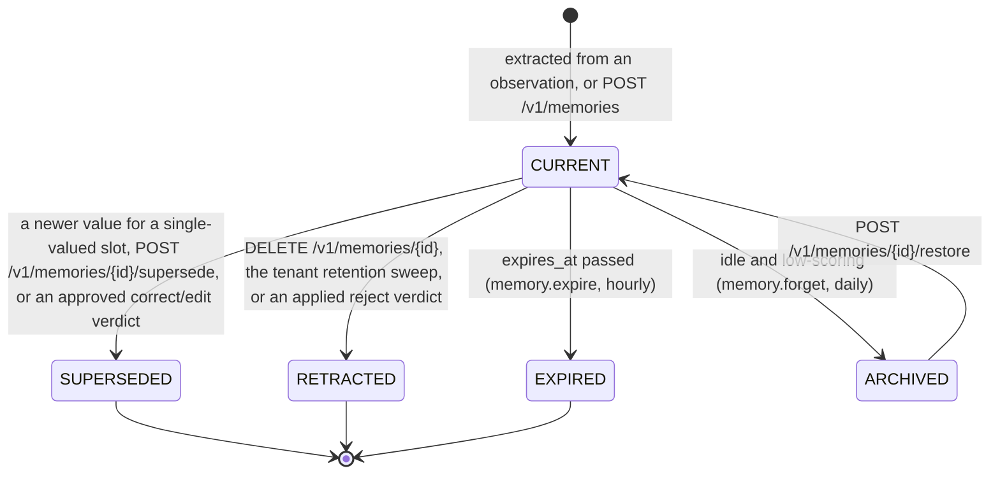
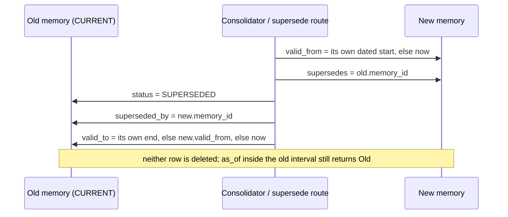
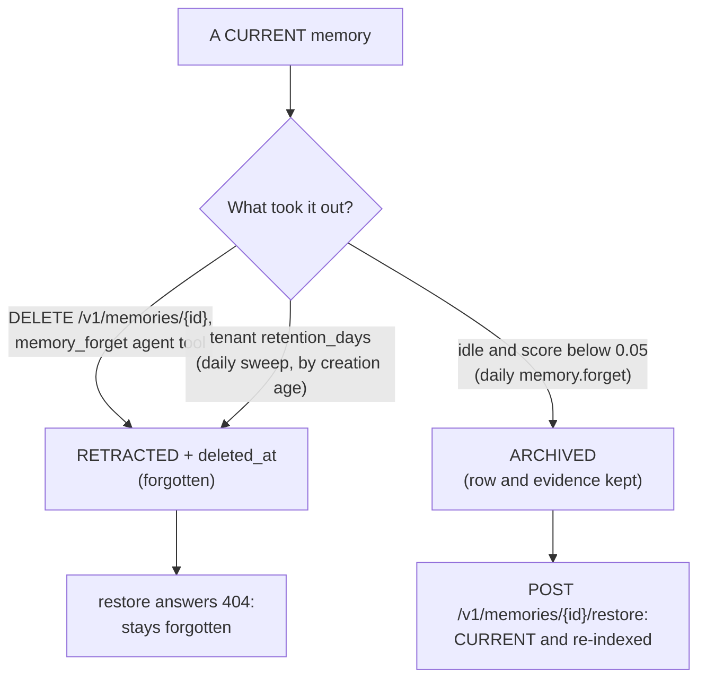
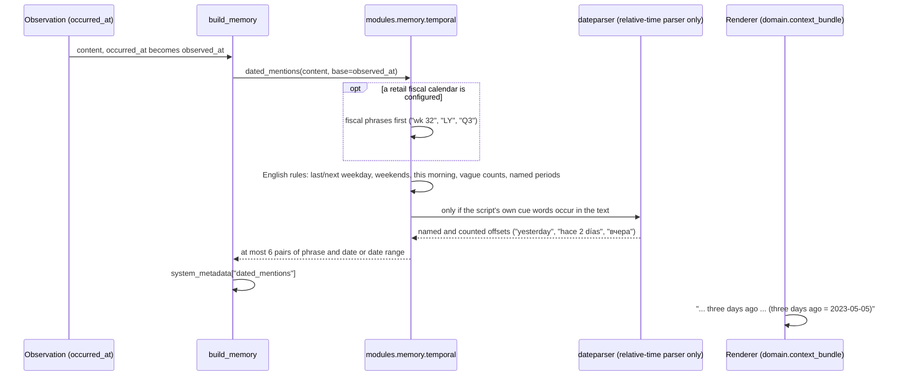

# 3 · Time

> A fact that stops being true is not deleted here. It is closed: it gets an end to its
> validity, a pointer to what replaced it, and it leaves retrieval — while the row, its
> evidence and the answer to "what did we believe last Tuesday" stay. This chapter covers the
> two clocks a memory carries, every way its status changes, what forgetting does and does
> not do, and how "three days ago" becomes a date.

**Previous:** [2 · Concepts](02-concepts.md) · **Next:** [4 · Retrieval](04-retrieval.md) · **Up:** [Documentation](../README.md)

---

## Two clocks

`TemporalState` (`domain/memory.py`) is "bitemporal validity: when the fact was true and when
we knew it".

| Field | Clock | Set from |
|---|---|---|
| `valid_from`, `valid_to` | **valid time** — when the fact held in the world | temporal hints in the text ("since 2026-09-01", "until …"), or the moment a replacement arrived |
| `observed_at` | **knowledge time** — when the service learned it | the `occurred_at` of the evidence: the message's own timestamp, which an importer may set to the original time (`occurred_at` on `POST /v1/messages`) |
| `status` | the lifecycle state below | the code paths below |
| `superseded_by`, `supersedes` | the revision chain, both directions | superseding |
| `contradicts` | memories that disagree with this one and stay current beside it | cross-principal conflicts (ADR 0013) |

Recall can ask either clock (`PointInTime` in `modules/retrieval/engine.py`):

- `as_of=<instant>` — what was **true** then: memories whose validity interval contains it,
  including ones superseded since;
- `known_at=<instant>` — what had been **learned** by then and not yet replaced: the audit
  question "what did we know on 1 September?";
- `time_from` / `time_to` — a plain filter on when something was observed.

Both point-in-time filters apply to memories only; a document passage has no valid time. They
work because superseded memories stay in the search index as history: the index holds
`CURRENT` and `SUPERSEDED` memories (`INDEXED_STATUSES` in `modules/rag/indexer.py`), each
with filterable `valid_from`, `valid_to` and `known_to` (the moment it was superseded), and
every ordinary search adds `current = true`.

---

## The status lifecycle

Every transition, as the code makes it. Only `CURRENT` memories are served by ordinary
retrieval; no transition here deletes a row.



| Transition | Code | What changes |
|---|---|---|
| → `SUPERSEDED` | `supersede` in `modules/memory/pipeline.py` and `modules/memory/revisions.py` | status, `superseded_by`, `valid_to` closed; the new row gets `supersedes` |
| → `RETRACTED` by forgetting | `MemoryRepository.forget` (`adapters/db/memory_repository.py`) | status `RETRACTED` **and** `deleted_at` set; final from the API's point of view (`404`) |
| → `RETRACTED` by a verdict | `retract` in `modules/memory/revisions.py`, from the feedback projector | status `RETRACTED`, `valid_to` closed; the row stays for the temporal view |
| → `EXPIRED` | `expire_due` in `adapters/db/memory_repository.py`, run by `memory.expire` | status `EXPIRED`; index entry removed by the `memory.index` job it enqueues |
| → `ARCHIVED` | `ForgettingService.sweep` (`modules/memory/forgetting.py`) | status `ARCHIVED`, a `forgetting` record with the score and threshold |
| `ARCHIVED` → `CURRENT` | `ForgettingService.restore` | status back, `restored_at` stamped, `access_count` + 1, re-indexed |

`CONTRADICTED` is in `TemporalStatus` and in the API's vocabulary, but nothing in `src/` sets
it: a conflict between two principals keeps both memories `CURRENT` and links them through
`contradicts` instead (below).

Each transition also bumps the revisions of every audience that could read the memory
(`bump_memory_revisions`), so a cached context that showed the old state stops being served
(chapter 10), and the `memory.index` job closes the memory's knowledge-graph relations
(`supersede_for_memory`, chapter 5).

---

## Superseding: how a fact is replaced

There are three routes to a supersession, and all three write the same chain.

**1. Consolidation, automatically.** When a new candidate arrives, the native consolidator
compares it with current memories in the same scope (ADR 0009, `consolidate` in
`modules/memory/native.py`). A new value for a **single-valued** slot supersedes the old one.
Which slots are single-valued is one closed vocabulary (`domain/predicates.py`): `name`,
`timezone`, `role`, `title`, `team`, `email`, `location`, `manager`, `employer`, `city`,
`works_at`, `lives_in` and the rest of that list, plus every `favourite_*`. A slot like
`likes`, `visited` or `participated_in` is **multi-valued**: values accumulate and none
replaces another. An explicit replacement signal ("actually", "no longer", "instead of",
"now") on the same slot also supersedes. Differing numbers or a negation always block a merge
— the classic false merges — and the memory gate holds the false-merge rate at 0.00 over 35
labelled pairs (`benchmark/results/memory_gate.json`).

**2. Explicitly.** `POST /v1/memories/{id}/supersede` (`ctx.update(id, text, reason=…)`)
writes a new version and closes the old. An already superseded memory answers `409`; only the
owner, the user an agent acts for, or a tenant admin may do it.

**3. By feedback.** An applied `correct` or `edit` verdict writes the correction as a new
memory that supersedes the old one, keeping its scope, visibility and evidence plus a
reference to the feedback (ADR 0023).

The replacement is bitemporal (`supersede` in `modules/memory/pipeline.py`):



**When two principals disagree** (ADR 0013): a different value for a single-valued slot,
written by *another* principal in a shared scope, is not a correction but a second opinion.
The consolidator answers `CONTRADICT`: both memories stay `CURRENT`, each lists the other in
`temporal.contradicts`, and the context's evidence report adds a "conflicting memories from
different principals" note (`modules/context/evidence.py`). A principal correcting its own
finding still supersedes it, because its own memories are matched first.

**What is not superseded:** the verbatim turn. Updating a fact leaves the turn it came from as
what was said then; only the current fact is served as the fact
([USAGE §4](../USAGE.md#4-correcting-supersede-forget-restore)).

---

## Expiry

A `SHORT_TERM` memory (tasks, tool notes, agent working memory — chapter 2) is written with
`expires_at = now + 7 days` (`SHORT_TERM_TTL`); a dated end of validity that comes sooner wins
(`build_memory` in `modules/memory/pipeline.py`). Being said again restarts the clock: the
reinforce branch sets `expires_at` seven days from the repeat, so "a standing instruction
repeated every day" is not killed seven days after its first mention.

`memory.expire` runs every hour (cron `29 * * * *`, `modules/jobs/registry.py`), sets due
memories to `EXPIRED`, bumps their readers' revisions and enqueues the index job that removes
their search and graph projections — inside the same transaction, so a crash after the expiry
commit cannot leave them searchable.

`EPHEMERAL` memories never reach PostgreSQL: they live in a per-thread or per-run cache list
with a TTL, readable only by the principal that wrote them or the user an agent works for
(`modules/memory/ephemeral.py`).

---

## Forgetting is archiving, and it is reversible

The background forgetting policy (`modules/memory/forgetting.py`) scores each idle memory:

```
score = importance × 0.5 ^ (idle_days / half_life) × (1 − 0.5 ^ (accesses + reinforcements))
```

`idle_days` runs from the latest of `updated_at`, `last_accessed_at` and `created_at`. A
memory idle for at least `forgetting_min_idle_days` (30) whose score is below
`forgetting_archive_threshold` (0.05) is marked `ARCHIVED`, with a half-life of 30 days and
at most 500 rows a run (`MemoryIntelligenceSettings` in `config/constants.py`). It runs daily
(`memory.forget`, cron `11 4 * * *`).

Two classes of memory are never archived automatically (`forgetting_protect_core`):

- the verbatim turns and rules every other memory is evidence from (categories
  `verbatim_turn` and `rule`);
- the user's own lasting facts and preferences (`LONG_TERM` memories of type `USER` or
  `PREFERENCE`).

They can still be forgotten explicitly or by tenant retention. "Recalled" is real usage: the
context builder buffers the ids of every memory it serves and bumps `access_count` and
`last_accessed_at` in one statement per tenant every two seconds or 200 ids
(`access_flush_seconds`, `access_flush_max_ids` in `ContextSettings`). The same score, with
the cache TTL as its half-life, evicts working-memory entries (`evict_working`).

### Three ways out of retrieval, and which ones come back



| | Forgotten | Archived |
|---|---|---|
| Caused by | `DELETE`, the `memory_forget` agent tool, the tenant's `retention_days` sweep | the forgetting policy |
| Row and evidence | kept, marked `deleted_at` | kept |
| Default listings | out | out |
| `restore` | `404` | back to `CURRENT` |
| Who may undo | nobody | the owner, the user an agent acts for, a tenant admin |

Tenant retention (`modules/tenancy/retention.py`, cron `37 3 * * *`) forgets memories older
than the tenant's `retention_days` **by creation age** — "retention is a data-minimisation
promise about how long something is kept, not about how recently it was useful" — through the
same soft delete `DELETE` uses, in bounded batches. It does **not yet** cover conversation
rows, documents or observations; the module and ADR 0021 both say so.

---

## Relative dates, resolved once, at ingest

"We met three days ago" is only a fact together with the day it was said. A reader handed the
line six weeks later has to do the arithmetic itself, which is the step a model is worst at.
So the service does it once, when the memory is written (`modules/memory/temporal.py`; ADR
0024 decision 7, amended 2026-10-04).



**What is resolved.**

- Named and counted offsets — `yesterday`, `tomorrow`, `three days ago`, `last week`,
  `hace 2 días`, `вчера`, `昨天` — in every language with a parser list for its script
  (`LANGUAGES`).
- The English phrases that are unambiguous, by rule: `last Friday` (the most recent Friday
  before the day it was said), `next Tuesday`, `last weekend`, `this weekend`,
  `this morning`, `tonight`.
- The vague counts — "a few days ago", "a couple of weeks ago" — as the range they allow.
- A **named period** is a range, not a day: `last week` is the Monday-to-Sunday before,
  `last month` the calendar month, `last year` the calendar year. A question naming that
  period is later matched against it (chapter 4, the period rule).

**What is deliberately not resolved.** dateparser's absolute-time parser is never used: on
this base it resolves weekdays correctly but also reads the word "we" as a Wednesday and
annotates absolute dates the step exists to leave alone. A bare weekday ("on Friday"),
`next weekend` and the seasons stay unresolved, because whether it is past or coming, and
which hemisphere, is not in the words. The rule is the measurement protocol's: a phrase
resolved to the wrong day corrupts an answer silently, so it is better left alone.

**What is stored.** Only the phrase, which is the memory's own words, and the date, which is
arithmetic on its timestamp: nothing generated. The renderer prints each memory with its
observed date and weekday and the resolved pairs after the text (`_memory_line` and
`_resolved_dates` in `domain/context_bundle.py`), so the model reading the bundle never does
the arithmetic. ADR 0024 records the cost on its host: 0.84 ms when the cue pre-check rejects
a text, 6–27 ms when it parses, on the ingest path only; the read path never calls this.

A deployment that sets `MEMORY__RETAIL_CALENDAR` (`454`, `445`, `544`, …) gets fiscal phrases
resolved against that calendar first, so "last week" is a fiscal week (`domain/fiscal.py`).

---

## Time at query time

The resolved dates are what the read side uses; chapter 4 has the details.

- The router classifies "when did…", "what year…", "since", "last quarter" and similar
  English cues as `TEMPORAL` (`modules/retrieval/router.py`), which routes the question to the
  graph as well.
- The memory ranking lifts, for a "when" question, memories that name a time, and for a
  question that names a period ("in June", "last month"), memories said in it or about a day
  in it (`modules/retrieval/memory_ranking.py`, `modules/retrieval/periods.py`).
- For a `TEMPORAL` question, the graph stage parses a date from the question and asks the
  graph for relations valid as of it (`modules/graph/retrieval.py`).

The knowledge graph keeps its own temporal status per relation — `CURRENT`, `SUPERSEDED`,
`RETRACTED`, `INVALIDATED` — with `as_of` (valid time) and `valid_at` (knowledge time) on the
entity routes. **Built, not wired:** marking a relation `INVALIDATED` ("it was never right")
with an `invalidated_by` edge is implemented in both graph stores (`GraphStore.invalidate`,
`modules/graph/invalidation.py`) but no module calls it today; relations are closed only as
`SUPERSEDED`, when their memory stops being current (chapter 5).

---

## What to read next

- How "currently true" is turned into a ranked, bounded context → [chapter 4](04-retrieval.md)
- Who may supersede, forget or restore a memory → [chapter 7](07-authorization.md)
- The routes: [api/memory.md](../api/memory.md) (supersede, forget, restore) and
  [api/context.md](../api/context.md) (recall with `as_of` and `known_at`)
