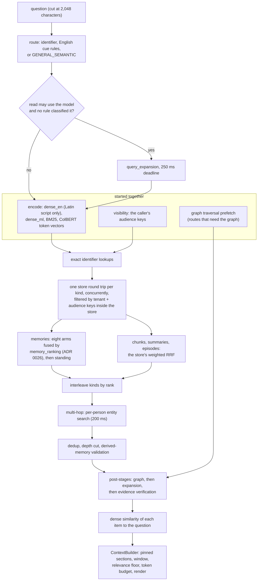
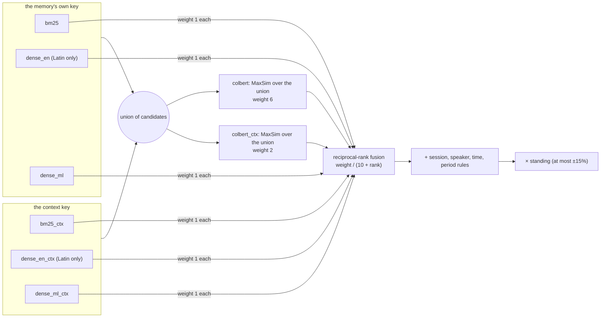
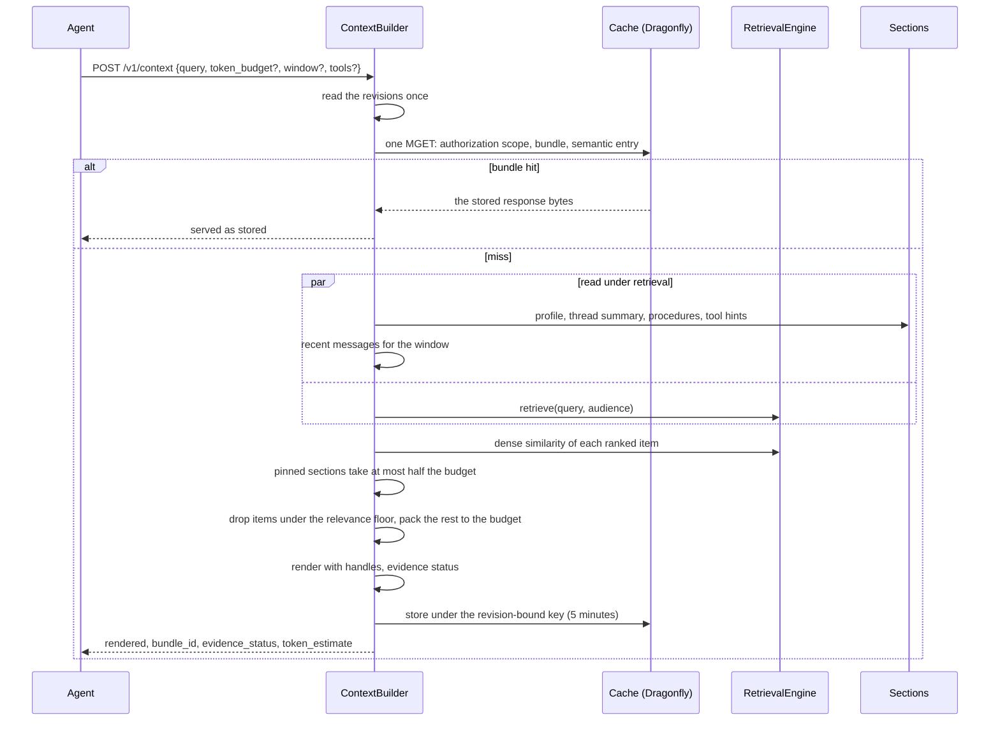

# 4 · Retrieval

> Four retrievers read the store — BM25, two dense encoders and a late-interaction
> (ColBERT) encoder — and their lists are combined by one fixed ranking that nothing was
> fitted to. This chapter follows a question from the moment it arrives to the rendered
> context: how it is routed, which arms are searched, how memories and documents are ranked,
> what the graph and the document structure add, how the bundle is packed under a token
> budget, and why there is no reranker.

**Previous:** [3 · Time](03-time.md) · **Next:** [5 · The knowledge graph](05-knowledge-graph.md) · **Up:** [Documentation](../README.md)

---

## The whole path

`RetrievalEngine.retrieve` (`modules/retrieval/engine.py`) produces ranked candidates;
`ContextBuilder` (`modules/context/builder.py`) turns them into a bundle. In order:

The rest of this chapter takes those boxes in order.

---

## Routing

`QueryRouter` (`modules/retrieval/router.py`) is regular expressions, no model. It returns a
`QueryType` and what the question needs. The rules are tried in this order, first match wins:

| Order | Type | Example cue | Also turns on |
|---|---|---|---|
| 1 | `EXACT_IDENTIFIER` | `mem_…`, `doc_…`, a UUID, `SKU-22` | exact lookup, graph |
| 2 | `CONVERSATION_HISTORY` | "what did I say", "earlier in this chat" | window; no documents |
| 3 | `USER_MEMORY` | "my timezone", "do I prefer" | window; no documents |
| 4 | `DECISION` | "why did we decide", "rationale" | graph |
| 5 | `GLOBAL_SUMMARY` | "overall", "key takeaways", "tl;dr" | document and section summaries |
| 6 | `DOCUMENT_MULTI_HOP` | "despite", "compare", "where has X travelled" | graph (three hops), entity search |
| 7 | `ENTITY_RELATION` | "who approved", "does X exclude" | graph (three hops) |
| 8 | `TEMPORAL` | "when did", "what year", "last quarter", "since" | graph, as of the date named |
| 9 | `DOCUMENT_LOCAL` | "page 4", "section 8", "according to the report" | — |
| 10 | `GENERAL_SEMANTIC` | anything else | graph by entity name (`semantic_graph`), three hops |

**The cue patterns are English.** A question in another language (`domain/language.py`
decides, without a model) is never routed by them — an incidental "since" in a German
sentence is not an English temporal cue — so only an identifier applies and everything else
is `GENERAL_SEMANTIC`: every dense space, BM25 and the graph by entity name.

**Query expansion** is the one place a read may call a model: when the tenant's policy has
`read_assist` on and a key can pay, a question no rule classified (every non-English
question included) is expanded by `query_expansion` (fast tier). The written query is encoded
while the model is asked, and past `query_expansion_timeout_ms` (250) it is searched as
written (`RetrievalSettings`). Separately, a deployment with a retail calendar searches
planning shorthand with its expansion — "WOS" with "weeks of supply" — from a fixed table
(`domain/glossary.py`).

---

## Encoding and the store-side filter

The query is encoded into every space the collection carries, concurrently, each model behind
its own single-caller runner (`adapters/models/_runner.py`; ADR 0024 decision 3):

| Space | Searched for | Model |
|---|---|---|
| `dense_en` | Latin-script queries only (`domain/script.py`) | Granite embedding small English r2, 384-d, ONNX |
| `dense_ml` | every query | Bekko a8m, 384-d, ONNX |
| `bm25` | every query | client-side BM25 term frequencies, Qdrant applies IDF |
| `colbert` | every query | mxbai edge ColBERT 32M, one 64-d vector per token |

A Cyrillic or Thai question therefore costs one dense encode, not two (ADR 0024 decision 2).

Every search carries the same filter, built before the search and applied **inside** Qdrant:
`tenant_id = T` and the record's `visibility_keys` overlap the caller's audience keys
(ADR 0005, ADR 0008; chapter 7), plus `current = true` for memories unless the request asked
for a point in time (chapter 3). A candidate the caller may not read is never a candidate, so
no ranking bug can leak it.

---

## The one ranking for memories

Memories are ranked by `modules/retrieval/memory_ranking.py` (ADR 0026). There is nothing to
tune per call and nothing that was fitted to a benchmark.

**Two keys per memory** (ADR 0025 decision 2). Each memory is indexed twice: its own text,
and the same text read after the turn it answers (the preceding message in the same
conversation, within six hours and 500 characters — `index_preceding_turn` in
`MemoryIntelligenceSettings`). A reply rarely restates its question — "Yes, last weekend with
my kids" answers "Did you go camping?" — so the second key carries the question's words.

**Eight ranked lists in one round trip.** `search_arms` (`adapters/search/qdrant_store.py`)
sends one `query_batch_points` with a prefetch per arm, each reading its own top
`memory_arm_depth` (100):

The ColBERT arms do not search the collection: they rescore the union of the other arms'
candidates, so their cost is bounded by the arms' depth, not by the tenant's size
(ADR 0025 decision 1).

**The score**, with the constants as they are in the code:

| Term | Value | Rule |
|---|---|---|
| fusion | `K = 10` | each arm adds `weight / (K + rank)`; every arm weighs 1 except `colbert` (`LATE = 6`) and `colbert_ctx` (`LATE_CONTEXT = 2`) |
| session | `SESSION = 0.3`, `SESSION_DEPTH = 50` | every memory gains 0.3 × the best fused score among the fused top 50 in its session — the day it was observed on. Evidence comes in runs. |
| speaker | `SPEAKER = 1.0` | a question that names a person lifts that person's memories by one rank-1 unit (`1 / (K + 1)`) |
| time | `TIME = 1.0` | a "when / what year / how long / before / after" question lifts memories whose text names a time |
| period | `PERIOD = 3.0` | a question naming a period ("in June", "on 1 February, 2023", "last month") lifts memories said in it or about a day in it, using the dates resolved at ingest (`modules/retrieval/periods.py`, chapter 3) |
| standing | at most ±15% | `by_standing` multiplies by `standing_factor(confidence, reinforcement)` (`domain/learning.py`): confirmed memories move up a little, doubted ones down; it reorders near-ties and never outweighs relevance |

**Why these values and not fitted ones.** ADR 0025 had shipped a logistic regression over 26
features fitted on LoCoMo. ADR 0026 tested whether those coefficients described
conversations or described LoCoMo, by fitting on one corpus and scoring the other: fitted on
LongMemEval, the learned ranking read **0.677** recall@10 on LoCoMo, where equal-weight
fusion with nothing fitted read **0.742**. Each value above was chosen on one corpus and kept
only where the other agreed; the speaker and time rules are round values neither corpus tuned.

**What it measured through the service** (ADR 0026, all ten LoCoMo conversations, 1,536
answerable questions): recall@10 **0.778** for the general ranking
(`benchmark/results/phase12/locomo_general.summary.json`), and **0.800** after the context
key gained its own ColBERT arm (`locomo_mk3.summary.json`), with context build p50 130 ms /
p95 279 ms on an otherwise idle host. That is lower than the 0.829 the learned ranking showed
on the corpus it was fitted on, and it is the number that carries to a corpus nobody fitted
it on. The period rule is not in ADR 0026's text: it is described in the module's docstring,
and no through-the-service figure for it is recorded in `benchmark/results/` or
`docs/MEASUREMENTS.md`.

### Multi-hop: the per-person search

For a multi-hop question over a memory-only pool, the people the question names are searched
again, each as their own subject, for the question's topic, and fused with the original
ranking (`memory_entity_search`, bounded by a 200 ms timeout). Measured over all 1,986 LoCoMo
questions (`docs/MEASUREMENTS.md` §8.4): +2.5 / +2.8 points of complete multi-hop coverage at
@50 / @100, no depth worse; it fires for 250 of the 1,986 questions and costs those +122 ms
at the median on the measuring box.

---

## Documents, summaries and episodes

Chunks, document summaries and thread episodes are ranked by the store's own reciprocal-rank
fusion, one prefetch per arm, weighted by `RetrievalSettings.hybrid_weights`:
`bm25` 2.0, `dense_en` 0.5, `dense_ml` 2.0, `colbert` 2.0. The weights were fitted offline
from per-arm rank dumps (`benchmark/fit_rrf_weights.py`; ADR 0024 decision 4) and are a
constant, not a setting. Adding the ColBERT arm at 2.0 moved SciFact nDCG@10 from 0.746 to
0.759 offline (ADR 0025).

The per-kind lists are **interleaved by rank** before the cut, so a long list of document
chunks can never crowd the memories out (`zip_longest` in `retrieve`).

**Depth.** One constant sets it: `FINAL_K = 50`, with prefetch and fusion depth at
`DEPTH_RATIO = 2.0` times that (`config/constants.py`). A memory-only pool keeps
`memory_recall_k = 100`. Exact-duplicate texts — the same document uploaded twice — collapse
onto one candidate. Exact identifier hits lead the list but do not end the search: a question
that names a thing is answered by documents that need not contain the identifier.

---

## What the post-stages add

Three stages run after the cut, in this order (`adapters/wiring.py`):

1. **Graph** (chapter 5): for routes that need it, the typed facts around the entities the
   question names, plus the source chunks and memories those facts point at. The traversal
   was started as soon as the scope was known, so it runs under the encoder instead of after
   the search.
2. **Expansion** over the Document Context Graph (ADR 0011, `modules/context/expansion.py`):
   for the best-ranked chunks, the definition of a term they use, the footnote they cite, the
   parent section's summary and the neighbouring chunks — never leaving the source document,
   at most `expansion_budget_items` (8). Exact-id hits are never expanded.
3. **Evidence verification** (chapter 6): the companions a chunk needs — its definition,
   footnote, referenced section — are checked, fetched directly when missing (up to two
   rounds), and the result becomes the bundle's evidence report.

---

## Packing the bundle

**The cache key** binds everything that changes the answer: tenant, the caller's scope
fingerprint, the revisions of every audience the bundle depends on, the retrieval and context
configuration, the index fingerprint, which model uses are active for this caller, the
budget, the document filter, the tools and the window flag (`_lookup`). A write bumps a
revision, so a cached bundle can never outlive the data it summarises (chapter 10). A
separate **semantic cache** reuses a bundle only for a deliberately narrow equivalence —
the same question minus polite framing and punctuation — and refuses any question that names
"now", "today", "latest" or quotes (`modules/context/semantic_cache.py`).

**Pinned sections first.** The profile blocks, the thread summary, the procedures learned for
the task and the tool hints open the prompt, in that priority, and together take at most half
the budget (`PINNED_SHARE = 0.5`, `modules/context/sections.py`). Each is one indexed read,
run concurrently with retrieval, and none calls a model.

**The relevance floor.** A fusion score only orders. Without a floor, a question the store
cannot answer fills its budget with whatever ranked next. Each ranked memory, chunk and
summary carries its cosine similarity to the question in the `dense_ml` space as `relevance`,
and one under `relevance_floor` (0.20) is not packed; exact hits and expansion companions are
exempt. Measured on a LoCoMo conversation (`docs/MEASUREMENTS.md` §8.2): at 0.20 every
evidence memory of 135 questions was still packed, while ten questions nothing in the corpus
answers went from 30.8 packed memories each to 0.9; at 0.25 the first evidence was lost.

**The budget.** The default `token_budget` is 8,000 (`ContextSettings`); the conversation
window is the most recent messages after the thread summary, at most 20 and 2,000 tokens;
`window=False` leaves it out for a framework that keeps its own history.

**The rendering** (`ContextBundle.render`, `domain/context_bundle.py`):

- `## Most relevant` — the top of the ranking (up to 30), each followed by the memories
  extracted from the same turn;
- `## Memories` — every memory, oldest first, each line with its date, weekday, speaker,
  text and resolved relative dates; a memory already shown above stands as a one-line
  pointer, so every body appears exactly once, and two or more values of one multi-valued
  slot ("participated in" on four days) are gathered into one dated block;
- `## Facts`, `## Summaries`, `## Knowledge` — graph facts, summaries and document passages
  with their section paths;
- `## Evidence status` — only when it is not `COMPLETE`.

A model-extracted memory is labelled "model-extracted, unverified" on its line. The default
response (`format="prompt"`) is the rendered text plus `bundle_id`, `evidence_status` and
`token_estimate`; `format="full"` returns every part. At the 8.7 measurement the prompt form
was 12,456 bytes at p50 against 74,128 for the full bundle, and no faster to build
(`docs/MEASUREMENTS.md` §8.7).

---

## Why there is no reranker

A cross-encoder reranker re-scores the top candidates jointly with the question. It was the
default once; it was removed on measurement, twice.

**As a replacement for the fused order** (`docs/MEASUREMENTS.md` §3e, SciFact, 1,000
documents, 70 paired queries, clean store): nDCG@10 79.33% with reranking against **84.51%**
without, recall@10 97.14% against 98.57%. Paired per query it rescued no query the first
stage missed and lost one; exact sign test p = 0.012, mean nDCG delta −0.0518 with a 95%
interval of [−0.0917, −0.0120]. It cost 11.2 s per query against 0.53 s — about 161 cores for
20 requests a second against about 8.

**As features of a learned ranking** (ADR 0025, LoCoMo, leave-one-conversation-out): two
cross-encoders added 2.6 points of recall@10, and cost 2.4 CPU-seconds per memory search
against 0.17 s without them — about 48 cores against 3.4 at 20 requests a second. The arms'
own scores, sessions and speakers recovered the difference, so the service ships no
cross-encoder (ADR 0025 decision 6). The offline scorer stays in `benchmark/cross_encoder.py`
for anyone who wants to re-run the question on their own corpus.

ADR 0027 also tried fusing the graph's memories into the ranking as one more ranked list; it
was neutral at best and was removed rather than left switched off.

---

## Latency, honestly

On the only hardware this has been measured on — a 2015 4-core laptop without AVX2, shared
with other workloads — `/v1/context` with the model off read p50 305 ms / p95 525 ms in the
prompt form, of which the two encodes and two hybrid searches are about three quarters
(`docs/MEASUREMENTS.md` §8.7). The 300 ms p95 target is set for an 8 vCPU VM and has not been
measured there. No read calls a model unless the tenant's policy turns `read_assist` on; query
decomposition was removed in 0.3.0 because a model call on the read path took 3.2–12.2 s
through a local gateway (`docs/MEASUREMENTS.md` §8.4).

---

## What to read next

- What the graph stage adds and how it stays inside its budget → [chapter 5](05-knowledge-graph.md)
- The evidence report and checking an answer against the bundle → [chapter 6](06-trust.md)
- The routes: [api/context.md](../api/context.md) (`/v1/context`, `/v1/recall`)
