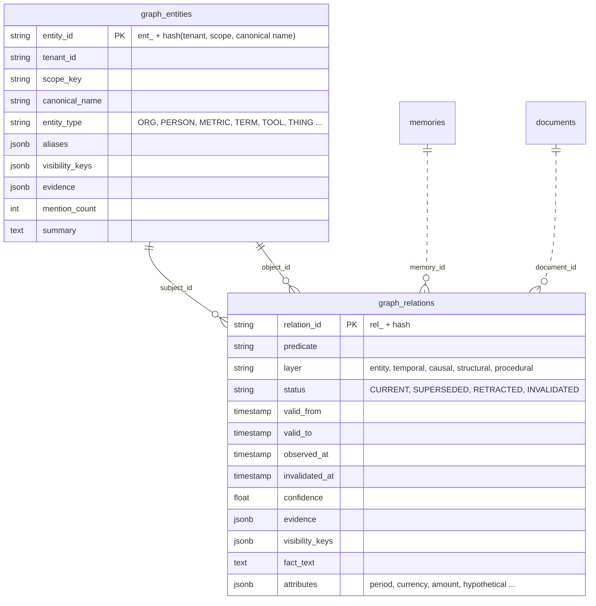
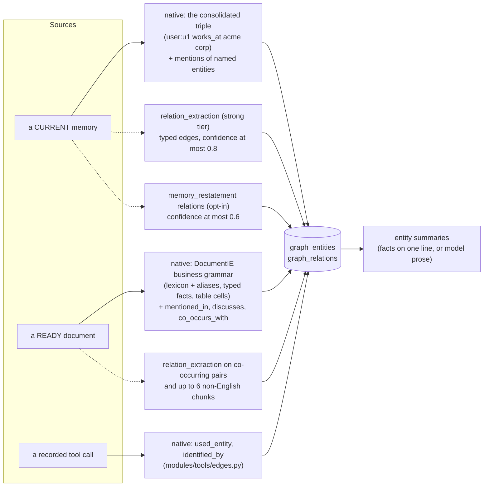
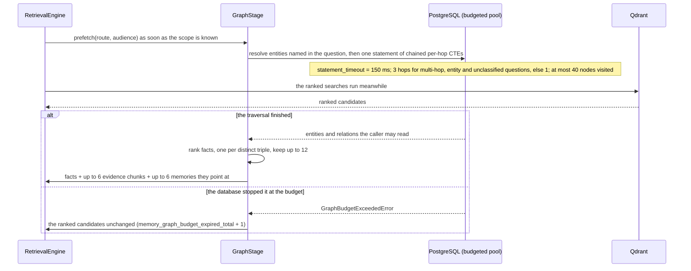

# 5 · The knowledge graph

> Similarity search finds passages that look like the question. It cannot follow a chain —
> "who leads the freight operator Acme uses?" — or answer "what does Adjusted EBITDA
> exclude?" when the answer is a relation stated once in a footnote, or say what was true on a
> given date. The knowledge graph exists for those questions. This chapter covers what is in
> it, how it is built with and without a model, and what it adds to a context under a hard
> time budget.

**Previous:** [4 · Retrieval](04-retrieval.md) · **Next:** [6 · Trust](06-trust.md) · **Up:** [Documentation](../README.md)

---

## Two graphs, not one

| | Document Context Graph | Knowledge graph |
|---|---|---|
| Nodes | parts of one document: sections, paragraphs, tables, chunks | entities: organisations, people, metrics, terms, places, tools, users |
| Edges | `PARENT`, `CHILD`, `NEXT`, `PREVIOUS`, `ON_PAGE`, `IN_TABLE`, `FOOTNOTE`, `CROSS_REFERENCE`, `MENTIONS`, `DEFINED_BY`, `DEFINES` (`domain/enums.py:ContextGraphEdge`) | typed relations: `works_at`, `excludes`, `driven_by`, `acquired`, `has_value`, … |
| Built from | document structure, without a model (ADR 0007) | memories, documents and tool calls (ADR 0010, ADR 0016) |
| Stored in | `context_edges` | `graph_entities`, `graph_relations` |
| Used by | expansion and evidence verification (chapters 4 and 6) | the graph stage, the entity routes |

The rest of this chapter is about the knowledge graph.

---

## What is stored

The graph lives in PostgreSQL next to the canonical rows (ADR 0010): one backup restores
everything and no extra database is needed. It is derived state, rebuildable from memories and
chunks.

(Columns from `adapters/db/orm.py`.) Three properties carry the design:

- **Every relation carries evidence.** A fact points at the chunk, node, page or message it
  came from. Retrieval uses the graph as "a router to evidence, never a substitute for it"
  (`modules/graph/native.py`): the facts' source text is pulled into the context with them.
- **Ids are deterministic hashes**, so re-running enrichment upserts instead of duplicating,
  and `delete_for_document` plus a re-run is an exact rebuild of a document's part.
- **Every entity and relation carries the audience keys of its source**, so the graph is
  filtered by the same rule as everything else (chapter 7).

### Layers

Every relation belongs to exactly one layer, assigned from its predicate
(`domain/graph.py:layer_for`):

| Layer | Predicates (examples) | Answers |
|---|---|---|
| `causal` | `driven_by`, `caused_by`, `due_to`, `offset_by`, `depends_on` | why |
| `temporal` | `supersedes`, `invalidated_by`, `closed_on`, `founded_in`, `effective_from` | when, and which fact replaced which |
| `structural` | `mentions`, `mentioned_in`, `co_occurs_with`, `discusses`, `defined_in` | where something appears |
| `procedural` | `used_entity`, `identified_by` | what tool calls did with entities |
| `entity` | everything else: `works_at`, `excludes`, `has_value`, `acquired`, … | typed facts |

`structural` and `procedural` are the bookkeeping layers (`BOOKKEEPING_LAYERS`): retrieval
ranks them after the typed facts. `GET /v1/graph/entities/{id}?layers=` restricts a traversal
to some layers.

### Time on a relation

A relation has its own status. `SUPERSEDED` means it was true and stopped being true
(`valid_to` set); `as_of` inside its interval still returns it. `INVALIDATED` means it was
never right; `as_of` never returns it, and `valid_at` before the invalidation still does,
because that is what was believed then (`modules/graph/invalidation.py`). The entity routes
take both clocks: `as_of` for valid time, `valid_at` for knowledge time.

When a memory stops being current — superseded, expired, forgotten, archived — or is a model
rewrite without verified entailment, the `memory.index` job closes its relations
(`supersede_for_memory`, called from `GraphService.enrich_memories`).

**Built, not wired:** the invalidation path — closing a relation as `INVALIDATED` and writing
an `invalidated_by` edge that records why it gave way — is implemented in both stores
(`GraphStore.invalidate` in `adapters/graph/postgres_store.py` and `memory_store.py`), but no
module calls it today. Re-extraction and contradictions do not yet invalidate relations;
until they do, `INVALIDATED` is a status the read filters honour and nothing writes.

---

## How it is built

Enrichment runs inside the jobs that index the source — `memory.index` for memories,
`document.index` for documents (`modules/jobs/registry.py`) — never on the request that wrote
the data. (`docs/ARCHITECTURE.md` draws it as `graph.enrich`; there is no job of that name.)

Solid arrows are deterministic and always run; dotted arrows run only when a model use is
allowed and a key can pay (chapter 8).

### Native enrichment, from memories

A memory contributes a typed fact from its consolidated subject–predicate–object triple, plus
a `mentions` edge to each entity its text names (`NativeGraphEnrichment.enrich_memory`). The
speaker is their own node (`user:<id>`). Because extraction is first-person and English-shaped
(ADR 0009), a casual third-person turn contributes few typed facts on its own; that is the gap
`relation_extraction` and `memory_restatement` fill when a model is allowed.

### Native enrichment, from documents

A document goes through a deterministic two-pass "business grammar" (ADR 0016,
`modules/graph/document_facts.py`):

1. **A document-level lexicon**: defined terms, a financial metric lexicon, numeric table row
   labels, organisations by legal suffix, people with roles, a location gazetteer, programmes
   from headings. Aliases resolve to one entity — `ARR`, `total revenue` → `Revenue`; `ACME`
   → `ACME Corporation` — and are searched in both stores (`aliases`).
2. **A grammar of business statements** over each chunk: `has_value` with period, currency,
   amount and change; table cells as one `has_value` per row and period; `segment_of`,
   `driven_by`, `excludes`, `operates_in`, `acquired`, `approved_by`, `closed_on` and more.
   "Would have been" statements become `would_have_value` with `hypothetical: true`, so a
   counterfactual never masquerades as the actual figure.

Every rule is anchored on an explicit cue and keeps its sentence and chunk: precision over
recall. The structural layer stays beside the typed facts — one `mentioned_in` per entity with
its pages, `discusses` per section, and `co_occurs_with` at low confidence for at most six
entities per chunk (ADR 0010) — so the graph remains a router to evidence even where no typed
fact was found. ADR 0016 is explicit that English business and financial documents are covered
well and other genres need lexicon and rule additions.

The gate: over 49 golden facts in the fixture documents, fact recall 1.00, 0 false facts and
0 noise entities (`benchmark/results/kg_gate.json`).

### Native enrichment, from tool calls

A tool catalog entry can say which argument names which kind of entity (`supplier: ORG`). A
recorded call with such an argument `used_entity` it; when the call succeeded and the output
carried an id for that entity, the entity is `identified_by` that id. That is what lets a
later task naming "Acme" have its `supplier_id` filled in (`modules/tools/edges.py`). These
edges carry the call's audience.

### With a model

| Use | When | Bounds (`modules/graph/native.py`, `GraphSettings`) |
|---|---|---|
| `relation_extraction` | English: a memory with two or more rule-found entities and only `mentions` between them → typed relations among those entities. Other languages: the model names both ends, and both names must occur verbatim in the text. Documents: the top co-occurring entity pairs, and chunks not in English | confidence at most 0.8, `extraction: llm`; at most 8 relations per memory, 12 pairs and 6 non-English chunks per document |
| `memory_restatement` (opt-in, ADR 0027) | the relations returned with a turn's restatement are written bound to the turn, and the turn is linked to each object it names | confidence at most 0.6; every word of person and object must occur in what the model was shown |
| `summaries` | entity summaries rewritten as prose | at most 4 model calls per enrichment job, 32 entities refreshed per job, 12 facts per summary |
| `entity_resolution` | `GET /v1/graph/entities?q=` names that match no entity lexically | never used by the retrieval-time graph stage |

An entity's `summary` is written only from facts every reader of the entity may read, so a
summary never discloses more than the relations do, and it is rewritten only when those facts
change (`modules/graph/summaries.py`). Without a model it is the facts on one line:
`Acme (ORG): acquired Westfalen; operates in Germany`.

---

## The graph at query time

`GraphStage` (`modules/graph/retrieval.py`) runs for the routes that need the graph:
`ENTITY_RELATION`, `DOCUMENT_MULTI_HOP`, `TEMPORAL`, `DECISION`, `EXACT_IDENTIFIER`, and
`GENERAL_SEMANTIC` while `semantic_graph` is on — which covers every question not in English
(chapter 4).

**Started early.** The traversal depends only on the route and the caller's scope, so it
starts before the search and runs underneath the encoder; it used to run after the search
"whose result it never read".

**Bounded by the database, not a client timer.** The traversal is one SQL statement over
indexed, per-hop-limited CTEs on a separate connection pool (`budgeted_pool_size` 4,
`budgeted_pool_overflow` 4) whose connections carry `prefetch_budget_ms` — 150 ms — as their
`statement_timeout` (`GraphSettings`, `adapters/graph/postgres_store.py`). PostgreSQL stops a
slow walk; the query is then answered without graph facts. The reason this is server time:
a client-side 150 ms timer measured the client's own scheduling as much as the graph, and on
a loaded box dropped facts from traversals whose statements took 90 ms after waits that lasted
370–590 ms (`docs/MEASUREMENTS.md` §8.3). On the measuring box the change took the mean
traversal from 13.0 to 9.9 ms (§8.1), and with the production budget 159 of 1,986 LoCoMo
traversals were still stopped at 150 ms there (§8.3) — the budget doing its job.

**Three hops, not two, for a two-hop question.** Entities in different chunks of one document
are already two hops apart through the document that mentions them, so "who leads the freight
operator used by Acme?" — Acme → report → Westfalen → Bergmann — needs three. `max_visited`
(40 at retrieval time) bounds the cost.

**Ranking the facts.** Typed facts before the bookkeeping layers; within them, facts whose
predicate the question cues first ("exclude" → `excludes`, "drove" or "why" → `driven_by`,
"pay" → `consideration`); then facts touching an entity the question named; then confidence.
Copies of one document yield the same triple under different ids, and only one is kept.

**What enters the context.** Facts become `kind="fact"` candidates in the bundle's
`graph_facts` (cited `f1`, `f2`, …), appended after the ranked evidence so they never displace
it. The chunks the facts cite are inserted right after the ranked evidence and before the
facts; conversation relations point at memories, which are fetched under their own bound.
Everything pulled in is checked against the same audience specification the store used.

**As of a date.** For a `TEMPORAL` question the stage parses a date from the question and asks
for the relations valid then.

---

## Isolation in a graph

A visible hub must not tunnel into invisible leaves. Traversal is hop by hop, each hop
filtered by `tenant_id` and the caller's audience keys, and every entity reached through a
visible edge is re-checked against the audience (ADR 0010). ADR 0010 records the gate:
`tests/security/test_graph_isolation.py` runs 96 reader configurations over 144 objects in
two tenants, two hops from a tenant-wide hub, and the returned set equals the oracle's allowed
set. The audience key for tenant-wide objects is itself tenant-scoped, found while writing that
gate: a bare `global` key would have left the tenant column as the only barrier.

---

## The entity routes

| Route | Purpose | Bounds (`GraphSettings`) |
|---|---|---|
| `GET /v1/graph/entities` | search visible entities by name prefix (`q`) and `entity_type`, most mentioned first | at most 100 per search |
| `GET /v1/graph/entities/{id}` | an entity's profile: the current value per predicate, relations, history (superseded, retracted, invalidated), evidence; `depth` hops of traversal; `layers`, `as_of`, `valid_at` | 50 relations, 20 history rows, `max_visited` 200 |

The SDK calls and examples are in [api/memory.md](../api/memory.md#the-knowledge-graph).

---

## What it does not do

- It does not invent relations: native extraction anchors every fact on a cue in the text,
  and model relations are kept only when their names occur in what the model was shown.
- It does not replace text: a fact enters a context with the passage it came from.
- It does not run community summaries or global graph search: ADR 0012 documented
  `graphrag_global` and never implemented it; document and section summaries answer
  "overall" questions instead.
- It is not a ranked list in the fusion: that was measured and removed (ADR 0027).

---

## What to read next

- How the facts and their evidence are checked before an answer relies on them → [chapter 6](06-trust.md)
- Which model uses enrich the graph, and who pays → [chapter 8](08-models.md)
- The data model in one page → [ARCHITECTURE.md](../ARCHITECTURE.md#core-data-model)
