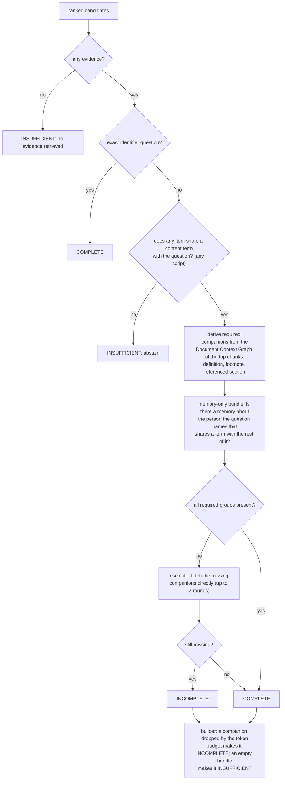
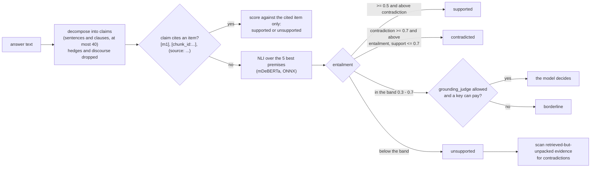
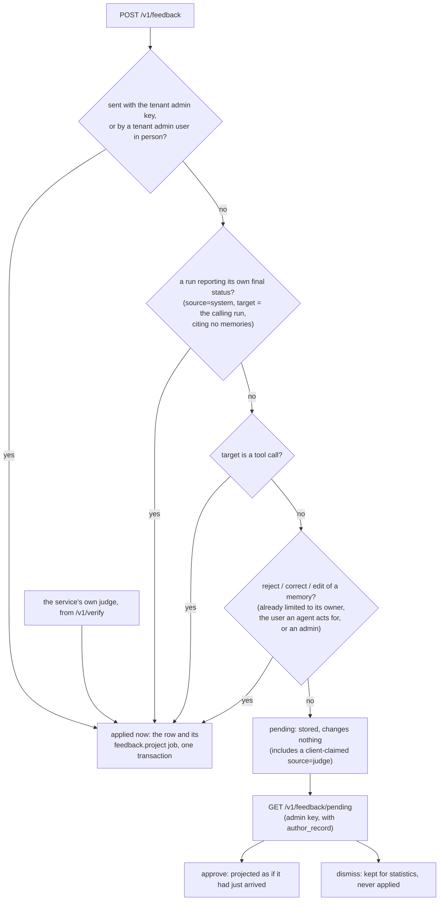

# 6 · Trust

> A memory service is only useful if you can tell when not to believe it. This chapter covers
> the three mechanisms for that: the **evidence report** that says whether a context can
> support an answer, **`/v1/verify`**, which checks an answer claim by claim against the
> context it was given, and **feedback review**, which stops a vote from changing what the
> platform learned until someone has looked at it. It ends with the defences against memory
> poisoning — someone, or something, writing what they want an agent to believe later.

**Previous:** [5 · The knowledge graph](05-knowledge-graph.md) · **Next:** [7 · Authorization](07-authorization.md) · **Up:** [Documentation](../README.md)

---

## Provenance is the floor

Everything in this chapter rests on one invariant from chapter 2: every memory carries at
least one `EvidenceRef` back to its source (`domain/memory.py`, `min_length=1`), every graph
relation carries its evidence (ADR 0010), and every item in a context bundle carries a stable
citation key and a short handle (`m1`, `f1`, `s1`, `d1`). A claim can always be traced to the
message, page or tool run it came from.

---

## The evidence report: can this context support an answer?

Every `/v1/context` and `/v1/recall` response carries a report with a status
(`EvidenceReport` in `domain/context_bundle.py`):

| Status | Meaning |
|---|---|
| `COMPLETE` | every companion the ranked evidence requires is present — or nothing required one; the `notes` say which |
| `INCOMPLETE` | evidence exists but something it needs is missing: a definition, a footnote, a referenced section, or support for the person the question names |
| `INSUFFICIENT` | no evidence, or none that shares a content term with the question: the case for answering "I don't know" |

It is produced by `VerificationStage` (`modules/context/evidence.py`; ADR 0011) and then
re-checked by the builder against what actually fit:

Four details make it honest rather than decorative:

- **The report describes the bundle, not the retrieval.** A companion that was found but did
  not fit the token budget counts as missing (`_assemble` in `modules/context/builder.py`), so
  a bundle never claims completeness for evidence it dropped.
- **`COMPLETE` says which kind it is.** "No companion evidence was required" and "no document
  seeds to derive requirements from" are recorded as notes, because the two meanings were
  indistinguishable before.
- **The wrong-person check.** In a two-person conversation every question shares terms with
  the corpus, so the plain overlap rule cannot see a wrong presupposition ("what was
  grandma's gift to Melanie?" when it was Caroline's grandma). For memory-only bundles,
  `subject_evidence_check` requires that a memory *about the named person* shares a term with
  the rest of the question, and reports `INCOMPLETE` when none does.
- **Conflicts are named.** When two principals hold different current values for one slot,
  the report adds "conflicting memories from different principals" (chapter 3, ADR 0013).

The service never acts on the status for you: there is no `require_evidence` flag and nothing
raises ([USAGE §7](../USAGE.md#7-evidence-the-status-and-v1verify)). Check `evidence_status`
and answer that you do not know when it is `INSUFFICIENT`. The rendered prompt carries an
`## Evidence status` section whenever the status is not `COMPLETE`.

**What it has caught, and what it has not.** The degenerate-input benchmark
(`docs/MEASUREMENTS.md` §4) found an empty query reported `COMPLETE` with ten memories
attached, and an ASCII-only term rule that could never abstain for Japanese, Chinese, Korean,
Cyrillic, Greek or Arabic queries; both were fixed (CJK now uses character bigrams). Still
open and recorded as failing there: a prompt-injection string is answered rather than declined
because it shares one incidental word with the corpus — a lexical overlap gate cannot catch
that.

On the critical golden set the retrieval gate reports an evidence-complete rate of 1.00
(`benchmark/results/retrieval_gate.json`) — produced with the hash-embedding
stand-in and marked `representative: false`, so it bounds the logic, not a deployment.

---

## `/v1/verify`: did the answer follow from the context?

After your model answers, send the answer with the `bundle_id` of the context it was given.
The bundle's records are kept for 30 minutes in the same scope (`RECORD_TTL_SECONDS` in
`modules/context/handles.py`); after that, or from another scope, verify answers `404`.

`GroundingCascade` (`modules/grounding/cascade.py`) is deterministic first:

Thresholds are `NLISettings` in `config/constants.py`: decide at 0.5, borderline band
0.3–0.7, five premises per claim, forty claims at most. A claim that names its source is
judged only against that source — a middling score there is a failed citation, not something
to argue about. Claims that are not supported and collide with evidence the retriever found
but the bundle did not pack are reported as `contradicted`: the bundle's `unused` list exists
for exactly this scan.

The report gives counts of `supported`, `unsupported`, `contradicted` and `borderline`, the
`per_claim_hallucination_rate`, the verdict and evidence per claim, the NLI provider and a
`representative` flag — `false` means the NLI is a stand-in and the numbers should not be
trusted.

**The NLI model.** `MoritzLaurer/mDeBERTa-v3-base-xnli-multilingual-nli-2mil7`, FP32 ONNX
(`NLIModel` in `config/constants.py`; ADR 0024 decision 6). On the English golden grounding
set it scores 36 of 40, the same as the English model it replaced; its int8 graph lost eleven
points and is not shipped (ADR 0024; `benchmark/results/multilingual_nli_mdeberta_fp32.json`).
The hermetic test suite runs a lexical stand-in instead, and the committed grounding-gate
artifact says so: `nli_provider: lexical-nli-v2`, `representative: false`
(`benchmark/results/grounding_gate.json`).

**Recorded on a run.** With a `run_id` (or the scope's agent run), the report is written as
the service's own judge feedback on that run (`modules/grounding/judge.py`): `confirm` when no
claim is unsupported or contradicted, else `reject`; score `1 − per_claim_hallucination_rate`;
the memories behind supported claims as its evidence. Its id is derived from the run, the
bundle and the answer, so verifying the same answer twice records one verdict. This is the
one verdict applied without review (next section), because the service wrote it.

---

## Feedback review: a vote waits

Feedback (ADR 0023) is a verdict — `confirm`, `reject`, `correct`, `approve`, `edit` — on a
memory, a run, a tool call or a procedure, from a `human`, a `judge`, an `interrupt` or the
`system`. It is not a rating column: it changes things (`modules/feedback/service.py`):

| Target | Verdict | Effect when applied |
|---|---|---|
| memory | `confirm`, `approve` | reinforcement + 1, confidence + 0.1 (capped at 1.0) |
| memory | `reject` | retracted: `RETRACTED`, validity closed, index entry removed |
| memory | `correct`, `edit` | a corrected memory supersedes it (chapter 3) |
| run | any | the run's explicit outcome; each memory its answer cited moves ± 0.05 confidence (at most 20, `CITED_CONFIDENCE_STEP` in `domain/learning.py`) |
| tool call | any | tool statistics and the approval pattern; an approval *suggestion* changes nothing until accepted |
| procedure | `reject` | the procedure is no longer offered until its steps change |

Confidence and reinforcement feed the ranking (the ±15% standing factor, chapter 4) and
forgetting (chapter 3). So before ADR 0028, anyone who could read a memory could confirm it
again and again under fresh feedback ids, and a thumbs-down on a correct answer lowered every
memory it cited. **Now a vote is stored and changes nothing until the tenant's administrator
approves it** (ADR 0028, `_needs_review`):

A verdict is decided once (`409` after that). Every record keeps who voted, on what, when, the
verdict and — once decided — who reviewed it, when and why, so the statistics survive whether
or not a vote was applied. `author_record` shows the reviewer how an author's earlier votes
fared (pending, approved, dismissed), so a voter who is usually dismissed is visible without a
reputation system. The consequence ADR 0028 states plainly: without anyone working the queue,
votes accumulate and the platform learns nothing from them.

The routes and SDK calls are in [api/feedback.md](../api/feedback.md).

---

## Memory poisoning: what stops a bad write

A poisoned memory is one written so that a later context carries it to a model: an injected
instruction, a false fact repeated until it looks certain, a model hallucination indexed as
truth, a vote that buries a correct memory. No single mechanism stops all of those; these
are the ones in the code, each with where it lives.

| Threat | Defence | Where |
|---|---|---|
| Reading what you should not, or writing into someone else's audience | the audience filter is applied inside the store before any search; writing a `WORKSPACE` memory requires membership of an existing team | chapter 7, `modules/tenancy/gate.py` |
| An agent's own text becoming the user's memory | agent-authored observations are never kept verbatim, and first-person facts in them are re-typed from `USER`/`PREFERENCE` to `AGENT` | `Observation.agent_authored`, ADR 0013 |
| The echo loop: a memory is retrieved, repeated by the agent, extracted again and reinforced until it reads as certain | a candidate whose only evidence is an agent's own output is counted as an echo and cannot raise confidence | `_is_echo` in `modules/memory/pipeline.py` |
| One principal repeating itself to inflate a fact | corroboration counts distinct principals: + 0.15 confidence the first time another principal says it, + 0.05 for a repeat | `_apply` in `modules/memory/pipeline.py` |
| A second agent overwriting a shared fact | a different value from another principal is kept as `CONTRADICT` beside the original, and the evidence report names the conflict | ADR 0013, chapter 3 |
| A false merge that silently changes a fact | differing numbers or negation always block a merge; false-merge rate 0.00 on 35 labelled pairs | ADR 0009, `benchmark/results/memory_gate.json` |
| A model inventing a person, place or quantity | restatement lines are kept only when every number and capitalised name occurs in what the model was shown; model relations only when their names occur verbatim; confidence capped at 0.8 (relation extraction) and 0.6 (restatement) | ADR 0027, `modules/memory/restatement.py`, `modules/graph/native.py` |
| A model rewrite read as fact | memories in the unverified categories (`contextual_fact`, `assisted`, `reflection`, or provider `llm`) are rendered "model-extracted, unverified", contribute no graph relations, and are left out of the contradiction scan's evidence | `unverified_representation` in `domain/memory.py`, `modules/graph/service.py`, `modules/retrieval/engine.py` |
| A vote moving what was learned | votes wait for review; a client claiming to be the judge waits too | ADR 0028 |
| A reader rewriting or deleting a team's memory by disagreeing with it | `reject`, `correct`, `edit`, supersede and forget need the owner, the user an agent acts for, or a tenant admin; workspace viewers cannot write | `_authorize_memory_verdict`, chapter 7 |
| Feedback outweighing relevance | standing moves a fused score by at most ±15% | `MAX_STANDING_SHIFT` in `domain/learning.py` |
| Not knowing who read a poisoned record | the read audit records the credential, principal and record ids of every recall and context | chapter 7 |
| An entity summary leaking facts | summaries are written only from facts every reader of the entity may read, and the model is told the facts are data, never instructions | `modules/graph/summaries.py` |

**What is not there, stated plainly.**

- **No instruction-injection filter on writes or reads.** The service stores text as said and
  renders retrieved items as cited evidence, but it adds no preamble telling a model to ignore
  instructions inside them, and the degenerate-input benchmark records a prompt-injection
  question that was answered rather than declined (`docs/MEASUREMENTS.md` §4). Treat the
  rendered context as untrusted data in your own system prompt.
- **The admission gate is built and not wired.** `modules/memory/admission.py` scores a
  candidate on worthiness, novelty, confidence and expected utility and can admit, defer or
  reject it; `ObservationPipeline` accepts a gate, but `adapters/wiring.py` constructs the
  pipeline without one. Every candidate the rules extract is admitted today.
  ([api/memory.md](../api/memory.md) describes the gate as if it ran; the wiring is the
  source of truth.)
- **No per-voter rate limit or reputation.** ADR 0028's argument is that review makes one
  unnecessary for safety; `author_record` is the visibility it provides instead.

---

## What to read next

- The audience filter every defence above depends on → [chapter 7](07-authorization.md)
- Which judgements a model may make, and on whose key → [chapter 8](08-models.md)
- The routes: [api/context.md](../api/context.md#verifying-an-answer) and [api/feedback.md](../api/feedback.md)
