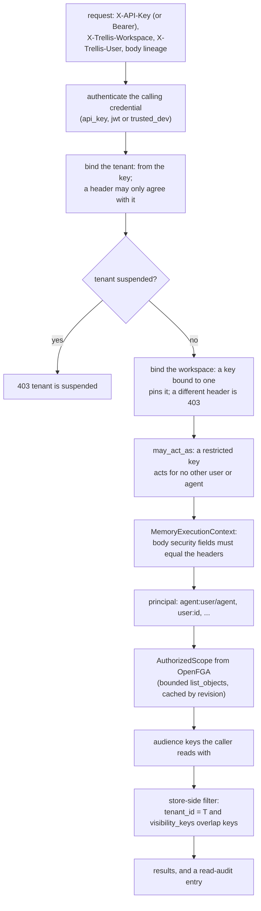
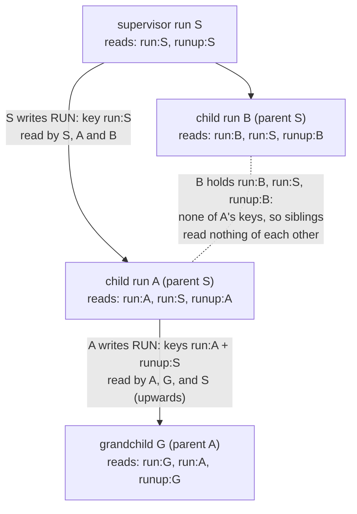

# 7 · Authorization

> "Who may read this" is a property of every stored record here, turned into a filter that
> runs inside the search store before any candidate exists. This chapter covers the whole
> chain: how a caller is authenticated, how a tenant, a workspace and a user are bound to that
> credential, the seven visibility levels and the audience keys behind them, and what an
> agent's identity really is when one user runs many agents.

**Previous:** [6 · Trust](06-trust.md) · **Next:** [8 · Models](08-models.md) · **Up:** [Documentation](../README.md)

---

## The chain, end to end

Each box is below, in order. The design rule behind the last two (ADR 0005): never
"retrieve globally, then filter in memory". The filter is one `must_any` clause in Qdrant and
one array-overlap predicate in PostgreSQL, so no candidate outside it is ever materialised.

---

## Authentication: who is calling

The service authenticates the **calling service**, then honours the scope it asserts within
that credential's limits (`modules/auth/authentication.py`). The mode is not a setting; it
follows from what is configured (`AuthenticationSettings.mode` in `config/settings.py`):

| Mode | When | What the credential is |
|---|---|---|
| `api_key` | the default; always when `bootstrap_admin_key` is set | a key the service issued, verified against its stored SHA-256 hash; it names its tenant and optionally a workspace (ADR 0021) |
| `jwt` | `jwt_jwks_url` is set | an issuer's token (RS256/ES256); with `tenant_claim` set, the claim must equal the tenant header — fails closed |
| `trusted_dev` | development keys only, no bootstrap key | trusts the context headers as given; **refused** when `service.environment` is `staging` or `prod` |

`gcp_iam` and `mtls`, named in ADR 0005, were never deployed and are gone. In deployed
environments the settings also refuse a bootstrap key shorter than 32 characters
(`_production_guards`).

### Keys and roles

| Role | May | Notes |
|---|---|---|
| `platform` | onboard tenants, issue each one's first admin key, suspend and resume | the configured `bootstrap_admin_key` — never issued, never a row; acts for no tenant (a request with it on a data route is refused) |
| `admin` | administer one tenant: keys, workspaces, model keys and policy, the read audit, the feedback review queue | tenant-wide; cannot be bound to a workspace |
| `service` | read and write memory for the tenant's users and agents | what an agent or a harness holds; may be bound to a workspace |

What the verifier guarantees (`modules/auth/keys.py`, ADR 0021):

- **Revocation holds from the next request, on every instance.** Revoking a key or suspending
  a tenant replaces the cache entry with a tombstone instead of deleting it, so a reader that
  fetched the row a moment earlier cannot write the stale record back; entries are written
  set-if-absent.
- **A flood of garbage tokens costs a bounded amount.** Unknown ids are cached as missing for
  five seconds, and each instance reads the store for at most 600 unrecognised ids a minute
  (`UNKNOWN_IDS_PER_MINUTE`). "Recognised" is a key this process has issued, verified or been
  told about on the tenant registry's channel (ADR 0031).
- **Suspensions and revocations reach every process promptly.** The instance that makes the
  change publishes it on the cache's pub/sub channel (`trellis:tenancy`), and every API
  worker of every pod applies it on arrival. With the cache down, the registry's one-minute
  refresh of quotas and suspensions is the bound, and the verifier's tombstones still decide
  for keys.
- **A secret is shown once.** An idempotent retry of key issuance or onboarding replays the
  record with `token: null`.
- **A tenant holds at most 1,000 live keys** (`MAX_KEYS_PER_TENANT` in `domain/tenancy.py`).

### Binding the scope to the credential

`api/deps.py:build_context` turns a request into its execution context:

1. **The tenant** comes from the key. A header naming another tenant is `403 credential is not
   valid for this tenant`, never a silent redirect. A development key (laptops only) acts in
   the development tenant (`authentication.trusted_dev_tenant`, `default`) when the request
   names none, and in the named one when it does.
2. **A suspended tenant** is refused for every credential kind, from an in-process tenant
   registry that costs no store read (`modules/tenancy/registry.py`).
3. **The workspace**: a key bound to a workspace pins it; a header naming another is `403`.
4. **`may_act_as`**: a key restricted to listed principals acts for those and no others.
   `_require_may_act_as` checks the request's user against the `user:<id>` entries and its
   `agent_id` against the `agent:<id>` entries (`403 this key may not act for that user` /
   `… as that agent`); a request naming neither acts as the key itself, the anonymous service
   principal, which holds no grant on any user's or agent's memories. `*` lifts it
   (`tests/security/test_may_act_as.py`, ADR 0032).
5. **Body against headers**: a `tenant_id`, `workspace_id` or `user_id` in the body that
   disagrees with a header is refused, and `custom_metadata` may not contain any reserved key.

The rate limit runs before authentication: a one-minute window per tenant and credential,
6,000 requests plus 200 burst by default or the tenant's own `rate_limit_per_minute`
(`RATE_LIMIT_PER_MINUTE`, `RATE_LIMIT_BURST`), answering `429` with `Retry-After`. It is
counted in the cache and fails open when the cache is down.

---

## Tenants and workspaces

**A tenant is the wall nothing crosses.** Every object id and every audience key carries the
tenant (`thread:acme/thr_1`, `user:acme/u1`), so tenancy is structural rather than a column
someone has to remember (ADR 0005). A tenant is onboarded by the platform key
(`POST /v1/admin/tenants`), carries `retention_days`, `rate_limit_per_minute` and the
`admission_gate` switch, and can be suspended. Identifiers are never reused: a deleted workspace keeps its rows, and creating
another with the same id is `409`, so audit entries and memory anchors keep their meaning.

**A workspace is a team inside a tenant** that shares what it stores (ADR 0021). Membership is
written twice in one unit of work — as rows and as OpenFGA tuples — with one of three roles:

| Workspace role | Reads the team | Writes into it |
|---|---|---|
| `admin` | yes | yes, and reads and writes the team's threads |
| `member` | yes | yes |
| `viewer` | yes | no |

Writing into a team takes membership: every path that would mint a `WORKSPACE` audience —
a message, a memory, a tool record, a document or thread opened in a workspace — goes through
`modules/tenancy/gate.py` and is refused unless the caller is a `member` (admins compute to
it). A `WORKSPACE`-visible memory also needs the team row to exist, or it answers `Workspace
not found`. A workspace id with no team row is a bare anchor that grants nothing, and an id
already used as an anchor cannot later become a team, so nothing labelled before teams
existed is adopted by one. A request naming a workspace reads that team; one naming none reads
every team the caller belongs to.

---

## Visibility: the seven audiences

At write time each memory, chunk and message gets `visibility_keys` derived from its
visibility and its anchors; at read time the caller's scope becomes the set of keys it may
read; read means a non-empty intersection (`modules/authz/visibility.py`).

| Visibility | Who reads | Key written on the record |
|---|---|---|
| `PRIVATE` | exactly one principal | `principal:<t>/<principal>` |
| `RUN` | this agent run and the runs it spawns; a child's notes addressed up reach only its parent | `run:<t>/<run>`, plus `runup:<t>/<parent>` when it has a parent |
| `THREAD` | everyone participating in the thread — read **in** that thread | `thread:<t>/<thread>` |
| `USER` | the user, across threads, and every agent acting for them | `user:<t>/<user>` |
| `AGENT_GROUP` | cooperating agents sharing a group id, at any depth | `agroup:<t>/<group>` |
| `WORKSPACE` | every member of the team (admin, member, viewer) | `workspace:<t>/<workspace>` |
| `TENANT` | everyone in the tenant | `tenant:<t>` |

Three rules refine the table:

- **The author keeps access.** For `USER`, `AGENT_GROUP`, `WORKSPACE` and `TENANT`, the
  author's own `principal:` key is appended, so whoever wrote a shared memory can still read
  it after leaving the team (`readable_by`). `PRIVATE`, `RUN` and `THREAD` do not get it:
  with it, `THREAD` meant "this thread, or anywhere if you wrote it", which an integrator
  reported as a new conversation recalling the previous one (`_NO_OWNER_KEY`).
- **A thread is the one being read in.** A caller authorized for twenty threads carries only
  the current thread's key into a turn inside a thread (`from_scope`, `current_thread_id`),
  always as an intersection with what was granted, so naming a thread grants nothing.
- **`PRIVATE` means one principal.** An agent acting for a user reads the user's `USER`
  memories (it inherits the user's access), not the user's `PRIVATE` ones, and the reverse
  (ADR 0005).

There are deliberately no per-user ACLs on individual memories: the audience levels are the
vocabulary ([api/tenancy.md](../api/tenancy.md#what-this-area-does-not-do)).

---

## Who an agent is

**An agent is bound to the user it runs for.** The principal of a request that names an
agent and a user is `agent:<user_id>/<agent_id>` (`MemoryExecutionContext.principal_id`,
chapter 2). `agent_id` arrives in the body and is not authenticated; with a bare
`agent:<agent_id>`, a caller who simply named another user's agent read that agent's `PRIVATE`
memory — reproduced against a live service (HTTP 200) before the change. An agent with no user
— an ingestion job, an unattended run — keeps the bare form, since there is no user to
impersonate into.

**A run is a visibility boundary** (ADR 0013, amended by the code in
`modules/authz/visibility.py`). An agent's working memory (`AGENT`, `TOOL`, `WORKING` types)
defaults to `RUN` whenever the request carries an `agent_run_id`, else `PRIVATE`. Hand-off
flows down the run tree, one level per hop, and never sideways:

A reader's scope carries its own run id and its parent's (`AuthorizedScope.run_ids`), plus
the `runup:` key of its own run, which is how a supervisor reads what its children produced
without the children reading each other. Before the `run:`/`runup:` split, `RUN` carried the
author's principal, which made it an identity audience: five parallel workers on one agent id
read each other's notes and a retry inherited the failed attempt's reasoning (comment in
`visibility_keys`). Peers that do want to share say so with `AGENT_GROUP`; anything durable
belongs in `USER`.

The rest of ADR 0013, all in force:

- **Sharing is explicit**: `memory_type=SHARED` or a wider `visibility`; nothing is shared by
  accident.
- **Corroboration is counted, not duplicated**: the same finding from a second principal
  reinforces the existing memory, records the second principal in `contributors` and raises
  confidence by 0.15; the owner stays the first writer.
- **Conflicts are kept, not overwritten**: chapter 3.
- **No chat pollution**: agent messages are `INTERNAL` and never in the visible history or the
  conversation window; first-person facts in agent-authored text become the agent's memory,
  never the user's.

---

## OpenFGA and the authorized scope

Relationships live in OpenFGA (`deploy/openfga/model.fga`): types `user`, `agent`, `tenant`,
`workspace`, `thread`, `document` and `memory`, with relations such as a thread's `owner`,
`participant` and `viewer`, a workspace's `admin`, `member` and `viewer`, and `admin from
tenant`. Tuples are written when objects are created (`AuthorizationService.grant_*` in
`modules/authz/service.py`).

At read time the principal's `AuthorizedScope` — the threads, documents, runs, agent groups
and workspaces it may read — comes from OpenFGA's `list_objects`, bounded by
`max_listed_objects` (2,000). Past the bound the scope is marked `truncated` and retrieval
falls back to per-object checks (ADR 0005). The scope is cached under a revision fingerprint
for at most 60 seconds (`authz_ttl_seconds`), and grants bump the `MEMBERSHIP` revision so a
change is seen on the next request rather than at the cache's expiry. An in-memory provider
implements the same model for tests; a unit test parses the `.fga` file and asserts the two
agree, and a contract test runs against a real OpenFGA server when one is available.

Authorization calls get 8 seconds and two retries of transient failures; when the provider is
down, authorization fails closed (ADR 0015, `AuthorizationTuning`).

**Planned, not built:** OpenFGA tuples are written inside the request's unit of work but are
not part of the database transaction, so a commit that fails after a grant can leave a tuple
with no row behind it. ADR 0021 names the repair sweep that would reconcile tuples against
rows as the planned follow-up, and it does not exist yet.

---

## The read audit

Every recall and context assembly writes an entry to `memory_reads`: the credential, the
principal it acted for, `recall` or `context`, the record ids served, a `query_hash` and a
scope fingerprint — never the query text (`modules/audit/service.py`). Entries are written in
batches off the request path and purged after 400 days (`read_audit_retention_days`, hourly
purge). A tenant admin reads it with `GET /v1/reads`, newest first.

What it guarantees: a graceful stop (SIGTERM) flushes everything queued before the pool
closes. A process killed outright loses up to one flush interval (1 s) of entries plus a
batch in flight. A queue that fills (10 000 entries, the store stalled for seconds) drops the
newest entry, and so does a row that cannot be stored even on its own; both kinds are
counted in `memory_read_audit_dropped_total`. It is an operational record with that loss
window, not a compliance ledger: a read is never slowed or refused for its audit entry
(ADR 0031).

---

## How isolation is tested

The release-blocking suite is `tests/security` (`make security-test`):
`test_isolation.py` cross-checks the visibility rule against an independent oracle with
property-based generation; `test_retrieval_isolation.py` indexes every visibility variant of
two tenants with identical text into one collection and runs 96 reader configurations through
the whole pipeline (ADR 0008); `test_graph_isolation.py` does the same for graph traversal
(chapter 5); `test_tenant_binding.py` covers the credential-to-tenant binding. The last
committed artifact reports 0 cross-tenant, 0 cross-user and 0 private-agent leaks
(`benchmark/results/security.json`, dated 2026-09-15, older than the current code; CI runs the
suite on every push — chapter 12). `tests/agent/test_platform_edge_cases.py` drives the
tenancy lifecycle through the SDK: replayed issuance, wrong role, wrong tenant, suspension,
id reuse, keys outliving their workspace, idempotent revocation.

---

## What to read next

- The routes for keys, workspaces, model keys and the audit → [api/tenancy.md](../api/tenancy.md)
- Onboarding a tenant and the probes → [api/admin.md](../api/admin.md)
- Whose model key pays for a model call → [chapter 8](08-models.md)
