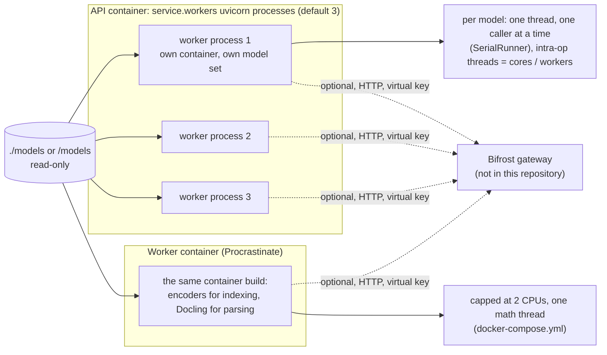
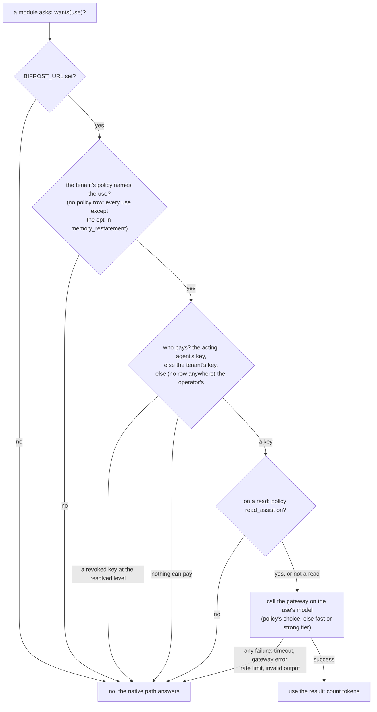

# 8 · Models

> The service uses two very different kinds of model. A small, frozen set of encoders and a
> claim-checking classifier runs in-process, on CPU, on every request; a generative model is
> optional, reached only through an external gateway on someone's virtual key, and every
> path works without it. This chapter covers which model runs where and why, how a model call
> is allowed and paid for, and what you give up — and keep — by running with no LLM at all.

**Previous:** [7 · Authorization](07-authorization.md) · **Next:** [9 · API and SDK](../api/README.md) · **Up:** [Documentation](../README.md)

---

## The frozen local set

These are constants, not settings (`FROZEN_MODELS` in `config/constants.py`): "a change to a
model or its ONNX graph is also `make reindex`", because the embedding fingerprint names the
vector collections and vectors from two encoders can never share one.

| Role | Model | Runtime | Used for | Why this one |
|---|---|---|---|---|
| English dense (`dense_en`) | `ibm-granite/granite-embedding-small-english-r2`, 384-d, Apache-2.0 | ONNX, FP32 | Latin-script queries, every record | lowest query p95 of the candidates benchmarked at the smallest useful dimension ([below](#how-the-english-encoder-was-chosen)) |
| Multilingual dense (`dense_ml`) | `hotchpotch/bekko-embedding-v1-a8m`, 384-d, MIT | ONNX | every query and record; the relevance floor (0.20) is its cosine | XQuAD paragraph R@10 over 12 languages: 98.83% against 65.96% for the English encoder (ADR 0024) |
| Sparse (`bm25`) | client-side BM25 term frequencies, Qdrant applies IDF | no weights | every query and record | exact terms, identifiers, numbers |
| Late interaction (`colbert`) | `mixedbread-ai/mxbai-edge-colbert-v0-32m`, 64-d per token, Apache-2.0 | publisher's ONNX export, FP32 | rescoring the other arms' candidates | SciFact nDCG@10 0.746 → 0.759 offline at weight 2.0 (ADR 0025) |
| Grounding NLI | `MoritzLaurer/mDeBERTa-v3-base-xnli-multilingual-nli-2mil7`, MIT | ONNX, FP32 | `/v1/verify`; at write, the statement labeller's sentences the lexicon left open (ADR 0035) | 36/40 on the English golden grounding set, the same as the English model it replaced (ADR 0024) |
| Document layout | Docling's layout and table models | — | parsing PDFs and images | ADR 0007 |

Every revision is pinned in the constants. **No reranker ships** (chapter 4). **Quantised
graphs were measured and rejected**: the NLI's int8 graph lost eleven points (ADR 0024), the
ColBERT int8 graph changed every top-10 checked (ADR 0025), and on the measuring box the
English encoder's int8 graph was slower than FP32 and its worst vector sat at cosine 0.9667
from the reference (`docs/MEASUREMENTS.md` §7).

### How the English encoder was chosen

`make bench-embedding` runs every candidate through the real pipeline and the golden set
(`benchmark/results/embedding.json`, p95 over 18 golden queries in a 4-core container). The
384-dimension encoder answered at a query p95 of 204 ms and indexed the set in 59 s; its
768-dimension sibling took 2,020 ms and 369 s. Both scored Recall@20 and evidence-group recall
of 1.00. Three things that tells you:

- **Quality is undiscriminated, not equal.** Every candidate scoring a perfect 1.00 means the
  golden set (18 questions over 2 documents) is too easy to rank encoders; it needs harder
  questions before it can.
- **Bigger is not better under a latency budget.** The larger encoders bought no measurable
  recall here and cost 10 to 26 times their smaller siblings.
- **The early recall budget did not survive real models.** End-to-end recall p95 in that run
  was 3.5-4.1 s for every candidate; the budgets had been set against the deterministic
  stand-in. Today's read-path figures are in `docs/MEASUREMENTS.md` §8.

Rows for models since excluded by provenance remain in `embedding.json` as evidence, not as
candidates.

**Provenance rule.** No Chinese-developed checkpoint or derivative runs anywhere in the stack
— not as a default, a benchmark challenger, an operator's choice or a model discovered through
the gateway. One pattern (`domain/provenance.py`) is consulted wherever a model is named, and
`tests/unit/test_model_provenance.py` asserts it on every surface.

### Where they run

- **In-process, in every process.** Each API worker and the background worker build their own
  container with their own copy of the model set (`__main__.py`, `worker.py`). The separate model tier of ADR 0019 — the encoders and NLI
  served over HTTP from their own containers — was removed in 2026-09: the reranker that made
  it worth having was off on measured evidence, the model server had no batching, so it only
  added an HTTP hop to every query, and the target became a single 8 vCPU VM with external
  stores (ADR 0019, status note).
- **One caller per model.** Each model owns a single-thread executor entered through a
  semaphore of one (`adapters/models/_runner.py`), so two encodes are never inside a model at
  once and waiting is visible in asyncio rather than hidden in an executor backlog. Its
  intra-op threads are the process's share of the cores (`_model_threads` in
  `adapters/wiring.py`: an 8-vCPU box with three workers gives 2). The module says plainly
  that the case for this is arithmetic and a bounded queue; the concurrent measurement on the
  8 vCPU VM does not exist yet.
- **CPU only.** GPU is out of scope by requirement (ADR 0019, alternatives considered);
  nothing prevents it, but nothing is built for it.
- **Ingestion does not compete with queries.** The worker container is capped at two CPUs with
  one math thread, so a consolidation burst costs the query path nothing (comment in
  `docker-compose.yml`).
- **Weights are local.** `make models` (or the compose `model-fetch` step) puts the set in
  `./models`, about 1 GB the first time ([README](../../README.md#install-and-run)); the image
  reads `/models`. A missing model is a startup error, never a silent download or fallback.
  The test suite's deterministic hash embedding is a code-level stand-in
  (`application.container.Overrides`), never reachable from configuration, and any result
  produced with it is labelled `representative: false`.

---

## The generative model: optional, through a gateway

The service never talks to a model provider. When `BIFROST_URL` is set, `adapters/models/llm.py`
speaks the OpenAI-compatible HTTP API of a [Bifrost](https://github.com/maximhq/bifrost)
gateway that runs outside the service and holds the provider keys; no provider SDK is
importable under `src/` (Ruff `banned-api` and `tests/unit/test_architecture.py`). There is
deliberately no gateway in `docker-compose.yml`: starting one there would put provider keys
inside the application's own deployment, which is the coupling the gateway exists to remove
(`deploy/bifrost/README.md`).

### When a call is allowed

A use runs only when all four hold (`LLMAssist.wants`, `modules/llm/assist.py`; each use is
in [the twelve uses](#the-twelve-uses)):

- **Who pays** is resolved from the most specific row (`modules/llm/credentials.py`): the
  acting agent's key (`PUT /v1/agents/model-key`, one per `agent_id` whichever user it acts
  for), else the tenant's (`PUT /v1/model-key`, admin key), else — only while neither level
  has a row — the operator's `BIFROST_VIRTUAL_KEY`. A revoked key refuses rather than falling
  through, and a key registered or rotated mid-call fails that call closed instead of mixing
  keys. Keys are stored encrypted under the operator's envelope keys
  (`MEMORY__AGENT_CREDENTIALS__*`) and never returned. In `dev` and `test` with none set, the
  service derives a development envelope key at startup (from a fixed label and the database
  URL, so every process agrees; never stored) and logs `agent_credentials.development_key` as
  a warning: registration works on a laptop and protects nothing. `staging` and `prod` never
  get one and refuse registration until the keys are set
  (`adapters/models/credential_cipher.py:envelope_settings`). There is no workspace-level key: ADR
  0023's workspace model keys were removed (migration `0021_final_surface`).
- **What it may be spent on** is the tenant's policy (`PUT /v1/model-key/policy`), with
  exactly three fields: `uses`, `read_assist` and `models` (a gateway model per use). There
  is no deployment-level allow-list, no per-request `use_llm`, and no `MEMORY__MODELS__*`
  variable.
- **Background work is bound to the owner of the data**, so the owner's key pays and the
  owner's policy decides; a periodic job scans only tenants that hold a live key, or every
  tenant when the operator's key pays.
- **Which model**: the tenant's `models` entry for the use, else the tier's constant —
  `LLMTuning.fast_model` for `contextual_extraction`, `query_expansion`, `chunk_context` and
  `memory_restatement`, `LLMTuning.model` for the rest. Both are `auto`: the service lists
  the gateway's authenticated model catalogue and picks a recognised text-model family,
  never guessing at an opaque alias (`adapters/models/catalog.py`).
- **Language**: every system prompt ends with one rule — return text in the language of its
  source, never translated (`SOURCE_LANGUAGE_RULE`).

### Bounded and metered

The transport is the shared `bifrost-sdk` client, the same one the agent harness uses
(`vendor/bifrost-sdk`, regenerated by `make vendor`): a 30-second timeout, two retries, and a
circuit breaker that opens for 30 seconds after five consecutive failures (`LLMTuning`,
`LLMTransport` in `config/constants.py`). A `429` is retried after the delay the gateway asks
for — read from `Retry-After` and from the response body, because some providers put it only
there — and never counts toward the breaker: backpressure is the gateway working
(`docs/MEASUREMENTS.md` §5b records the run where it did not, and every judge call failed
silently). A reasoning model that spends its whole output budget thinking returns an error
naming the cause rather than an empty answer (§5).

Every successful call adds to `llm_usage_daily` (`GET /v1/model-key/usage`) and
`memory_llm_tokens_total{tenant,use,direction}`; a request reports its own spend in
`X-Trellis-LLM-Tokens`, and a job logs `job.llm_tokens`. Prompt text is never logged
(`LOG_SOURCE_TEXT = False`). Changing a key or a policy invalidates cached model-assisted
reads, because which uses are active is part of the context cache key (chapter 4).

---

## The twelve uses

`LLMUse` in `config/settings.py` names twelve. Each is optional work layered on a
deterministic path, and any model failure (no key, gateway error, rate limit, invalid output)
falls back to that path. The tier is the model the call goes to: `fast`
(`LLMTuning.fast_model`) for `contextual_extraction`, `query_expansion`, `chunk_context` and
`memory_restatement`, `strong` (`LLMTuning.model`) for the rest; a tenant's policy may name a
gateway model per use instead (`models: {"memory_restatement": "<gateway model id>"}`).
`/v1/context` and `/v1/recall` make no model call unless the read is assisted (the policy's
`read_assist`), and then only `query_expansion`.

### Ingestion (background jobs; never on the request that wrote the data)

| use | when it runs | tier | what it produces | without it |
|---|---|---|---|---|
| `contextual_extraction` | a user message the rules cannot fully read. **English**: two or more sentences no rule parsed → the model selects source spans (narrative units, `modules/memory/narrative.py`), never new wording. **Any other language** (`Observation.lang`, `domain/language.py`): every message with a sentence that is not a question or an acknowledgement → typed facts in the message's language, each citing its sentences (`modules/memory/source_facts.py`); a slot (`lives_in`, `works_at`, `name`, ...) only when its value is copied from the cited text, so a German message can supersede an English fact | fast | OBSERVATION spans (English); PREFERENCE / USER / SEMANTIC / EPISODIC / TASK facts (other languages) | English rules only; the verbatim turn is kept in every language, so the text stays retrievable through the multilingual dense space |
| `contextual_extraction` (statement kinds) | a user sentence whose kind the NLI head was unsure of (entailment between the confirmation and the decision thresholds of `StatementLabellerSettings`), one call per observation for all of them | fast | a proposed kind, kept only when the NLI head confirms the sentence entails it (ADR 0035) | the lexicon's and the NLI head's kind |
| `relation_extraction` | graph enrichment of a memory. English: ≥ 2 entities found by the rules and only `mentions` edges between them → typed relations among those entities. Other languages: the model names both ends and the relation (`graph/native.py:open_relations`), and both names must occur verbatim in the text. Documents: the top co-occurring entity pairs (English), and up to `LLM_MAX_OPEN_CHUNKS_PER_DOCUMENT` = 6 chunks not in English | strong | typed edges (`extraction: llm`, confidence ≤ 0.8) | `mentions` / `co_occurs_with` / structural edges |
| `chunk_context` | document ingestion: parts of a split node, tables, and chunks not in English, at most 48 per document | fast | a 1-2 sentence situating context indexed with the chunk (`text` never changes) | the deterministic header (title, section path, salient entities) |
| `conflict_adjudication` | a new fact in the grey band of lexical similarity to an existing one (same numbers, same negation) | strong | supersede / keep-both decision | the deterministic lexical/dense thresholds |
| `summaries` | document node summaries (bounded number per document), thread summaries (`summary.refresh`, every `SUMMARY_EVERY` messages), the `user` profile block, graph entity summaries (≤ 4 model calls per enrichment job) | strong | abstractive text | the extractive / template text, stored the same way |
| `reflection` | periodic job, per principal with a key, over recent memories | strong | cited insights (≥ 2 sources) | none |
| `memory_connections` | periodic job over recent memory pairs | strong | typed edges between memories (supersedes / contradicts / relates) | none |
| `memory_restatement` | **opt-in** (ADR 0027): a conversation message, at ingest, when the tenant's policy names this use. The model sees the turn, the turn before it, the speakers and the date, and returns a standalone restatement, up to three facts and up to four relations, checked against what it was shown (every number and capitalised name must occur there). Backfill earlier turns with `python -m memory_service.tools.restate --tenant <id> [--limit N] [--force]` | fast | the restatement appended to the turn's own index key (`system_metadata["restatement"]`; the content stays verbatim) and model-extracted graph relations bound to the turn (confidence ≤ 0.6) | the turn indexed as said |
| `procedure_abstraction` | the tool-learning job, for a procedure that clears support and success-rate gates | strong | title and strategy text distilled from successes and failures | the miner's own rendering |

### Reads (only when the read is assisted)

| use | when it runs | tier | fallback |
|---|---|---|---|
| `query_expansion` | `/v1/context` or `/v1/recall` whose question no rule classified - which includes every question not in English, since the router's cue patterns are English and never route another language (`modules/retrieval/router.py`) | fast | the unexpanded hybrid search (every dense space, BM25, the graph by entity name) |
| `entity_resolution` | `GET /v1/graph/entities?q=` names that match no entity lexically | strong | lexical match only; the retrieval-time graph stage never uses it (it runs under the graph budget) |
| `grounding_judge` | `/v1/verify`: claims the NLI cascade could not decide | strong | the claim stays undecided |

Reflection and connections are only registered as jobs when a gateway is configured
(`modules/jobs/registry.py`, crons `53 */6 * * *` and `19 */6 * * *`). The read path makes no
model call unless the policy's `read_assist` is on, and then only `query_expansion`,
`entity_resolution` on the entity route, and `grounding_judge` in verify; query decomposition
was removed in 0.3.0 because a model call on the read path took 3.2–12.2 s against a 300 ms
budget (`docs/MEASUREMENTS.md` §8.4).

An optional **Hindsight** extraction service can take non-agent contextual extraction when a
deployment runs one (`MEMORY__HINDSIGHT__BASE_URL` and the `[hindsight]` extra;
`adapters/models/hindsight.py`); agent extraction stays on the Bifrost path because that SDK
cannot carry a per-request virtual key. The Hindsight server owns its own model configuration;
source storage and authorization stay in this service.

---

## Running without an LLM

This is the default, and a supported mode: leave `BIFROST_URL` unset and no model call is
ever made. Every use above falls back to its deterministic path, every gate in chapter 12 runs
this way, and the `/v1/context` latency figures in chapter 4 are with the model off. What
changes:

| Without a model | Still there |
|---|---|
| English sentences no rule matches produce no fact; non-English messages produce no typed facts | the verbatim turn, indexed in both dense spaces and BM25, so the text is still retrievable in any language |
| graph relations are the rule-found ones only | the document business grammar, memory triples, mentions, tool edges |
| summaries are extractive or templated | thread summaries, profile blocks, entity summaries — all still written |
| borderline claims stay `borderline` | NLI, citation checks and the contradiction scan |
| no reflection insights or memory connections | consolidation, superseding, forgetting |

The README states the boundary exactly: "Model-free operation is a supported mode, not a claim
of equal answer accuracy." Generated-answer accuracy with the current write path has not been
measured either way ([README status](../../README.md#status-read-this-before-you-trust-a-number)).

### Opting in: `memory_restatement`

The one opt-in use restates each conversation turn so it stands on its own — names for
pronouns, absolute dates for relative ones — and appends that to the turn's own index key; the
memory's content stays verbatim (ADR 0027). It costs one model call per message, so the
default policy leaves it out: a tenant lists it in its policy `uses`, and backfills earlier
turns with `python -m memory_service.tools.restate --tenant <id> [--limit N] [--force]`.

Its evidence so far is mixed and the ADR says so: offline on one LoCoMo conversation, turn +
restatement as the turn's own key read recall@10 0.858 against 0.839 without; through the
service with a 2B CPU model, 0.838 → 0.842, within noise; and judged on answers, the 2B model's
restated corpus lost answers (17 → 13 of 30 under the strict ruler). "So with a 2B model the
restatement does not pay; it stays opt-in", and the deciding run with a hosted model through
the gateway has not been recorded yet.

---

## What to read next

- The routes for model keys, policy and usage → [api/tenancy.md](../api/tenancy.md#model-keys-two-registered-levels-and-the-operators-resolved-in-order)
- Configuring the gateway in a deployment → [chapter 11](11-operations.md)
- Every endpoint, side by side with its SDK call → [chapter 9, the API](../api/README.md)
