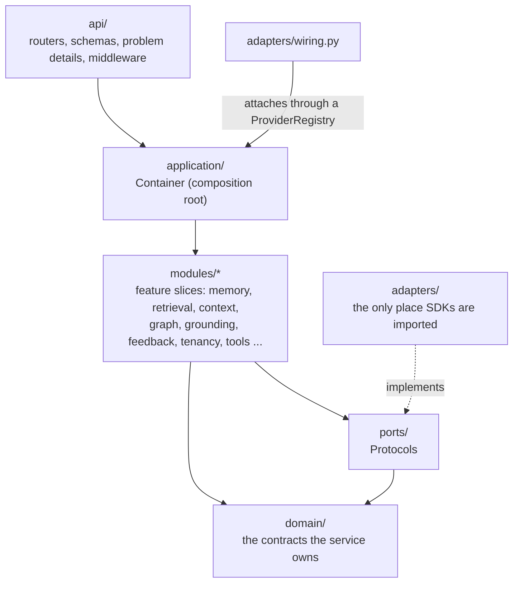
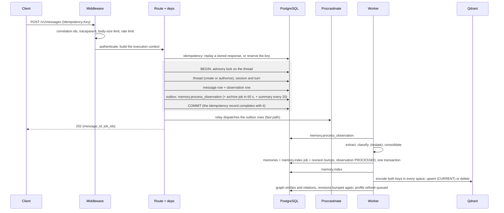
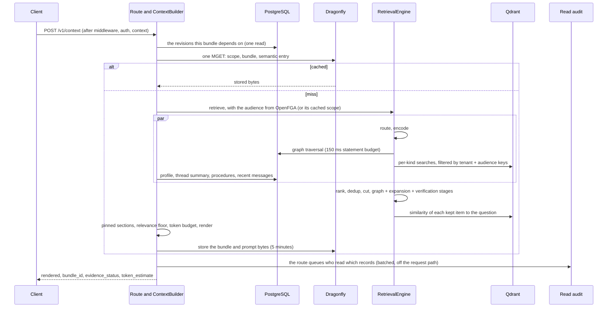

# 10 · Architecture

> [`ARCHITECTURE.md`](../ARCHITECTURE.md) is the one-page map. This chapter is the guided
> tour: why the code is split into ports and adapters, which process does what, and — step by
> step, with the file each step lives in — the path a write takes from the HTTP request to a
> searchable memory, and the path a read takes from a question to a rendered context.

**Previous:** [9 · API and SDK](../api/README.md) · **Next:** [11 · Operations](11-operations.md) · **Up:** [Documentation](../README.md)

---

## Ports and adapters

The service is hexagonal (ADR 0001). The core says what it needs as a `typing.Protocol` in
`ports/`; an adapter in `adapters/` implements it with a real system; `adapters/wiring.py`
attaches the configured adapters to the composition root, `application/container.py`.

| Port (`ports/`) | Shipped adapter (`adapters/`) | Test stand-in (`Overrides`) |
|---|---|---|
| `SearchStore` | `QdrantSearchStore` | qdrant-client local mode |
| `TaskQueue` | `ProcrastinateTaskQueue` | `InlineTaskQueue`, `RecordingTaskQueue` |
| `AuthorizationProvider` | `OpenFGAAuthorizationProvider` | `MemoryAuthorizationProvider` |
| `CacheProvider` | `RedisCache` (Dragonfly speaks the protocol) | `MemoryCache`, or no cache at all |
| `BlobStore` | `GCSBlobStore`, `FilesystemBlobStore` (dev) | `MemoryBlobStore` |
| `GraphStore` | `PostgresGraphStore` | `MemoryGraphStore` |
| `EmbeddingProvider` | `OnnxEmbedding` (`SentenceTransformersEmbedding` for `runtime="torch"`) | `HashEmbedding` |
| `LateInteractionEncoder` | `OnnxColbert` | `HashLateInteraction` |
| `NLIProvider` | `OnnxNLI` | `LexicalNLI` |
| `LLMProvider` | `BifrostLLM` | `DisabledLLM` |
| `DocumentParser` | `DoclingParser` | `BuiltinParser` (also the fallback) |
| repositories, `UnitOfWork` | `adapters/db/*` (SQLAlchemy, psycopg 3) | the same, against a test database |

The rules are enforced by tests, not convention (`tests/unit/test_architecture.py`, Ruff
`banned-api`):

- `domain/`, `application/`, `modules/`, `ports/` and `api/` never import a provider SDK, and
  no LLM provider SDK is importable anywhere under `src/`;
- the domain imports no application, adapter or framework code; ports are Protocols, not
  implementations; the SDK does not depend on the service's internals;
- wiring selects providers through the registry, not a switch; every declared stand-in has a
  wiring branch;
- no module reads another module's tables directly; every persistent write is idempotent;
  every derived memory keeps its `EvidenceRef` provenance.

**Stand-ins are code, not configuration.** The in-process stand-ins live on
`application.container.Overrides`, which nothing in the environment can reach: "the shipped
service has exactly one implementation per port". They used to be provider values in the
settings, which meant a typo in an env file could point a deployment at an in-memory queue.

Framework adapters (LangGraph and the rest) are not in this repository at all; they live in
the agent harness that consumes the service (ADR 0020).

---

## Processes and stores

| Process | Entry point | Does |
|---|---|---|
| API | `memory-api` → `__main__.py:run_api`: `service.workers` uvicorn processes (default 3) | every HTTP route; each process builds its own container, model set and pools |
| Worker | `memory-worker` → `worker.py`: Procrastinate, `tasks.worker_concurrency` (default 4) | every background job (chapter 11) |

| Store | Holds | If lost |
|---|---|---|
| PostgreSQL | the source of truth: threads, messages, observations, memories, evidence, documents, the graph, jobs and the outbox, tenancy, feedback, audit, revisions | restore from backup |
| Qdrant | the search index: chunks, summaries, episodes, memories and tools under named vectors | rebuilt from PostgreSQL by `tools/reindex.py` (`make reindex`) |
| Dragonfly | caches: bundles, authorization scopes, the hot thread, working memory, key verification | nothing; reads fall through to PostgreSQL |
| GCS (filesystem in dev) | immutable archive segments of chat and files | the reconciler re-verifies against manifests (ADR 0006) |
| OpenFGA | relationship tuples for threads, documents, workspaces, memories | rebuilt from rows; a repair sweep is planned, not built (chapter 7) |

Collections are named by the fingerprint of every encoder and the key layout, so a changed
model or graph file is a new collection, never a mixed one (ADR 0024 decision 1, ADR 0025).

---

## The path a write takes

Follow one message: `POST /v1/messages` with `{"role": "USER", "content": "My timezone is
Europe/Berlin"}`.

Step by step:

1. **Middleware** (`api/middleware.py`). `CorrelationMiddleware` assigns the request and
   correlation ids, continues an incoming `traceparent` (ADR 0022), enforces the 25 MB body
   limit (`MAX_BODY_BYTES`: from `Content-Length` before the body is read, and by counting
   the bytes of a streamed body as they arrive), bounds `Idempotency-Key` and refuses a scope or credential header sent twice with
   different values. `RateLimitMiddleware` counts the credential's one-minute window
   (chapter 7).
2. **Authentication and context** (`api/deps.py`). The credential is verified; the tenant,
   workspace and user are bound to it; the body's lineage is merged into an immutable
   `MemoryExecutionContext` (chapter 2).
3. **Idempotency** (`api/idempotent.py`, `modules/idempotency/service.py`). With an
   `Idempotency-Key` — or, without one, a key derived from the lineage and the content — a
   retry returns the stored response with `Idempotent-Replayed: true` instead of writing
   again.
4. **One unit of work** (`ConversationService.append_message`,
   `modules/conversation/service.py`). Concurrent first messages of a new thread are
   serialised with a transaction-scoped advisory lock — a race the durability run found
   (ADR 0015). The thread is created or write-authorized; an import that names
   `source_system` + `source_message_id` already stored returns the existing message; the
   session and turn are resolved; NUL bytes are stripped; the message row and an
   `Observation` carrying the full lineage are written.
5. **The outbox, in the same transaction** (ADR 0004). `memory.process_observation` is
   written to `job_outbox` with an idempotency key; so is the thread's archive job, deferred
   60 seconds and coalesced per thread, and, every 20th message, the summary refresh. Because
   Procrastinate defers through its own connection pool, it cannot join the request's
   transaction; the outbox is what makes "acknowledged" mean "the record and its processing
   job are both committed".
6. **Commit, then dispatch.** After `COMMIT` the `OutboxRelay` hands the rows to Procrastinate
   (`adapters/db/uow.py`). If that fast path fails — a crash, a queue outage — the row stays
   pending and `system.outbox_sweep` re-dispatches it within a minute; a row that fails 20
   times is marked dead and kept for someone to look at. After commit, the message is also
   appended to the hot thread cache.
7. **`202 Accepted`.** At this moment no memory exists yet; the response carries the job ids
   to poll (`GET /v1/jobs/{id}`).
8. **The pipeline** (`ObservationPipeline.run`, `modules/memory/pipeline.py`). An observation
   already processed is skipped, so a replayed job is a no-op. The work is bound to the
   observation's owner, so their model key and policy govern any model use. The native
   provider extracts candidates — here, a `timezone` attribute and the verbatim turn —
   classifies them (type, lifetime, visibility), optionally restates the turn (opt-in), and
   consolidates each against current memories in the same scope: create, reinforce, merge,
   supersede or contradict (chapter 3). All of it, the `memory.index` job and the revision
   bumps commit in one transaction with the observation marked `PROCESSED`.
9. **Indexing** (`memory.index`: `Indexer.index_memories` in `modules/rag/indexer.py`).
   `CURRENT` memories are encoded under both keys in every dense space, BM25 and ColBERT
   and upserted with their payload — audience keys, type, subject, dates, resolved relative
   dates — and `SUPERSEDED` ones as history; every other state is deleted from the index.
   The same job enriches the graph (chapter 5) and **bumps the revisions again** now that the
   memory is findable: the first bump happened while the job was being enqueued, so a context
   built in between would otherwise cache a bundle that cannot see the memory for the whole
   cache TTL (`_bump_for` in `modules/jobs/registry.py`). A `USER` or `PREFERENCE` memory also
   queues a refresh of the user's pinned profile block.

The other writes take the same shape:

- **`POST /v1/memories`** (a statement) writes the memory itself in the request's transaction,
  deduplicated on content per owner and scope, with its `memory.index` job — readable at
  once, searchable when the job lands.
- **`POST /v1/documents`** stages the bytes in PostgreSQL (`file_staging`) in the accept
  transaction, deduplicated by SHA-256 within the tenant; `document.parse` builds the
  hierarchy, chunks and Document Context Graph; `document.index` indexes chunks and summaries
  and enriches the graph; the raw file is archived immutably and verified before the staged
  bytes are purged (ADR 0007).
- **`POST /v1/feedback`** stores the verdict and, if it is applied rather than pending,
  its `feedback.project` job in one transaction (chapter 6).

**Archiving the conversation** (ADR 0006): the archive job groups staged messages into
JSONL + zstd segments, uploads them immutably, verifies generation, SHA-256 and size, and only
then marks the manifest verified and the messages archived; large payloads are purged from the
hot database after a 24-hour grace period, and reads of purged messages hydrate from the
segment and re-check the hash. The reconciler repairs acknowledged-but-unarchived threads,
missing manifests and checksum drift. The durability run injected cache, blob and queue
outages and worker crashes and verified every acknowledgement afterwards: 0 acknowledged data
loss (`benchmark/results/durability.json`, 278 injected worker crashes, dated 2026-09-15).

---

## The path a read takes

Follow one question: `POST /v1/context` with `{"query": "what timezone am I in?"}`.

Step by step (`modules/context/builder.py`, `modules/retrieval/engine.py`):

1. **One revision read, one cache round trip.** The revisions every part of the bundle
   depends on — user, thread, agent, tenant, graph, document, membership — are read once.
   From them both cache keys are derived, and the authorization scope, the bundle and the
   semantic entry are asked for in a single `MGET`. "It was four" round trips (`_lookup`).
2. **A hit is served as stored bytes**, with no retrieval, no scope resolution and no model.
   The key embeds the revisions, the scope fingerprint, the configuration and index
   fingerprints, which model uses are active for this caller, the budget, the document
   filter, the tools and the window flag, so a write anywhere in the bundle's audience makes
   the old entry unaddressable — invalidation by revision bump, never by scan (ADR 0008).
3. **On a miss, the audience.** The caller's `AuthorizedScope` comes from OpenFGA's
   `list_objects`, or from the scope cache under the membership revision; it becomes the set
   of audience keys (chapter 7).
4. **Retrieval** (chapter 4): route; encode the query in every space the script calls for,
   concurrently with the visibility lookup and the graph prefetch; exact lookups; one store
   round trip per kind, filtered inside Qdrant; the memory ranking; interleave, dedup, cut;
   the graph, expansion and verification stages.
5. **Beside retrieval**, never after it: the pinned sections (profile blocks, thread summary,
   procedures, tool hints) and the recent messages are read concurrently.
6. **Packing**: the dense similarity of each ranked item to the question, the relevance floor,
   pinned sections within half the budget, the rest to the budget, the evidence report
   re-checked against what fit, and the rendering with handles.
7. **After the build**: the bundle and its prompt form are cached for five minutes
   (`context_bundle_ttl_seconds`); the bundle's records are kept for `/v1/verify` for 30
   minutes; served memory ids are buffered for the access counters (chapter 3); the route
   queues a read-audit entry (`api/routers/v1/retrieval.py`, chapter 7).

`/v1/recall` is steps 3 and 4 alone: ranked items, no bundle, no pinned sections.

---

## Caching and revisions

Revision counters live only in PostgreSQL (`domain/revisions.py`), read in one statement per
bundle lookup. Every mutation increments the revisions of the audience that can read what it
changed — `TENANT`, `USER`, `THREAD`, `AGENT`, and `MEMBERSHIP` for grants; `GRAPH` only for a
graph change whose audience is unknown, `DOCUMENT` for ingestion's own bookkeeping (ADR
0031) — and every sensitive cache key embeds the
relevant ones, so stale entries simply stop being addressed. `MEMBERSHIP` is kept apart from
`TENANT` and `USER` because those move with every memory write, and a scope invalidated by
content churn was resolved again for no reason. Which revisions a memory bumps follows its
audiences, including readers other than its owner (`memory_revision_keys` in
`modules/memory/revisions.py`).

The cache is never load-bearing: every cached read falls through to PostgreSQL when Dragonfly
is down, readiness reports `degraded` rather than failing (chapter 11), and the hot thread
cache is validated against the thread revision so a message acknowledged during a cache outage
is never hidden by a stale list (ADR 0015).

---

## Where things live

| You want to change… | Start in |
|---|---|
| what is extracted from a message | `modules/memory/native.py`, `modules/memory/pipeline.py` |
| how memories are ranked | `modules/retrieval/memory_ranking.py` |
| how a query is routed | `modules/retrieval/router.py` |
| what goes into the bundle and how it renders | `modules/context/builder.py`, `modules/context/sections.py`, `domain/context_bundle.py` |
| the evidence report | `modules/context/evidence.py` |
| graph extraction | `modules/graph/native.py`, `modules/graph/document_facts.py` |
| audiences and visibility | `modules/authz/visibility.py`, `deploy/openfga/model.fga` |
| which model use runs and who pays | `modules/llm/assist.py`, `modules/llm/credentials.py`, `modules/llm/policy.py` |
| background jobs and schedules | `modules/jobs/registry.py` |
| a tuning value | `config/constants.py` (a code change, reviewed like one) |
| a deployment fact | `config/settings.py` |

---

## What to read next

- Running it: deployment, configuration, the jobs and their schedules → [chapter 11](11-operations.md)
- The one-page structural summary → [ARCHITECTURE.md](../ARCHITECTURE.md)
- The decisions behind each boundary → [the ADR index](../adr/README.md)
