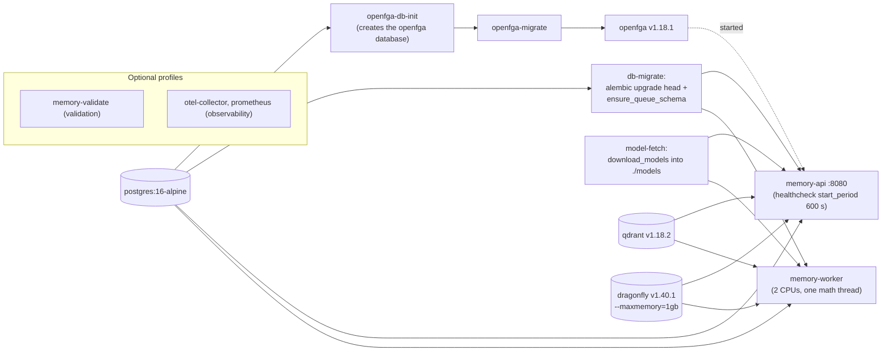
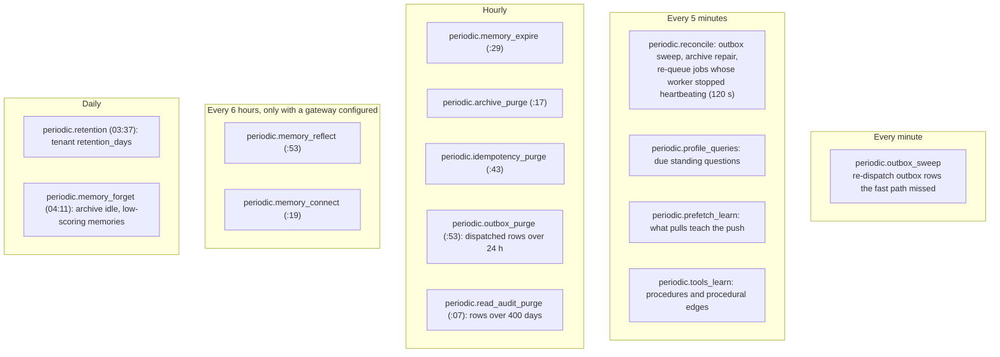

# 11 · Operations

> Everything an operator needs to run the service: what `docker compose up` starts and in
> which order, the short list of settings that are deployment facts and the long list of
> values that are deliberately constants, what hardware it has been measured on and what it
> is sized for, every background job and its schedule, migrations and reindexing, and what to
> watch.

**Previous:** [10 · Architecture](10-architecture.md) · **Next:** [12 · Testing and gates](12-testing-and-gates.md) · **Up:** [Documentation](../README.md)

---

## Deploying

### The compose stack

`docker compose up -d` on a fresh checkout reaches a working service with no manual steps
(`docker-compose.yml`): it fetches the model weights, applies both database schemas, then
starts the API and the worker.

| Service | Role | Notes |
|---|---|---|
| `postgres` | the source of truth and the job queue | `max_connections=200`, `shared_buffers=256MB` |
| `qdrant` | the search index | REST on 6333, gRPC on 6334 (the client queries over gRPC) |
| `dragonfly` | the cache | Redis protocol; `--maxmemory=1gb` |
| `openfga` (+ `openfga-migrate`, `openfga-db-init`) | relationship tuples | its own database on the same PostgreSQL |
| `model-fetch` | one-shot: the frozen model set into `./models` | about 1 GB the first time, skipped afterwards |
| `db-migrate` | one-shot: Alembic, then Procrastinate's own schema | `tools/ensure_queue_schema.py` — neither schema is created on boot |
| `memory-api` | the HTTP service | `start_period: 600s`: loading the models takes minutes on a cold start, and without it the stack reported unhealthy while it was still legitimately loading (ADR 0019 context recorded ~6 minutes) |
| `memory-worker` | background jobs | `cpus: '2'`, `OMP_NUM_THREADS=1`: ingestion must not bid for the cores the query path is measured on |
| `memory-validate` | profile `validation`: runs `make validate` against the real services with the repository bind-mounted | chapter 12 |
| `otel-collector`, `prometheus` | profile `observability` | `deploy/otel/collector.yaml`, `deploy/prometheus.yml` |

**The model gateway is not in the stack.** Bifrost is deployed separately and owns all
outbound model traffic; the service is given a URL and, optionally, the operator's virtual
key (`deploy/bifrost/README.md`, chapter 8). Without `BIFROST_URL` the service runs complete.

**The image** (`deploy/Dockerfile`): `runtime` is Python 3.12 slim with the extras named by
the `EXTRAS` build argument — `gcp models docling` by default, because the default parser is
Docling and a default build must be able to honour a default setting; text-only deployments can
build with `EXTRAS="gcp models"`. It swaps OpenCV for its headless build and installs
Tesseract when Docling is included. `validation` adds the dev tooling and every extra.

### What a production deployment changes

| In dev compose | In production |
|---|---|
| `MEMORY__BLOB__PROVIDER=filesystem` | `gcs` — the settings refuse `filesystem` when `service.environment` is `staging` or `prod` |
| `.env.example`'s `TRUSTED_DEV_API_KEYS=["dev-key"]` (`trusted_dev` mode) | remove it; set `MEMORY__AUTHENTICATION__BOOTSTRAP_ADMIN_KEY` (at least 32 characters), onboard tenants, then unset it — refused otherwise (`_production_guards`) |
| every store in the compose network | external PostgreSQL, Qdrant, Dragonfly and OpenFGA; the target is a single VM with external stores (ADR 0019 status) |
| `.env.example`'s `BIFROST_URL` pointing at a local gateway | your gateway's URL, or unset to run with no model |

Onboarding after deployment: `POST /v1/admin/tenants` with the bootstrap key returns the
tenant's first admin key once ([api/admin.md](../api/admin.md)). `tools/onboard.py` is an
operator tool that grants a user tenant membership or tenant admin directly in the
authorization store.

---

## Configuration: deployment facts only

`config/settings.py` is "the operator's surface, and nothing else". Sources, highest first:
environment variables (`MEMORY__SECTION__KEY`), then `.env`, then `secrets.env` (git-ignored),
then defaults. Every credential is a `SecretStr`, and `/version` shows a redacted snapshot.

| Variable | Default | What |
|---|---|---|
| `MEMORY__SERVICE__ENVIRONMENT` | `dev` | `dev`, `test`, `staging`, `prod`; the last two enable the production guards |
| `MEMORY__SERVICE__PORT`, `__LOG_LEVEL`, `__LOG_JSON` | `8080`, `INFO`, `true` | |
| `WEB_CONCURRENCY` / `MEMORY__SERVICE__WORKERS` | CPUs, 1–8 (the image sets 3) | API worker processes, 1–8; the second wins when both are set; unset, one per CPU the container may use (cgroup quota and affinity, not the host's count) |
| `MEMORY__DATABASE__URL` | localhost | the request path's connection; may be a transaction-mode PgBouncer ([deploy/database.md](../deploy/database.md)) |
| `MEMORY__DATABASE__DIRECT_URL`, `__TRANSACTION_POOLER` | `URL`, `false` | PostgreSQL itself, for the job queue, the graph traversal and migrations; `true` when `URL` is a transaction pooler |
| `MEMORY__DATABASE__CONNECTION_BUDGET` | 28 × processes | connections one **pod** may open; each process takes `budget // processes` and splits it 4:2:1 between requests, the graph traversal and the queue |
| `MEMORY__CACHE__URL` | `redis://localhost:6379/0` | any Redis-protocol cache |
| `MEMORY__TASKS__WORKER_CONCURRENCY` | CPUs, 1–8 | jobs a worker runs at once, 1–8; unset, one per CPU |
| `MEMORY__TASKS__METRICS_PORT` | 9464 | the job worker's Prometheus series and healthcheck |
| `MEMORY__SEARCH__QDRANT_URL`, `__QDRANT_GRPC_PORT`, `__QDRANT_API_KEY` | localhost:6333, 6334 | |
| `MEMORY__SEARCH__SHARD_NUMBER`, `__REPLICATION_FACTOR`, `__WRITE_CONSISTENCY_FACTOR` | 1, 1, 1 | the Qdrant cluster's layout for **new** collections ([deploy/search.md](../deploy/search.md)) |
| `MEMORY__AUTHORIZATION__OPENFGA_API_URL`, `__OPENFGA_STORE_ID`, `__OPENFGA_MODEL_ID`, `__OPENFGA_API_TOKEN` | localhost:8081 | a pinned model id that is not this build's model stops the service at start (ADR 0021) |
| `MEMORY__BLOB__PROVIDER`, `__CHAT_BUCKET`, `__FILE_BUCKET`, `__FILESYSTEM_ROOT`, `__GCS_PROJECT` | `filesystem` | `gcs` in deployed environments |
| `MEMORY__AUTHENTICATION__BOOTSTRAP_ADMIN_KEY` | unset | the platform operator (chapter 7); unset = nobody can onboard |
| `MEMORY__AUTHENTICATION__JWT_ISSUER`, `__JWT_AUDIENCE`, `__JWT_JWKS_URL`, `__TENANT_CLAIM` | unset | `jwt` mode when the JWKS URL is set |
| `MEMORY__AUTHENTICATION__TRUSTED_DEV_API_KEYS` | `[]` | development only |
| `MEMORY__AGENT_CREDENTIALS__ACTIVE_KEY_ID`, `__ENCRYPTION_KEYS` | unset | envelope keys that encrypt registered model keys |
| `MEMORY__HINDSIGHT__BASE_URL`, `__API_KEY` | unset | the optional extraction service (chapter 8) |
| `MEMORY__RETAIL_CALENDAR` | unset | a fiscal calendar such as `454`; resolves fiscal phrases and expands planning shorthand (chapter 3) |
| `BIFROST_URL`, `BIFROST_VIRTUAL_KEY` | unset | the model gateway and the operator's key on it; no `MEMORY__` prefix |
| `OTEL_EXPORTER_OTLP_ENDPOINT` | unset | tracing is on exactly when it is set |

What is **derived** is derived: the model is available when the gateway is configured, the
authentication mode follows from the credentials configured, tracing follows from its endpoint.
Domain code never reads environment variables.

### What is deliberately a constant

Everything that makes the product what it is lives in `config/constants.py`, and "nothing here
is read from the environment. Changing a value is a code change, reviewed like one." The
reason is recorded at the top of the file: three value sets and three mechanisms used to
configure the same retriever, "so the service that was benchmarked and the service that
shipped were never the same artefact".

| Constant group | Examples |
|---|---|
| `FROZEN_MODELS` | the encoders, ColBERT, NLI, revisions, runtimes, graph files, the relevance floor (chapter 8) |
| `RetrievalSettings`, `FINAL_K`, `DEPTH_RATIO` | depth, arm weights, timeouts for entity search and query expansion, expansion budget |
| `ContextSettings` | token budget 8,000, conversation window 20 messages and 2,000 tokens, access-counter flush |
| `MemoryIntelligenceSettings` | dedup thresholds, verbatim turns, preceding-turn key, forgetting half-life and threshold |
| `GraphSettings` | the 150 ms traversal budget, pool sizes, entity-route limits, summary bounds |
| `NLISettings` | grounding thresholds and band |
| `LLMTuning`, `LLMTransport` | model tiers (`auto`), timeout, retries, breaker |
| `CacheTuning`, `DatabaseTuning`, `TaskTuning`, `AuthorizationTuning` | TTLs, pool recycling, job retries and timeouts, outbox and audit retention, OpenFGA timeouts |
| service | `RATE_LIMIT_PER_MINUTE` 6,000 + `RATE_LIMIT_BURST` 200, `MAX_BODY_BYTES` 25 MB, `LOG_SOURCE_TEXT = False` |

There are no `MEMORY__MODELS__*` variables. A tenant's rate limit and retention are per-tenant
data set through the admin API, not settings. Tests and benchmarks replace values through
`Overrides` in code.

---

## Hardware

**What it is sized for.** A single 8 vCPU VM with external stores (ADR 0019 status). The
arithmetic in the code is three uvicorn workers with two intra-op model threads each, and a
worker capped at two CPUs (`DenseModel.threads`, `_model_threads`, `docker-compose.yml`). CPU
only (chapter 8).

**What it has been measured on.** A 2015 Intel i5 laptop with no AVX2 in the Docker VM, VM
memory limited to 5.8 GB, shared with other workloads (`docs/MEASUREMENTS.md`). On it, model
off: `/v1/context` p50 305 ms / p95 525 ms, of which two encodes and two hybrid searches are
about three quarters (§8.7). Every latency and throughput figure there is specific to that
box; quality figures are not. **The 300 ms p95 target is set for the 8 vCPU VM and has not been
measured there**; `make bench-model-throughput` exists to be run on the target and
`make load-test` from a separate machine.

**Disk and ingest.** The late-interaction vectors are the largest thing a point holds: about
5 KB for a memory and 65 KB for a 512-token chunk at half precision, on disk (ADR 0025); the
context key's own ColBERT vectors add about 22 KB per memory (ADR 0026, 169.9 MB for 7,787
memories). Each memory is encoded under two keys by two dense encoders and by ColBERT, which
ADR 0025 puts at roughly three times the per-turn ingest cost of the single-key layout; the
second late encode adds 30 ms CPU per memory on its host (ADR 0026). Raw chat and files are
archived as zstd segments; level 6 compressed a synthetic chat 5.6× (ADR 0006, synthetic data —
re-measure on a real corpus).

---

## Workers and periodic jobs

Every job is registered in one place, `modules/jobs/registry.py`, and every enqueued task name
must have a handler there (`tests/unit/test_job_registration.py`). Jobs run on named queues;
interactive work is prioritised over indexing, summaries and imports (`QUEUE_PRIORITY` in
`ports/tasks.py`).

| Job | Queue | Triggered by | Retries | Does |
|---|---|---|---|---|
| `memory.process_observation` | `chat-fast` | each message | 5 | the memory pipeline (chapter 10) |
| `memory.index` | `embedding` | every memory change | 5 | index or remove, enrich the graph, bump revisions, queue a profile refresh |
| `document.parse` | `document-parse` | upload | 3 | parse, hierarchy, chunks, Document Context Graph |
| `document.index` | `embedding` | parse | 5 | index chunks and summaries, enrich the graph |
| `archive.stage_message` | `archive` | each message, 60 s coalesced per thread | 10 | compress, upload, verify, manifest (ADR 0006) |
| `feedback.project` | `reconcile` | an applied verdict | 3 | apply it (chapter 6) |
| `summary.refresh` | `summary` | every 20 messages | 3 | the thread's durable summary, then its searchable episode |
| `episode.index` | `summary` | a message's window closing; a thread deleted | 3 | re-index the episode, or remove it once the thread is gone |
| `profile.refresh`, `profile.query` | `summary` | user facts; due standing questions | 3, 1 | the pinned profile blocks |
| `tools.index` | `embedding` | catalog upsert | 5 | the tools search collection |

Times are the cron expressions in the registry. Two notes that came from incidents, recorded
in the registry itself: the outbox sweep used to be registered but never scheduled, which left
writes answered `202` that never became memories — it now runs every minute and is "the floor
on how late a write can become a memory when the fast path misses it"; and outbox rows were
never deleted until `periodic.outbox_purge` was added (dead rows are kept).

Every job runs inside its own LLM accounting scope, so a job's model tokens are logged per job
(`job.llm_tokens`) and never leak into a request that ran it inline.

---

## Migrations and reindexing

**Schema.** Alembic owns the application tables (`migrations/versions/`, 0001 to 0022);
Procrastinate owns its own and installs them through its API (`tools/ensure_queue_schema.py`).
`make migrate` and the compose `db-migrate` step run both. CI applies every migration, rolls
all of them back and applies them again (chapter 12). Some migrations must land before new
code starts: ADR 0021's rollout note says migration 0014 had to be applied before the first
new-code instance because the request path read the new tables, and that its partial index was
built without `CONCURRENTLY`, holding writes to `memories` for the build. Read each ADR's
rollout section before upgrading across it.

**OpenFGA model.** The provider rolls the authorization model forward itself: when the store's
latest model differs from this build's, the build's model is written and used, reusing any
model in the history with the same meaning (ADR 0021).

**The search index.** Qdrant is derived from PostgreSQL. `make reindex` (`tools/reindex.py`)
rebuilds every `READY` document's chunks and summaries and every `CURRENT` memory, per tenant
or all; `REINDEX_ARGS="--drop"` deletes the current collections first; `--prune-dry-run` then
`--prune` retires an old collection generation; `make reindex-image` runs the same inside the
runtime image on a host without the model runtime's wheels. A reindex is required whenever a
fingerprint changes — an encoder, a graph file, the key layout (`mk2`, `mk3` in ADR 0025 and
0026) — and until `--prune` runs the previous generation keeps serving, so a rollback is a
revert of the build ([MULTILINGUAL-RUNTIME.md](../MULTILINGUAL-RUNTIME.md#moving-an-existing-tenant-the-reindex-path)).

**Backfills.** A tenant that opts into `memory_restatement` restates earlier turns with
`python -m memory_service.tools.restate --tenant <id> [--limit N] [--force]` (ADR 0027).

---

## Observability

**Probes** ([api/admin.md](../api/admin.md#operations)). `GET /health/live` is always `200`
while the process is up and checks nothing outside it. `GET /health/ready` is `200` when every
dependency answered (`ready`) or one other than PostgreSQL is down (`degraded`), and `503`
when PostgreSQL is down or the process has begun shutting down (`not_ready`). Mandatory:
`postgres`, `process`. Reported but never failing readiness: `qdrant`, `openfga`, `blob`,
`task_queue`, `cache`, `llm` - a shared dependency blinking used to take every pod out of
rotation at once, and the routes that need a missing store answer 503 themselves (ADR 0031).
The answer is reused for 3 s and each ping is bounded at 2 s. Wire the load balancer to
`ready`. `GET /version` reports which provider is
**running** per port and lists every place it differs from what was configured under
`degraded` — check it before believing a benchmark.

**Metrics.** Prometheus at `/metrics` (`observability/metrics.py`): request counts and
latency, per-stage timings (`memory_stage_seconds`), jobs, cache operations, authorization
denials, dependency up, evidence status, memory decisions, LLM requests, tokens and latency,
grounding claims, graph budget expiries, archive bytes, reconciler repairs, dropped audit
entries, and the overload signals: `memory_model_queue_waiters` and
`memory_model_queue_rejected_total` per model, `memory_request_deadline_exceeded_total` per
route class, `memory_db_pool_checked_out` / `memory_db_pool_capacity` per pool. `memory-api`
with more than one worker sets `PROMETHEUS_MULTIPROC_DIR` (emptied at start), so a scrape
is every worker's values summed (`# SCOPE: all N API worker processes`); started any other
way with several workers, the banner says the series are one worker's share
(`docs/MEASUREMENTS.md` §5c).

**The job worker** serves its own series on `MEMORY__TASKS__METRICS_PORT` (9464):
`memory_queue_depth` and `memory_queue_oldest_lag_seconds` per queue,
`memory_outbox_backlog`, `memory_jobs_failed_terminal` per queue, `memory_worker_running_jobs`
and `memory_worker_last_sample_timestamp_seconds` (sampled every 15 s; a stale value is a
worker that cannot reach its database). The compose healthcheck reads that port. On SIGTERM
the worker stops fetching, gives running jobs 30 s, then aborts and releases the rest for a
retry; compose's `stop_grace_period` for it is 45 s.

**Overload.** A read (GET, `/v1/context`, `/v1/recall`, `/v1/tools/hints`) that runs past
5 s, a write past 15 s, `/v1/verify` past 15 s is answered `504` `TIMEOUT` (retryable);
uploads and probes have no deadline. A model queue past 32 waiters answers `503` at once.
uvicorn refuses past 128 concurrent connections per worker and keeps idle keep-alive
connections for 65 s (above the SDK's 30 s and the usual 60 s load-balancer idle timeout;
uvicorn's own default of 5 s closed connections clients were about to reuse). The values are
`constants.OVERLOAD` (ADR 0031).

**Traces.** OpenTelemetry spans per stage, exported over OTLP/HTTP when
`OTEL_EXPORTER_OTLP_ENDPOINT` is set; W3C `traceparent` is continued from the caller and
returned on every response with `X-Trace-ID` (ADR 0022). The worker reports as
`trellis-memory-worker`.

**Logs.** Structured JSON with tenant, thread, session, turn, agent run, request, correlation
and trace fields. Source text — prompts, model output, message bodies — is never logged
(`LOG_SOURCE_TEXT = False`).

**Not built:** `docs/ARCHITECTURE.md` lists OpenLineage events for processing lineage; nothing
under `src/` emits them (the name appears only in a docstring of `domain/evidence.py`). Claim
provenance is `EvidenceRef` and execution is traced; processing lineage is not exported.

---

## Runbook: the questions that come up

| Symptom | Look at |
|---|---|
| a write was acknowledged but nothing is retrievable | `GET /v1/jobs/{id}`; outbox rows still pending (the sweep runs every minute); `memory_jobs_total` |
| readiness is `degraded` | which dependency is down in the body; requests that need it answer 503, the rest are served |
| clients see 503 / 504 under load | `memory_model_queue_rejected_total`, `memory_request_deadline_exceeded_total`, `memory_db_pool_checked_out` against `memory_db_pool_capacity` |
| jobs pile up | the worker's `memory_queue_depth` and `memory_queue_oldest_lag_seconds`; `memory_outbox_backlog` rising means the relay, not the worker |
| a benchmark number looks wrong | `/version` → `degraded`; any `representative: false` in the artifact (chapter 12) |
| graph facts are missing under load | `memory_graph_budget_expired_total`: the 150 ms budget is stopping traversals |
| a model use is not running | `BIFROST_URL`, the tenant's policy (`GET /v1/model-key/policy`), whether a key can pay, `memory_llm_assist_total` |
| search returns nothing after a model change | the collection fingerprint changed: `make reindex` |

---

## What to read next

- How the gates that guard all of this are produced and checked → [chapter 12](12-testing-and-gates.md)
- Install and the twenty-line agent → [README](../../README.md#install-and-run)
- Onboarding and probes, with response bodies → [api/admin.md](../api/admin.md)
