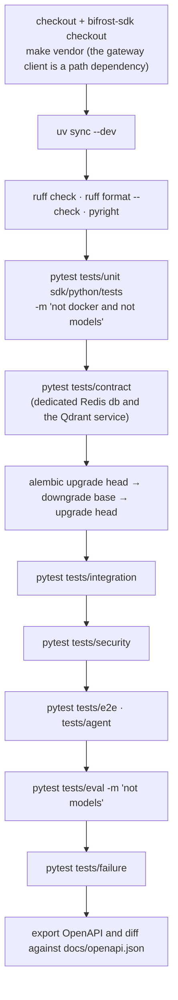
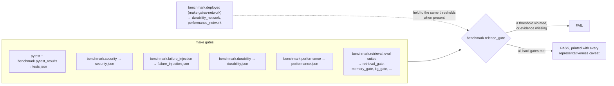

# 12 · Testing and gates

> Every number in this guide names the file it came from, and every behaviour it describes is
> pinned by a test. This chapter is how that is kept true: the test suites and what each one
> needs, exactly what CI runs on every push and what it does not, the release gates and the
> evaluator that refuses to pass without evidence, the benchmarks behind the quality figures,
> and the rules that stop a measurement from lying.

**Previous:** [11 · Operations](11-operations.md) · **Up:** [Documentation](../README.md)

---

## The suites

| Directory | Files | Marker | Needs | What it proves |
|---|---|---|---|---|
| `tests/unit` | 154 | `unit` | nothing external | domain rules, ranking, routing, rendering, settings guards, and the structural tests below |
| `sdk/python/tests` | 4 | — | nothing external | the SDK client, its verbs, paging and route coverage |
| `tests/contract` | 14 | `contract` | a cache and a Qdrant server when their URLs are set | the OpenAPI contract and conventions, each port's adapter contract (search, cache, blob, tasks, OpenFGA), the deployment profiles |
| `tests/integration` | 49 | `integration` | PostgreSQL and Redis (embedded fallbacks for the rest) | the pipeline, retrieval, graph, forgetting, feedback projection, multi-agent rules, idempotency, outbox durability |
| `tests/security` | 4 | `security` | PostgreSQL | isolation: the property-based oracle, retrieval and graph reader matrices, tenant binding (chapter 7) — release blocking |
| `tests/e2e` | 10 | `e2e` | PostgreSQL and Redis | full API flows over HTTP and the SDK, including the README's examples |
| `tests/agent` | 13 | (`e2e` target) | PostgreSQL and Redis | an agent's whole lifecycle through the SDK alone: onboarding, keys, workspaces, revocation, edge cases |
| `tests/eval` | 8 | `eval` | PostgreSQL and Redis | the quality gates: retrieval, memory, knowledge graph, grounding, tool memory, capability coverage |
| `tests/failure` | 1 | `failure` | PostgreSQL and Redis | worker kill, cache flush, blob outage, index rebuild, authorization outage |

Three more markers select tests that need what CI does not have: `docker` (a Docker daemon
with registry access), `models` (local model files) and `bifrost` (a running gateway)
(`pyproject.toml`).

**Hermetic by default.** A test builds its container with in-process stand-ins — the hash
embedding, qdrant-client local mode, an in-memory cache and authorization model, the builtin
parser, the lexical NLI — declared on `application.container.Overrides`, never in
configuration (chapter 10). `MEMORY_TEST_PROVIDERS=env` makes the same suites take the models,
search, cache, authorization, documents and retrieval sections from the environment instead,
so they run against real weights and servers, resetting the Qdrant collections and cache
between tests (`tests/support_real.py`; [CONTRIBUTING](../CONTRIBUTING.md)). Anything measured
with a stand-in is labelled `representative: false`.

---

## What CI runs

`.github/workflows/ci.yml`, on every push to `main` and every pull request, one job on
`ubuntu-latest` with PostgreSQL 16, Redis 7 and Qdrant 1.18.2 as service containers:

Every step must pass. The migration round trip catches a downgrade that does not undo its
upgrade; the OpenAPI diff fails the build when the checked-in contract no longer matches the
code (`make openapi` regenerates it).

**What CI does not run:**

- tests marked `docker`, `models` or `bifrost` — real OpenFGA and Qdrant servers through
  Docker, real model weights, a real gateway;
- `make gates` and `make validate` — the release-gate artifacts and their evaluator;
- every benchmark, the load test and the network-hop gates;
- `make model-test` (contract tests against real weights, inside the runtime image).

Those run where the weights and servers are: the `memory-validate` compose service
(`docker compose --profile validation up -d memory-validate`, then
`docker compose exec -e MEMORY_TEST_PROVIDERS=env memory-validate make validate`), or a
developer's `make verify` (`scripts/verify.sh`: lint, fresh artifacts, the live stack, a smoke
turn, both suites; `--fresh` rebuilds the stack including volumes, `--quick` skips Docker).

---

## Tests that keep the code and the documents honest

Some tests exist only so that a description cannot drift from what it describes:

| Test | Holds |
|---|---|
| `tests/unit/test_architecture.py` | the hexagonal rules (no provider SDK in the core, no LLM SDK anywhere, ports are Protocols, wiring through the registry, every stand-in has a wiring branch); one test database URL; no host literals; and "the memory type docs match what the pipeline actually produces" |
| `tests/unit/test_complexity_budget.py` | a ratchet: budgets set at the worst function's complexity at the time, so nothing may get worse and every improvement tightens them |
| `tests/unit/test_model_provenance.py` | the provenance rule on every surface that names a model (chapter 8) |
| `tests/unit/test_job_registration.py` | every enqueued task has a handler and the outbox has a scheduled repair path — both were broken on a running service, silently |
| `tests/unit/test_disabled_features_cost_nothing.py` | a feature that is off is not built, loaded or advertised |
| `tests/e2e/test_readme_examples.py` | every README snippet a reader is invited to copy runs against the real service: "if you change the SDK surface and this fails, fix the README in the same commit" |
| `tests/contract/test_openapi_contract.py`, `test_openapi_conventions.py` + the CI diff | every public route documents its examples and errors; operation ids, headers and problem details follow ADR 0022 |
| `tests/contract/test_deployment_profiles.py` | the deployment shapes that actually exist — and the degraded ones promised to survive: no cache, graph enrichment off, no LLM — each wired and made to do real work |
| `tests/eval/test_capability_coverage.py` | removing seven retrieval flags removed no capability: each test runs with the candidate flags off on an adversarial corpus ([CAPABILITY_COVERAGE.md](../CAPABILITY_COVERAGE.md), ADR 0012) |
| `tests/unit/test_benchmark_locomo_scoring.py`, `test_benchmark_store_guard.py` | the benchmark scorers, and the refusal to reset a store a benchmark does not own |

---

## The release gates

ADR 0015: "Release gates are produced by code, evaluated by code, and caveated honestly." Every
gate has a producer under `benchmark/` and an artifact under `benchmark/results/` with its
provenance — commit, platform, package versions — and `benchmark/release_gate.py` reads them.

| Gate | Threshold | Last committed value | Artifact (date) |
|---|---|---|---|
| acknowledged data loss | 0 | 0 (278 injected worker crashes, 0 duplicate memories) | `durability.json` (2026-09-15) |
| unauthorized retrieval: cross-tenant / cross-user / private-agent | 0 / 0 / 0 | 0 / 0 / 0 | `security.json` (2026-09-15) |
| critical Recall@20 | 1.00 | 1.00 over 17 critical questions | `retrieval_gate.json` (eval run) |
| critical evidence-group recall | 1.00 | 1.00; evidence-complete rate 1.00 | `retrieval_gate.json` (eval run) |
| KG fact recall / false facts / noise | 1.00 / 0 / 0 | 1.00 / 0 / 0 over 49 facts | `kg_gate.json` (eval run) |
| false-merge rate | ≤ 0.01 | 0.00 over 35 pairs; dedup recall 1.00 | `memory_gate.json` (eval run) |
| p95 latency (ms): chat accept / cached context / recall / context / file accept | 100 / 75 / 300 / 400 / 200 | 29.1 / 5.9 / 84.3 / 93.8 / 23.6, in-process ASGI | `performance.json` (2026-09-15) |
| failure recovery | every scenario passes | worker kill, cache flush, blob outage, search rebuild, authz denial: pass | `failure_injection.json` (2026-09-15) |
| all tests | 0 failed | 281 passed, 0 failed | `tests.json` (2026-09-15) |

Thresholds are in `benchmark/evaluation/__init__.py` (`CRITICAL_RECALL_K = 20`,
`FALSE_MERGE_RATE_MAX = 0.01`, `PerformanceBudgets` — "targets, not promises"). The grounding
and tool-memory gates have artifacts too (`grounding_gate.json`, `tool_gate.json`).

**Read that table with its dates.** Five of the artifacts were produced on 2026-09-15, at an
earlier commit (`provenance.git_commit` in each file), and the code has changed a great deal
since. They are the last committed evidence, not a statement about the current commit; CI
re-runs the suites behind them on every push, and `make gates` regenerates the artifacts. The
artifacts marked "eval run" (and `grounding_gate.json`, `tool_gate.json`) are rewritten by
every `pytest tests/eval` run; on the hermetic stand-ins their values do not change between
runs, only their timestamps.

**What the evaluator refuses to do** (`benchmark/release_gate.py`):

- **Missing evidence is a failed gate.** A gate whose artifact is absent fails; a missing or
  skipped test counts as a failure, never as a zero.
- **No threshold is ever relaxed** to make a build pass ([CONTRIBUTING](../CONTRIBUTING.md):
  "Never weaken a gate to make a test pass").
- **Representativeness is printed with every PASS.** Quality measured with the hash embedding
  and latency measured in-process without a network hop are flagged; the retrieval gate's own
  artifact says `representative: false` and "quality numbers are not representative". A PASS
  in this repository "is a statement about the service logic, not about a deployment"
  (ADR 0015).

**Planned, not done.** ADR 0017 (status: in progress) defines the real-component validation:
the same gates with real weights, real OpenFGA, Qdrant and Dragonfly servers and real workers
over a network hop, and a keep/cut row per component. Its gate table's "real value" column and
its keep/cut table are still empty. [FINAL_REPORT.md](../FINAL_REPORT.md) is explicit that the
service is not declared production-ready until those gates pass with representative providers.

---

## The benchmarks behind the quality figures

The gates prove the logic on fixtures; the quality figures quoted in chapters 4–8 come from
benchmarks run with the real encoders, PostgreSQL and Qdrant:

| Question | Target | Recorded in |
|---|---|---|
| Does the right evidence reach a conversational context? (no LLM, per-arm rank dumps) | `make bench-locomo-source` | `benchmark/results/phase12/`, `overhaul/`; ADR 0026 |
| Do answers come out right? (generate, then grade with a model) | `make bench-locomo-judged`, `make bench-longmemeval` | ADR 0027 evidence; `docs/history/` |
| Document retrieval quality, and twelve languages | `make bench-runtime-retrieval` (SciFact, XQuAD), `make bench-external` | `phase7/`; ADR 0024, ADR 0025 |
| `/v1/context` and `/v1/recall` latency, model off | `make bench-context-latency` | `overhaul/context_latency_*.json`; `docs/MEASUREMENTS.md` §8 |
| Empty, garbage and hostile input | `make bench-degenerate` | `degenerate*.json`; `docs/MEASUREMENTS.md` §4 |
| Throughput per model, for sizing | `make bench-model-throughput` (on the target VM) | `model_throughput.json` |
| A deployed instance under load | `make load-test`, `make gates-network` | `load_test.json`, `*_network.json` |

`docs/MEASUREMENTS.md` is the account of each run — what was measured, on which box, and
what is not trustworthy — and [FINAL_REPORT.md](../FINAL_REPORT.md) the per-gate account.

### Guards against a benchmark lying

`docs/MEASUREMENTS.md` opens with its retractions, "the most useful part of this file, because
each one is a way this harness can lie again": a recall figure produced by matching verbatim
turns against rewritten memories, an nDCG of 0.012 from a corpus 93% unindexed, and every
retrieval score before 2026-09-20, withdrawn because benchmarks truncated PostgreSQL but never
the vector store, so each run competed against the previous runs' orphaned vectors. Each is now
guarded in code:

- scoring functions are pinned by unit tests;
- `external_retrieval` refuses to score a corpus that is not fully indexed, or one where no
  candidate maps back to it;
- per-question records are persisted, so a score can be re-derived without re-running;
- each benchmark owns its database, and one `reset_store()` clears both stores — and refuses to
  truncate any database not named for a benchmark (ADR 0024 decision 11);
- benchmark Qdrant defaults to an isolated server on 16333, so a corpus never pollutes a store
  serving a running API;
- a judged run counts its own failed judge calls and says so in `caveats`, after a run whose
  79 judge calls had all failed produced a complete-looking result (§5b);
- a judged arm reads its spending from the gateway that enforces it and refuses an arm that
  would exceed the phase cap (ADR 0024 decision 9).

---

## How the claims in this documentation stay true

The rules every document here follows, and where each is enforced:

1. **Nothing claims a number that is not in `benchmark/results/`**, and a number produced with
   a stand-in is labelled as such. If a document and a gate artifact disagree, the artifact
   wins ([docs/README.md](../README.md#the-rule-these-documents-follow)).
2. **An ADR is amended, never rewritten.** A reversed or never-built decision keeps its text
   and gains a note saying what replaced it — ADR 0002's OPA row, ADR 0012's seven removed
   strategies, ADR 0019's model tier ([adr/README.md](../adr/README.md)).
3. **Golden sets are never edited to pass**; new questions are added, none removed or weakened
   (ADR 0017).
4. **An ablation that cannot show a benefit is not shipped.** Consolidation, the neighbour
   lift, `entity_prefetch`, query decomposition and the reranker were measured and removed
   rather than left switched off (`docs/MEASUREMENTS.md` §8.4, §8.6; ADR 0026).
5. **What runs is reported, not what was configured.** `/version` lists every fallback under
   `degraded` — a benchmark run with a non-empty list measured something else.
6. **The examples run.** README snippets are executed by `tests/e2e/test_readme_examples.py`;
   the OpenAPI file is diffed in CI.
7. **Code beats prose.** Where this guide and the code disagree, the code is right, and this
   guide cites the file so you can check. Where it found older documents out of date — the
   admission gate described as running in [api/memory.md](../api/memory.md) before it was
   wired behind a tenant switch, the NLI row in the README's model table — chapters 6 and 8
   say what the code does.

---

## What to read next

- The measurements themselves, with their caveats → [MEASUREMENTS.md](../MEASUREMENTS.md)
- The per-gate account and the production-readiness verdict → [FINAL_REPORT.md](../FINAL_REPORT.md)
- How to work on the service → [CONTRIBUTING.md](../CONTRIBUTING.md)
